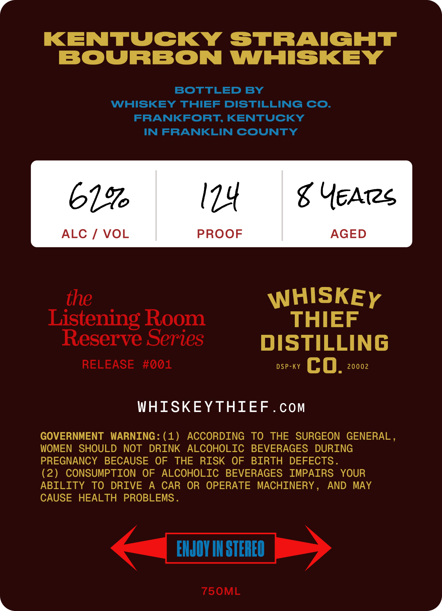
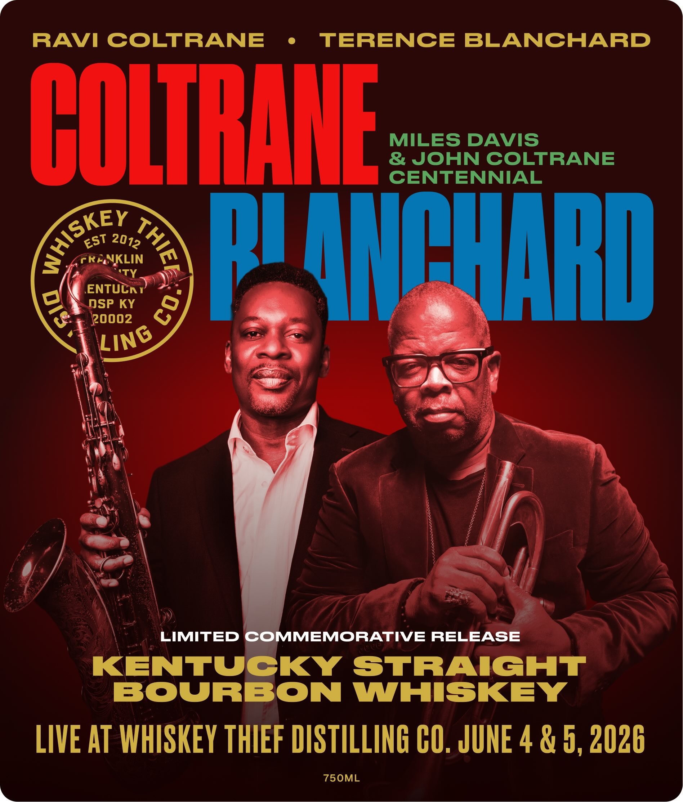

# TTB COLA Label Images - TTBID 26149001000306

**Brand Name:** WHISKEY THIEF DISTILLING CO.

**Fanciful Name:** COLETRANE AND BLANCHARD

**Issue Date:** 06/05/2026

**Origin Code:** 22

**Product Class/Type:** 101

**Source:** [TTB Public COLA Registry](https://ttbonline.gov/colasonline/viewColaDetails.do?action=publicFormDisplay&ttbid=26149001000306)

## Label Images

### Back Label

### Front Label

## Extracted Label Text

*Text extracted via OCR - may contain errors*

### Back Label

KENTUCKY
STRAIGHT
BOURBON
WHISKEY
BOTTLED BY
WHISKEY THIEF DISTILLING CO.
FRANKFORT KENTUCKY
IN FRANKLIN COUNTY
61,9
124
g YEATs
ALC
VOL
PROOF
AGED
the
WHISKEY
Listening Room
THIEF
Reserve Series
DISTILLING
RELEASE
#001
DSP-KY
co:
20002
WHISKEYTHIEF
Com
GOVERNMENT
WARNING: ( 1 )
ACCORDING
TO
THE
SURGEON GENERAL ,
WOMEN
SHOULD NOT
DRINK
ALCOHOLIC
BEVERAGES
DURING
PREGNANCY
BECAUSE OF
THE
RISK
OF
BIRTH
DEFECTS
(2)
CONSUMPTION
OF
ALCOHOLIC
BEVERAGES
IMPAIRS
YOUR
ABILITY
TO
DRIVE
A
CAR
OR   OPERATE
MACHINERY
AND MAY
CAUSE HEALTH
PROBLEMS _
EIJOY IH STEREO
75OML

### Front Label

RAVI COLTRANE
TERENCE
BLANCHARD
COLTRAIE
MIJGSRCOSTRANE
CENTENNIAL
3
frANKLIN
PIANPHARD
ENTUCn /
DSP KY
[2oo02
LIMITED COMMEMORATIVE RELEASE
KENTUCKY
STRAIGHT
BOURBON
WHISKEY
LIVE AT WhISKEY THIEF DISTILLING CO. JUNE 4 & 5, 2026
75OML
AiSkey
0
EST
2012
8
LING
|
