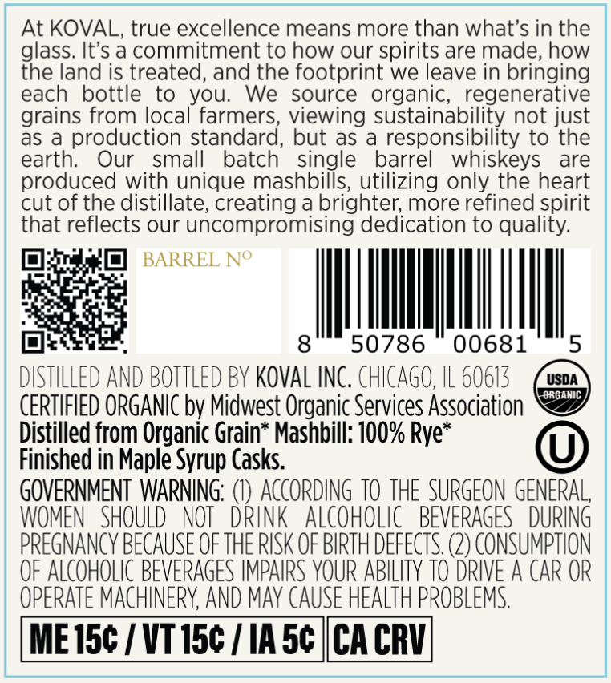
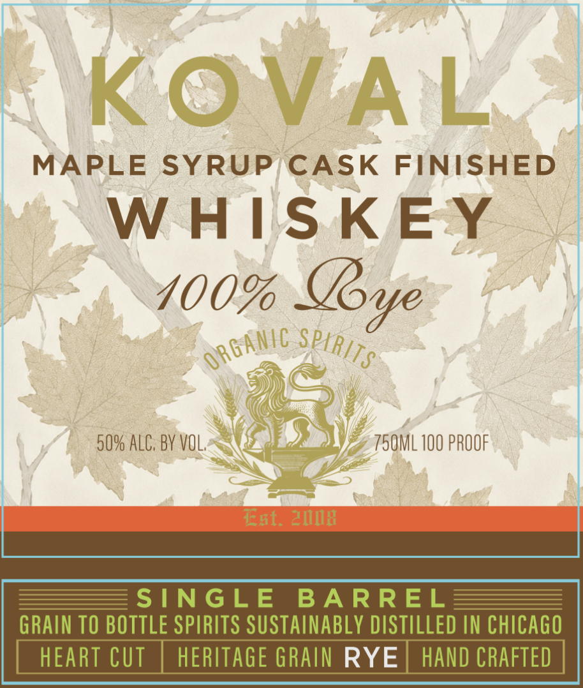

# TTB COLA Label Images - TTBID 26149001000309

**Brand Name:** KOVAL

**Fanciful Name:** MAPLE SYRUP CASK FINISHED

**Issue Date:** 06/02/2026

**Origin Code:** 04

**Product Class/Type:** 142

**Source:** [TTB Public COLA Registry](https://ttbonline.gov/colasonline/viewColaDetails.do?action=publicFormDisplay&ttbid=26149001000309)

## Label Images

### Back Label

### Front Label

## Extracted Label Text

*Text extracted via OCR - may contain errors*

**Detected Proof:** 100

### Back Label

At KOVAL, true excellence means more than what's in the
glass. It's a commitment to how our spirits are made; how
the land is treated, and the footprint we leave in bringing
each
bottle
to
you;
We
source
organic;,, regenerative
grains from local farmers, viewing sustainability not just
as a production standard, but as
responsibility to the
earth:
Our
small
batch
single
barrel
whiskeys
are
produced with unique mashbills, utilizing only the heart
cut of the distillate; creating a brighter; more refined spirit
that reflects our uncompromising dedication to quality:
BARREL No
8
50786
00681
5
DISTILLED AND BOTTLEd BY KOvAL INC . CHICAGO, IL 60613
USDA
orgaNIC
CERTIFIED ORGANIC bv Midwest Organic Services Association
Distilled from Organic Grain
Mashbill: 100% Rye*
Finished in Maple Syrup Casks.
GOVERNMENT WARNING;
ACCORDING TO THE SURGEON GENERAL,
WOMEN   SHOULD
NOT  DRInK   ALcoHOLIc   BEVERAGES   DURING
PREGNANCY BECAUSE OFTHE RISK OF BIRTH DEFECTS (2) consumpthon
OF ALCOHOLIC BEVERAGES IMPAIPS YOUR ABILITY TO DRIVE A CAR OR
OPERATE MACHINERY AND May CAUSE HEALTH PROBLEMS:
ME I5c / VT I5c
IA 5c |CA CRVL

### Front Label

KOVA
L
MAPLE
SYRUP
CASK
FINISHED
W HIS KEY
400%
50% ALC; BV VOL,
75ML 100 PROOF
ERL; ZMMB
SINGLE
BA RREL
GRAIN TO BOTTLE SPIRITS SUSTAINABLY DISTILLED IN CHICAGO
HEART CUT
HERITAGE GRAIN RYE
HAND CRAFTED
@oye
o RGAnc
SPKRITS
