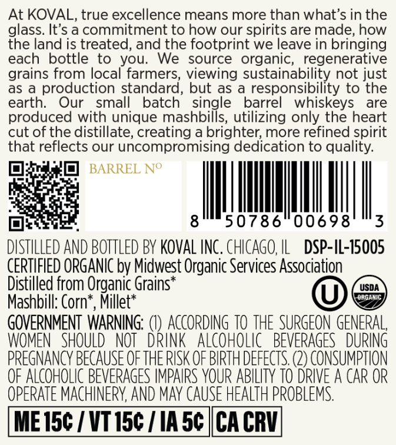
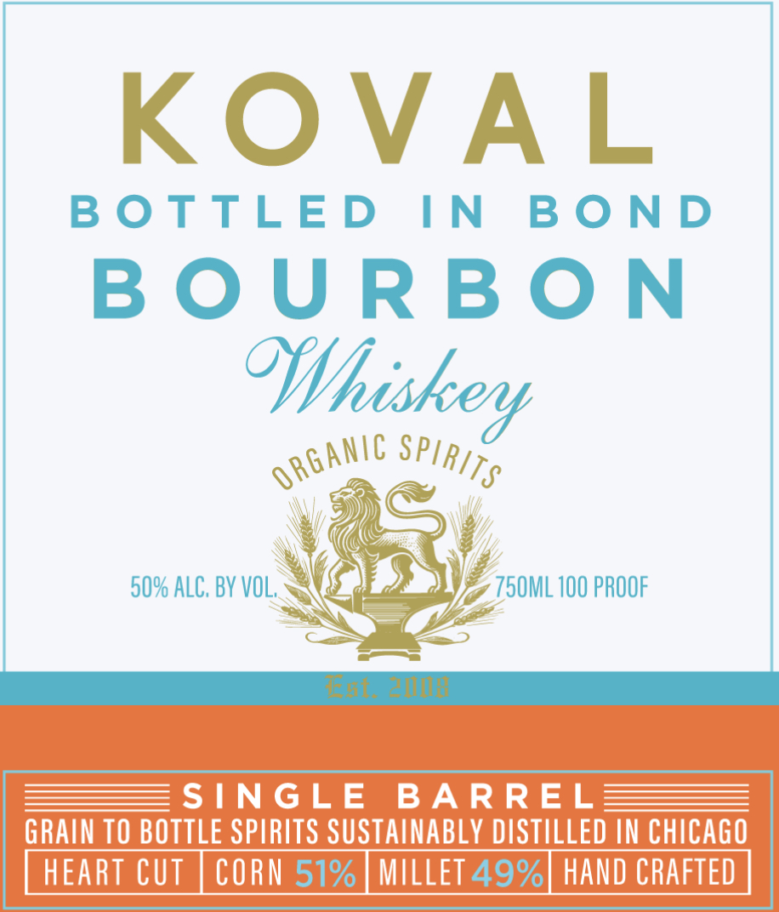

# TTB COLA Label Images - TTBID 26149001000317

**Brand Name:** KOVAL

**Issue Date:** 06/04/2026

**Origin Code:** 04

**Product Class/Type:** 111

**Source:** [TTB Public COLA Registry](https://ttbonline.gov/colasonline/viewColaDetails.do?action=publicFormDisplay&ttbid=26149001000317)

## Label Images

### Back Label

### Front Label

## Extracted Label Text

*Text extracted via OCR - may contain errors*

### Back Label

At KOVAL, true excellence means more than what's in the
glass. It's a commitment to
our spirits are made; how
the land is treated, and the footprint we leave in bringing
each
bottle to
you:
We
source
organic,  regenerative
grains from local farmers, viewing sustainability not just
as
production standard
but as
responsibility to the
earth:
small
batch
single
barrel
whiskeys
are
produced with unique mashbills, utilizing only the heart
cut of the distillate, creating a brighter; more refined spirit
that reflects our uncompromising dedication to quality:
BARREL No
8
50786
00698
3
DISTILLED AND BOTTLED BY KOVAL INC . ChICAGO, IL
DSP-IL-15005
CERTIFIED ORGANIC by Midwest Organic Services Association
Distilled from Organic Grains*
USDA
OrganIC
Mashbill: Corn
Millet*
GOVERNMENT WARNING:
ACcORDInG TO THE SURGEON GENERAL
WOMEN   SHOULD   NOT
DRINK
ALCOHOLIC   BEVERAGES   DURING
PREGNANCY BECAUSE OF THE RISK OF BIRTH DEFECTS: (2) CONSUMPTION
QF ALcOHOLIC BEVERAGES IMPAIRS VOUR ABILITY TO DRIVE A CAR OR
OpERATE MACHINERY, AND MaY CauSe HEALTh PROBLeMS:
ME 15c / VT15c
IA 5c |CA CRV
how
Our

### Front Label

KOVAL

BOTTLED IN BOND
BOURBON
Whi

= SINGLE BARREL 3
GRAIN TO BOTTLE SPIRITS SUSTAINABLY DISTILLED IN CHICAGO

HEART CUT MILLET 49%] HAND CRAFTED
