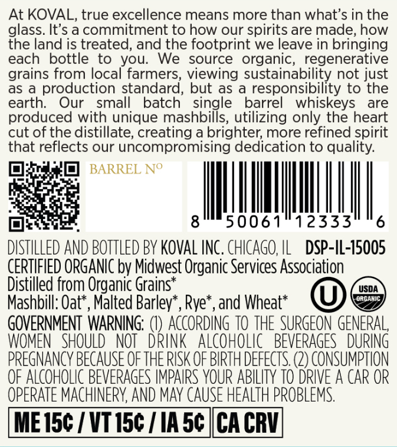
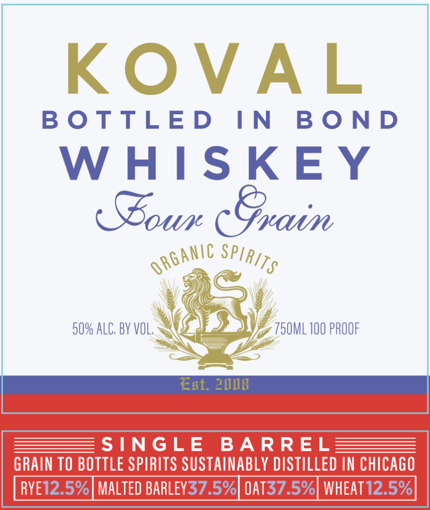

# TTB COLA Label Images - TTBID 26149001000320

**Brand Name:** KOVAL

**Issue Date:** 06/04/2026

**Origin Code:** 04

**Product Class/Type:** 119

**Source:** [TTB Public COLA Registry](https://ttbonline.gov/colasonline/viewColaDetails.do?action=publicFormDisplay&ttbid=26149001000320)

## Label Images

### Back Label

### Front Label

## Extracted Label Text

*Text extracted via OCR - may contain errors*

**Detected Proof:** 100

### Back Label

At KOVAL, true excellence means more than what’s in the
glass. It’s acommitment to how our spirits are made, how
the land is treated, and the footprint we leave in bringing
each bottle to you. We source organic, regenerative
grains from local farmers, viewing sustainability not just
as a production standard, but as a responsibility to the
earth. Our small batch single barrel whiskeys are
produced with unique mashbills, utilizing only the heart
cut of the distillate, creating a brighter, more refined spirit
that reflects our uncompromising dedication to quality.
MIN
Phra es
Pert be
opal gts 0061/12333" "6
DISTILLED AND BOTTLED BY KOVAL INC. CHICAGO, IL DSP-IL-15005
CERTIFIED ORGANIC by Midwest Organic Services Association
Distilled from Organic Grains* ©
Mashbill: Oat*, Malted Barley’, Rye*, and Wheat* BP
GOVERNMENT WARNING: (I) ACCORDING 10 THE SURGEON GENERAL,
WOMEN SHOULD NOT DRINK ALCOHOLIC BEVERAGES DURING
PREGNANCY BECAUSE OF THE RISK OF BIRTH DEFECTS. (2) CONSUMPTION
OF ALCOHOLIC BEVERAGES IMPAIRS YOUR ABILITY 10 DRIVE A CAR OR
OPERATE MACHINERY, AND MAY CAUSE HEALTH PROBLEMS.
ME15¢ / VT15¢ / IA5¢ |CACRV

### Front Label

KOvAL
B 0 TTLED
IN
B 0 N D
W HIS KE Y
(Goun (Gxaim
50% ALC, BY VOL,
750ML 100 PROOF
Ext. 2MIX
SINGLE
BA RREL
GRAIN TO BOTTLE SPIRITS SUSTAINABLY DISTILLED IN chiCAGO
RYE12.5%| MALTED BARLEY37.5%| 0AT37.5%| WHEAT 12.5%
0RGanic
SPIRITS
