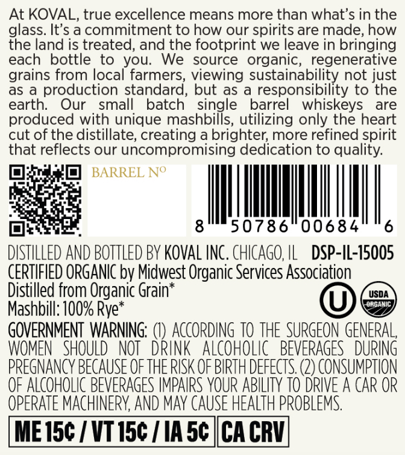
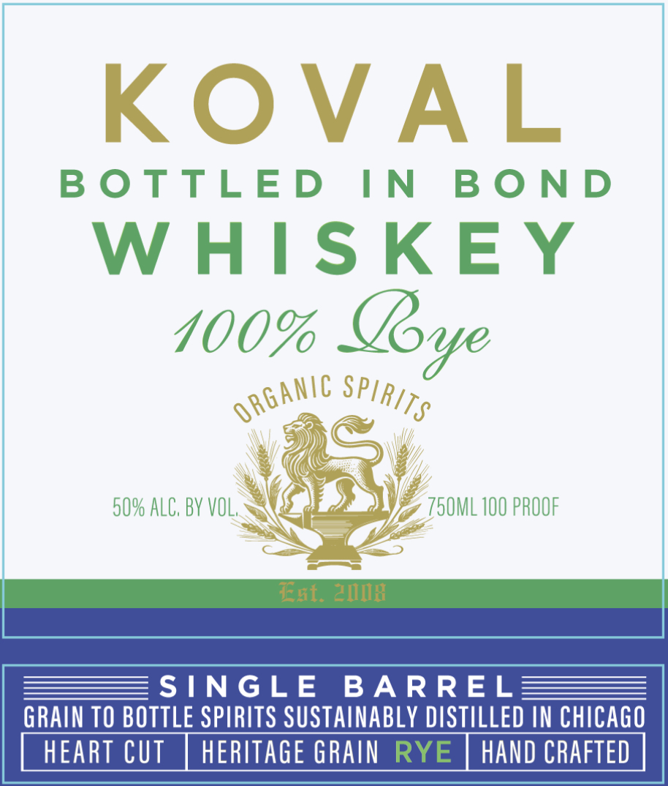

# TTB COLA Label Images - TTBID 26149001000324

**Brand Name:** KOVAL

**Issue Date:** 06/04/2026

**Origin Code:** 04

**Product Class/Type:** 119

**Source:** [TTB Public COLA Registry](https://ttbonline.gov/colasonline/viewColaDetails.do?action=publicFormDisplay&ttbid=26149001000324)

## Label Images

### Back Label

### Front Label

## Extracted Label Text

*Text extracted via OCR - may contain errors*

**Detected Proof:** 100

### Back Label

At KOVAL, true excellence means more than what's in the
glass. It's a commitment to how our spirits are made, how
the land is treated, and the footprint we leave in bringing
each
bottle to
you:
We
source
organic, regenerative
grains from local farmers, viewing sustainability not just
as
production standard, but as
responsibility to the
earth:
Our
small
batch
single
barrel
whiskeys
are
produced with unique mashbills, utilizing only the heart
cut of the distillate; creating a brighter; more refined spirit
that reflects our uncompromising dedication to quality:
BARREL No
8
50786
00684
6
DISTHLLED AND BOTTLED BY KOVAL INC. CHICAGO, HL
DSP-IL-75005
CERTIFIED ORGANIC by Midwest Organic Services Association
Distilled from Organic Grain*
USDA
ORgaMIC
Mashbill: 100% Rye `
GOVERNMENT WARNING;
ACcORDInG TO THE  SURGEON GENERAL,
WOMEN   SHOULD
NOT_DRINK   alcoholIc
BEVERAGES   DURING
PREGNANCY BECAUSE OF THE RISK OF BIRTH DEFECTS (2) CONSUMPTION
OF ALCOHOLIC BEVERAGES IMPAIRS YOUR ABILITY TO DRIVE A CAR OR
OPERATE MACHINERY, AND MAy CAUSE HEALTH PROBLEMS
ME 15c / VT 15c
IA 5c |CA CRV

### Front Label

BOTTLED IN BOND

WHISKEY
100% Lye

50% ALC, BY VOL. a V) 7 T50ML 100 PROOF

SINGLE BARREL

GRAIN TO BOTTLE SPIRITS SUSTAINABLY DISTILLED IN CHICAGO

HEART CUT | HERITAGE GRAIN HAND CRAFTED
