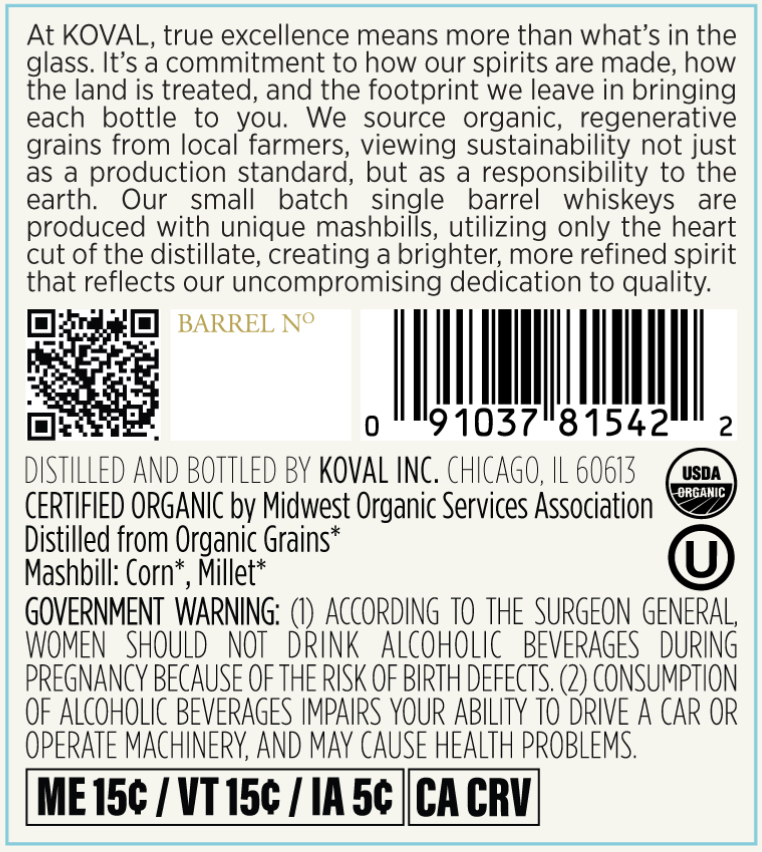
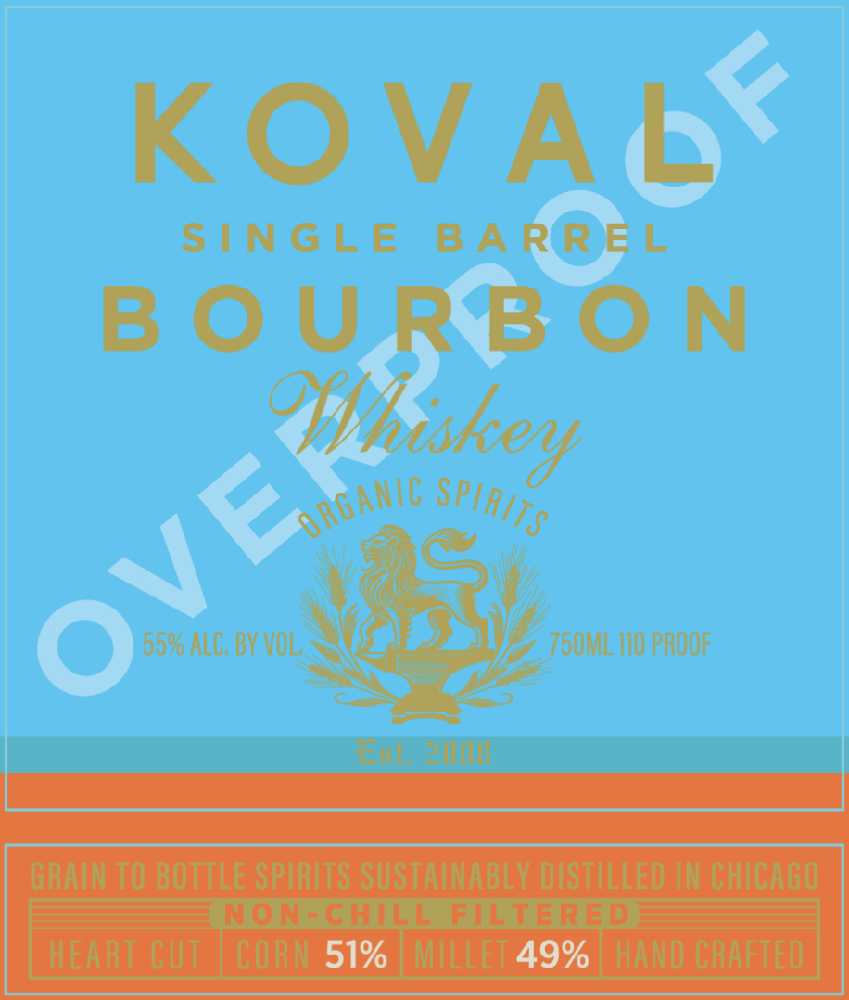

# TTB COLA Label Images - TTBID 26149001000330

**Brand Name:** KOVAL

**Issue Date:** 06/02/2026

**Origin Code:** 04

**Product Class/Type:** 141

**Source:** [TTB Public COLA Registry](https://ttbonline.gov/colasonline/viewColaDetails.do?action=publicFormDisplay&ttbid=26149001000330)

## Label Images

### Back Label

### Front Label

## Extracted Label Text

*Text extracted via OCR - may contain errors*

### Back Label

At KOVAL, true excellence means more than what's in the
glass. It's a commitment to how our spirits are made; how
the land is treated, and the footprint we leave in bringing
each
bottle
to
you:
We
source
organic; regenerative
grains from local farmers, viewing sustainability not just
as a
production standard, but as
responsibility to the
earth:
Our
small
batch
single
barrel
whiskeys
are
produced with unique mashbills, utilizing only the heart
cut of the distillate; creating a brighter; more refined spirit
that reflects our uncompromising dedication to quality:
BARREL No
0
"91037"81542
2
DISTILLED And BOTTLed BY Koval INC, chCAGO, IL 60613
USDA
ORGANIC
CERTIFIED ORGANIC by Midwest Organic Services Association
Distilled from Organic Grains*
Mashbill: Cornt
Millet*
GOVERNMENT WARNING;
ACcORDING TO THE SURGEON GENERAL,
WOMEN   SHOULD
NOT   DrinK  ALCoHOLic   BEVERAGES  DURING^
pReGNANCY BECAUSE OFTHE RISK OF BIRTH DEFECTS (2) conSuMPTION
OF ALCOHOLIC BEVERAGES IMPAIRS YOUR ABILITY TO DRIVE A CAR OR
OPERATE MACHINERY, AND May CAUSE HEALTH PROBLEMS
ME I5c / VT 15c
IA 5c
CA CRV

### Front Label

[if Gore a 7 si

i ‘ : vy pea

> * Tee wy ay boy [eal
GRAIN TO BOTTLE SPIRITS SUSTAINABLY DISTILLED IN CHICAGO
/_NON-CHILL FILTERED:
| HEART CUT | CORN 5196 | MILLET 4996| HAND CRAFTED
