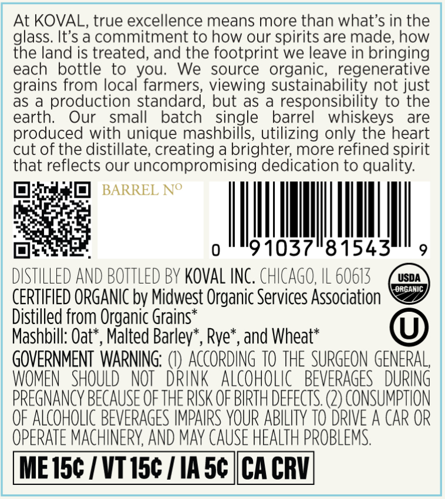
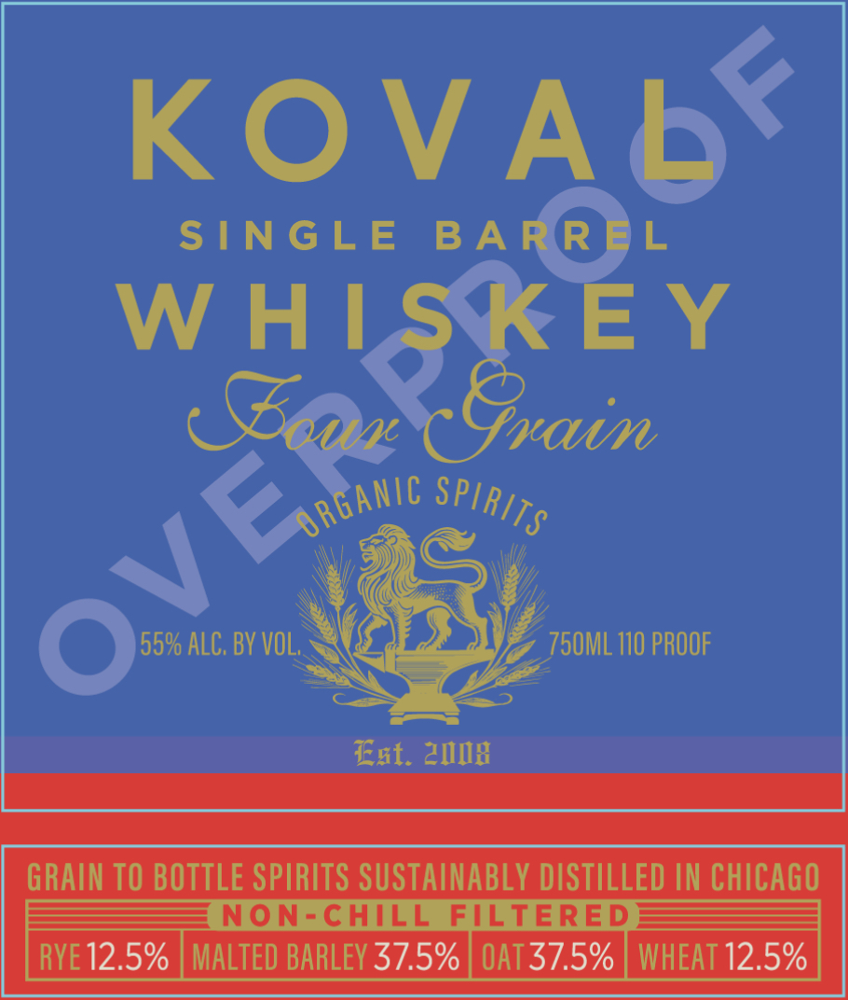

# TTB COLA Label Images - TTBID 26149001000333

**Brand Name:** KOVAL

**Issue Date:** 06/02/2026

**Origin Code:** 04

**Product Class/Type:** 140

**Source:** [TTB Public COLA Registry](https://ttbonline.gov/colasonline/viewColaDetails.do?action=publicFormDisplay&ttbid=26149001000333)

## Label Images

### Back Label

### Front Label

## Extracted Label Text

*Text extracted via OCR - may contain errors*

### Back Label

At KOVAL, true excellence means more than what's in the
glass. It's a commitment to how our spirits are made; how
the land is treated, and the footprint we leave in bringing
each
bottle to
We
source
organic; regenerative
grains from local farmers; viewing sustainability not just
as
production standard, but as
responsibility to the
earth:
Our
small
batch
single
barrel
whiskeys
are
produced with unique mashbills, utilizing only the heart
cut of the distillate; creating a brighter; more refined spirit
that reflects our uncompromising dedication to quality:
BARREL No
0
91037"81543
DISTHLLED AND BOTTLED BV KovAL INC. ChICAGO, IL 60613
USDA
€RGANIC
CERTIFIED ORGANIC by Midwest Organic Services Association
Distilled from Organic Grains*
Mashbill: Oat*, Malted Barlev*, Rye*, and Wheat*
GOVERNMENT  WARNING; () ACcORDING TO THE SURGEON GENERAL,
WOMEN   SHOULD   NOT
DrinK   ALcohoLic   BEVERAGES  DURING
PREGNANCY BECAUSE OF THE RISK OF BIRTH deFECTS: (2) conSumptIoN
OF ALCOHOLIC BEVERAGES IMPAIRS YOUR ABILITY TO DRIVE A CAR OR
OPERATE MACHINERY AND May CAUSE HEALTH PROBLEMS
ME 15c / VT 15c
IA 5c
CA CRV
you;

### Front Label

KOVA

SINGLE BARR)L
W HI EY

FOWH

a
Osun iv?

Est. ang

GRAIN TO BOTTLE SPIRITS SUSTAINABLY DISTILLED IN CHICAGO

SSS NON-CHILL FILTERED BSS

RYE 12.5% | MALTED BARLEY 37.5% | OAT 37.5% | WHEAT 12.5%
