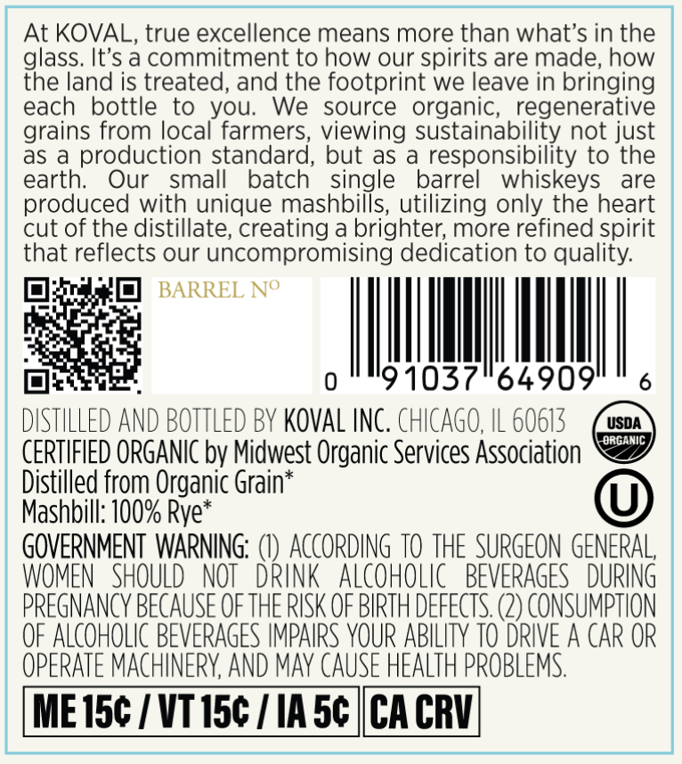
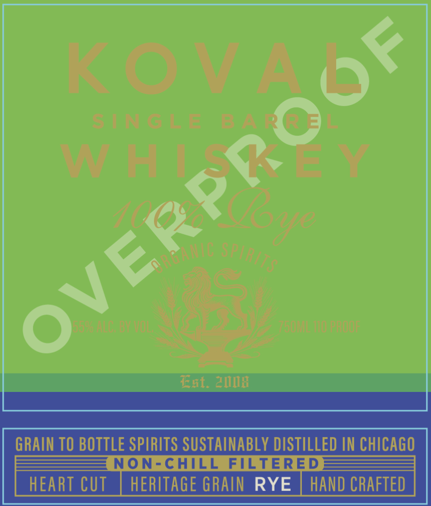

# TTB COLA Label Images - TTBID 26149001000336

**Brand Name:** KOVAL

**Issue Date:** 06/02/2026

**Origin Code:** 04

**Product Class/Type:** 140

**Source:** [TTB Public COLA Registry](https://ttbonline.gov/colasonline/viewColaDetails.do?action=publicFormDisplay&ttbid=26149001000336)

## Label Images

### Back Label

### Front Label

## Extracted Label Text

*Text extracted via OCR - may contain errors*

### Back Label

At KOVAL, true excellence means more than what's in the
glass. It's a commitment to how our spirits are made; how
the land is treated, and the footprint we leave in bringing
each
bottle
to
you:
We  source organic;  regenerative
grains from local farmers; viewing sustainability not just
as
production standard, but as
responsibility to the
earth:
Our
small
batch
single
barrel
whiskeys
are
produced with unique mashbills, utilizing only the heart
cut of the distillate; creating a brighter; more refined spirit
that reflects our uncompromising dedication to quality:
BARREL No
0
91037
64909
DISTILLED ANd BOTTLED BV KovAl INC. ChICAGO, IL 60613
USDA
ORGANIC
CERTIFIED ORGANIC by Midwest Organic Services Association
Distilled from Organic Grain
Mashbill: 100% Rye:
GOVERNMENT WARNING;
ACcORDING TO THE SURGEON GENERAL,
WOMEN   SHOULD
NOT   Drink   ALcoHoLic   BEVERAGES  DURING
PREGNANCY BECAUSE OF THE RISK OF BIRTH deFECTS: (2) consumpthon
OF ALCOHOLIC BEVERAGES IMPAIRS YOUR ABILITY TO DRIVE A CAR OR
OPERATE MACHINERY AND may CAUSE HEALTH PROBLEMS:
ME 15c / VT I5c
IA 5c
CA CRV|

### Front Label

U96}

R ( =
3ev8
02,
1

Fxt. 2IIB
GRAIN TO BOTTLE SPIRITS SUSTAINABLY DISTILLED IN CHICAGO
NON-CHILL
FILTERED
HEART CUT
HERITAGE GRAIN RYE
HAND CRAFTED
OVE
Eo
