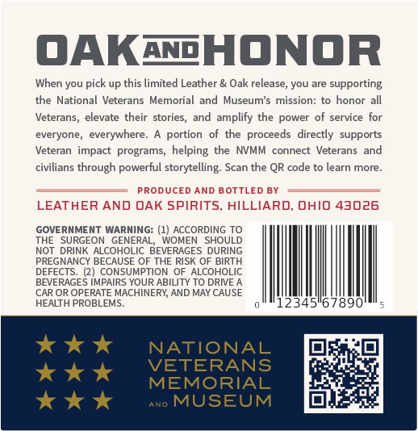
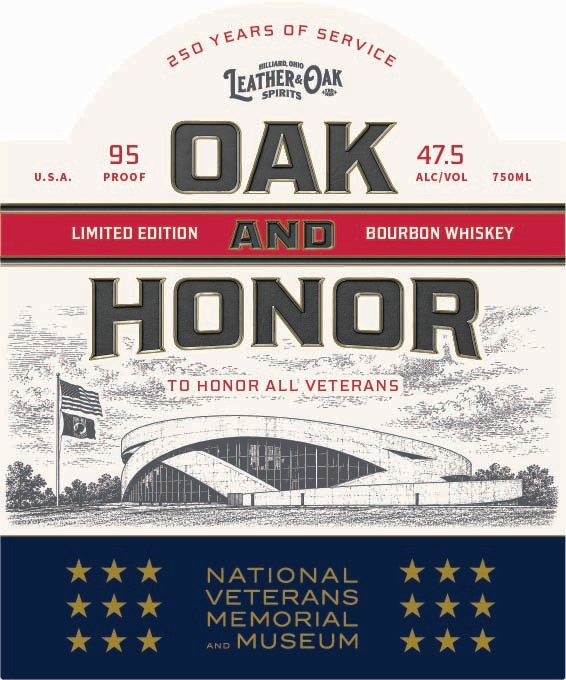

# TTB COLA Label Images - TTBID 26149001000338

**Brand Name:** OAK AND HONOR

**Issue Date:** 06/02/2026

**Origin Code:** 09

**Product Class/Type:** 101

**Source:** [TTB Public COLA Registry](https://ttbonline.gov/colasonline/viewColaDetails.do?action=publicFormDisplay&ttbid=26149001000338)

## Label Images

### Back Label

### Front Label

## Extracted Label Text

*Text extracted via OCR - may contain errors*

**Detected Proof:** 95

### Back Label

OAKaHONOR
When you pick up this limited Leather & Oak release, you are supporting
the National Veterans Memorial and Museum's mission: to honor all
Veterans
elevate their
stories
and amplify the
power of service for
everyone, everywhere_
portion   of the proceeds  directly  supports
Veteran
impact programs; helping the NVMM
connect Veterans  and
civilians through powerful storytelling:
the
QR code to learn more
PRODUCED AND BOTTLED BY
LEATHER AND OAK SPIRITS; HILLIARD, ohIO 43026
GOVERNMENT WARNING: (1} ACCORDING TO
THE
SURGEON GENERAL;
WOMEN
SHOULD
NOT DRINK ALCOHOLIC BEVERAGES DURING
PREGNANCY BECAUSE OF THE RISK OF BIRTH
DEFECTS_
CONSUMPTION
OF ALCOHOLIC
BEVERAGES IMPAIRS YOUR ABILITY TO DRIVE A
CAR OR OPERATE MACHINERY; AND MAY CAUSE
HEALTH PROBLEMS_
12345
NATIONAL
VETERANS
MEMORIAL
AND
MUSEUM
Scan

### Front Label

0F
Lezrroak
U.S.A.
PROOF
95
OAK
4716
T50ML
LIMITED EDITION
AND
BOVRBON WHISKEY
honor
TO HONOR ALL VETERANS
NATIONAL
VETERANS
MEMORIAL
ANO
MUSEUM
YEARS
SERVICE
250
