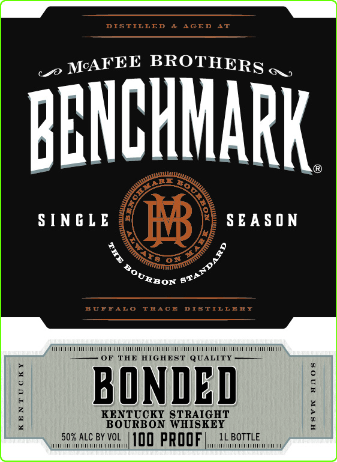
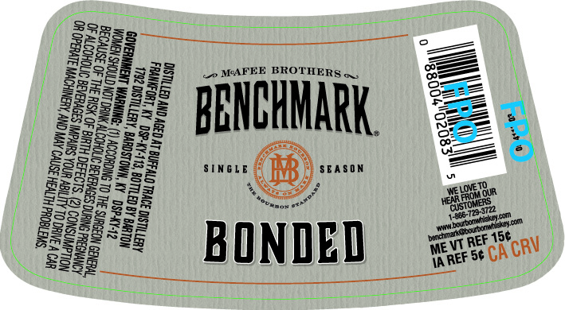

# TTB COLA Label Images - TTBID 26149001000611

**Brand Name:** BENCHMARK

**Issue Date:** 06/02/2026

**Origin Code:** 22

**Product Class/Type:** 101

**Source:** [TTB Public COLA Registry](https://ttbonline.gov/colasonline/viewColaDetails.do?action=publicFormDisplay&ttbid=26149001000611)

## Label Images

### Front Label

### Label 2

## Extracted Label Text

*Text extracted via OCR - may contain errors*

**Detected Proof:** 100

### Front Label

_o WAFEE BROTHERS ,,

BENCHMARK

SINGLE

SEASON

RRon 6F”

iii ra TT OTT VT TOOT TTT NOTIN TTT

E HIGHEST QUALITY ——

BONDED

2

KENTUCKY STRAIGHT

BOURBON WHISKEY

IL BOTTLE

uci ninunanennii

50% ALC BY VOL

|100 PROOF)

PTET

### Label 2

feet peer ETT

\ a Lo MAFEE BROTHERS, & i

| Bagse 288 ee |
HCY BENCHMARK = ‘
 «=§8935 555 * 2

| a SINGLE SEASON = i
Bae ae
| ggeee2e5 moe Ze
OP BONDED get
