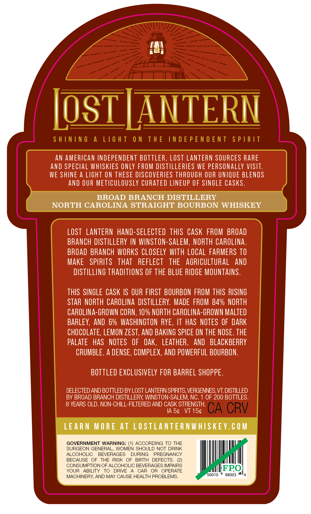
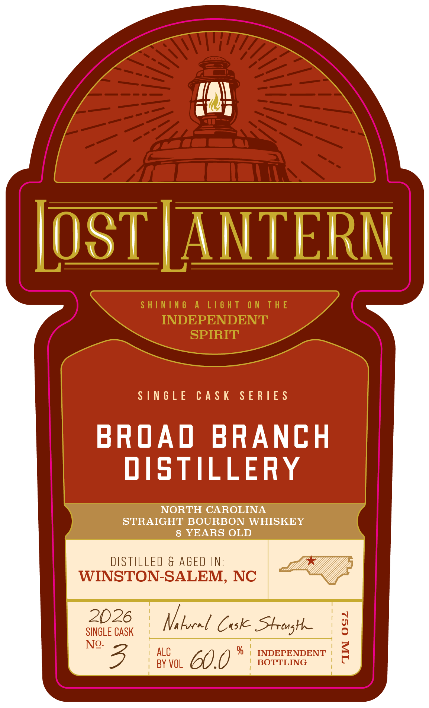

# TTB COLA Label Images - TTBID 26149001000632

**Brand Name:** LOST LANTERN

**Issue Date:** 06/05/2026

**Origin Code:** 46

**Product Class/Type:** 101

**Source:** [TTB Public COLA Registry](https://ttbonline.gov/colasonline/viewColaDetails.do?action=publicFormDisplay&ttbid=26149001000632)

## Label Images

### Back Label

### Front Label

### Label 2

## Extracted Label Text

*Text extracted via OCR - may contain errors*

**Detected Age:** 8 Years

### Back Label

Ip\
ia
USI IA |
| 5 \

AN AMERICAN INDEPENDENT BOTTLER, LOST LANTERN SOURCES RARE
AND SPECIAL WHISKIES ONLY FROM DISTILLERIES WE PERSONALLY VISIT.
WE SHINE A LIGHT ON THESE DISCOVERIES THROUGH OUR UNIQUE BLENDS

AND OUR METICULOUSLY CURATED LINEUP OF SINGLE CASKS.
BROAD BRANCH DISTILLERY
NORTH CAROLINA STRAIGHT BOURBON WHISKEY
LOST LANTERN HAND-SELECTED THIS CASK FROM BROAD
BRANCH DISTILLERY IN WINSTON-SALEM, NORTH CAROLINA.
BROAD BRANCH WORKS CLOSELY WITH LOCAL FARMERS 10
MAKE SPIRITS THAT REFLECT THE AGRICULTURAL AND
DISTILLING TRADITIONS OF THE BLUE RIDGE MOUNTAINS.
THIS SINGLE CASK IS OUR FIRST BOURBON FROM THIS RISING
STAR NORTH CAROLINA DISTILLERY. MADE FROM 84% NORTH
CAROLINA-GROWN CORN, 10% NORTH CAROLINA-GROWN MALTED
BARLEY, AND 6% WASHINGTON RYE, IT HAS NOTES OF DARK
CHOCOLATE, LEMON ZEST, AND BAKING SPICE ON THE NOSE. THE
PALATE HAS NOTES OF OAK, LEATHER, AND BLACKBERRY
CRUMBLE. A DENSE, COMPLEX, AND POWERFUL BOURBON.
BOTTLED EXCLUSIVELY FOR BARREL SHOPPE.
SELECTED AND BOTTLED BY LOST LANTERN SPIRITS, VERGENNES, VT. DISTILLED
BY BROAD BRANCH DISTILLERY, WINSTON-SALEM, NC. 1 OF 200 BOTTLES.

8 YEARS OLD. NON-CHILL-FILTERED AND CASK STRENGTH.
IAS¢ VT 15¢
LEARN MORE AT LOSTLANTERNWHISKEY.COM
GOVERNMENT WARNING: (1) ACCORDING TO THE
SURGEON GENERAL, WOMEN SHOULD NOT DRINK
ALCOHOLIC BEVERAGES DURING PREGNANCY
EECAURE GF tHE Hise Gr leu SEREETS 2)
rate Met ave cae ot one FPO,
MACHINERY, AND MAY CAUSE HEALTH PROBLEMS. 50010 98003 "4

### Front Label

in

IOST | ANTERI

SINGLE CASK SERIES

BROAD BRANCH

DISTILLERY

NORTH CAROLINA

STRAIGHT BOURBON WHISKEY

8 YEARS OLD

DISTILLED & AGED IN:

WINSTON-SALEM, NC

2026

a

SINGLE CASK

Vi locel Cok Strong

°)

No. B

| ALC

| BY VOL

CUY

% | INDEPENDENT

BOTTLING

7

S

### Label 2

SHINING A LIGHT ON THE INDEPENDENT SPIRIT —— ene ~~ Li¥idS LNJON3Jd SONI JHL NO LHSIT V SNINIHS
camel
ci =
Se
