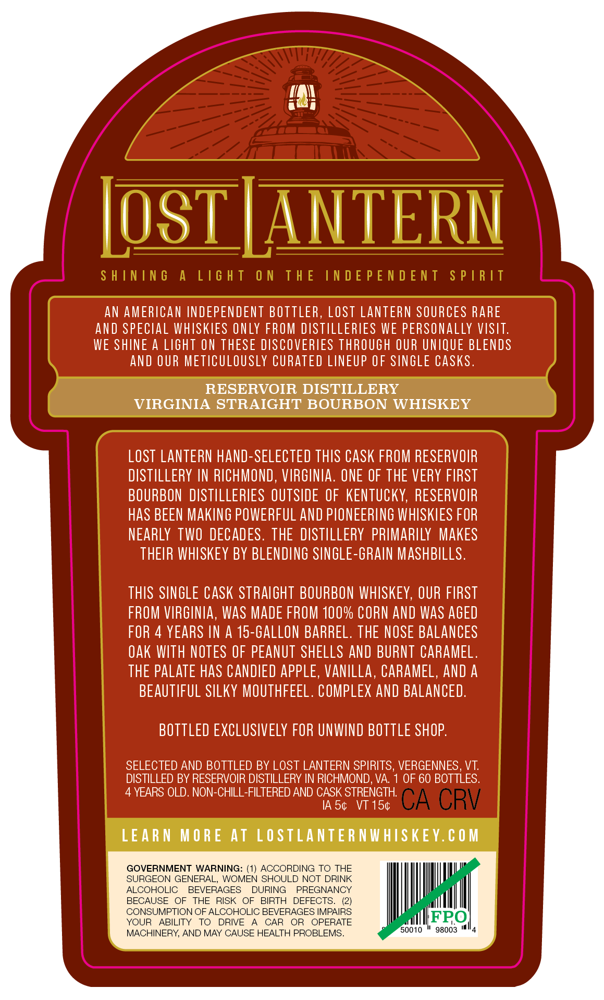
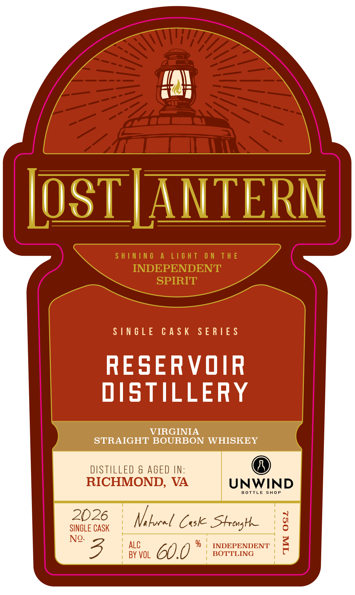

# TTB COLA Label Images - TTBID 26149001000685

**Brand Name:** LOST LANTERN

**Issue Date:** 06/03/2026

**Origin Code:** 46

**Product Class/Type:** 101

**Source:** [TTB Public COLA Registry](https://ttbonline.gov/colasonline/viewColaDetails.do?action=publicFormDisplay&ttbid=26149001000685)

## Label Images

### Back Label

### Front Label

### Label 3

## Extracted Label Text

*Text extracted via OCR - may contain errors*

**Detected Age:** 4 Years

### Back Label

LoST LANTERN
S H ININ 6
A
L16 H T
0 N
T h E
IN D E P E N D E NT
S P |R /T
AN AMERICAN INDEPENDENT BOTTLER, Lost LANTERN SOURCES RARE
and SPECLAL WHISKIES €NLY FROM DISTILLERTES WE PERSONALLY VISTT.
WE SHINE A LIGHT ON THESE DISCOVERIES THROUGH OUR UNIQUE BLENDS
AND OUR METICULOUSLY CURATED LINEUP OF SINGLE CaSks .
RESERVOIR DISTILLERY
VIRGINIA STRAIGHT BOURBON WHISKEY
LOST LANTERN hand-SELECTED ThIS CASK FROM RESERVOIR
DISTILLERY IN RICHMOND , VIRGINIA . ONE OF THE VERY FIRST
BOURBON  DISTILLERIES OUTSIDE OF  KENTUCKY, RESERVOIR
HaS BEEN MAKING POWERFUL AND PLONEERING WHISKIES FOR
NEARLY TWO DECADES . THE DISTLLERY PRIMARILY  MAKES
THEIR WHISKEY BY BLENDING SINGLE-GRAIN MASHBILLS .
THIS SINGLE CASK STRAIGHT BOURBON WHISKEY, OUR FIRST
FROM VIRGINIA, WaS MADE FROM 100% CORN AND WaS AGEd
FOR 4 YEARS IN A 15-GALLON BARREL. THE NOSE BALANCES
Oak WITH NOTES OF PEANUT SHELLS AND BURNT CARAMEL.
THE PALATe haS CANDIED APpLE, VanIlLa, CARAMEL, AND A
BEAUTIFUL SLLKY MOUTHFEEL . COMPLEX aND BALANCED.
BOTTLED EXCLUSIVELY FOR UNWIND BOTTLE SHOP.
SELECTED AND BOTTLED BY LOST LANTERN SPIRITS, VERGENNES, VT:
DISTILLED BY RESERVOIR DISTILLERY IN RICHMOND, VA
OF 60 BOTTLES.
YEARS OLD. NON-CHILL-FILTERED AND CASK STRENGTH
IA 54
VT 154
CA CRV
LEAR N
M 0 R E AT
LO STLANTER NWHISKEY.€ 0 M
GOVERNMENT WARNING: (1) ACCORDING TO THE
SURGEON GENERAL, WOMEN SHOULD NOT DRINK
ALCOHOLIC
BEVERAGES
DURING
PREGNANCY
BECAUSE
OF
THE
RISK
OF
BIRTH
DEFECTS
CONSUMPTION OF ALCOHOLIC BEVERAGES IMPAIRS
YOUR
ABILITY
TO
DRIVE
CAR
OR
OPERATE
FRO
MACHINERY; AND MAY CAUSE HEALTH PROBLEMS_
50010
98003

### Front Label

in

IOSTJANTERN

SINGLE CASK SERIES

RESERVOIR

DISTILLERY

Vv

N

STRAIGHT BOURBON WHISKEY

UNWIND

BOTTLE SHOP

SINGLE CASK

2026

Vi locel Cok Strong

“3

| ALC

| BY VOL

CUY

% | INDEPENDENT

BOTTLING

### Label 3

SHINING A LIGHT ON THE INDEPENDENT SPIRIT —— ene ~~ Li¥idS LNJON3Jd SONI JHL NO LHSIT V SNINIHS
camel
ci =
Se
