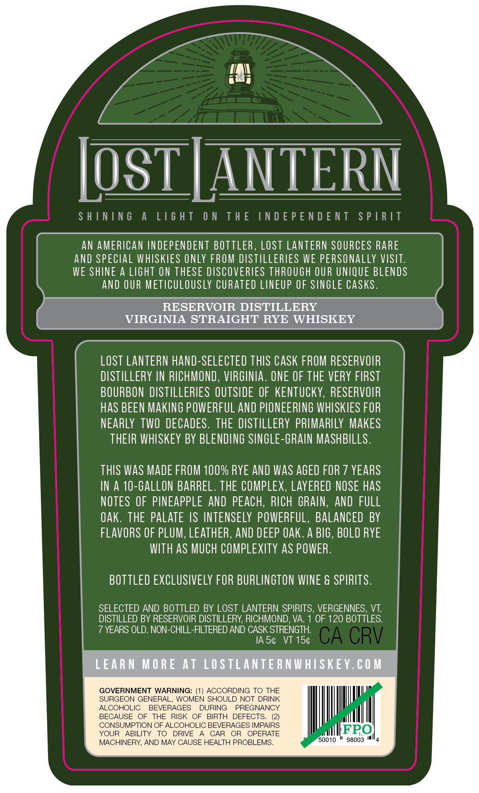
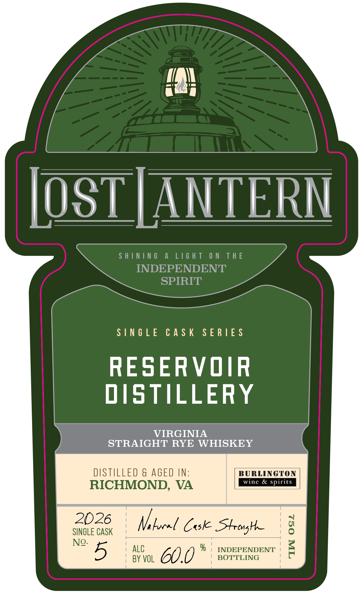

# TTB COLA Label Images - TTBID 26149001000688

**Brand Name:** LOST LANTERN

**Issue Date:** 06/05/2026

**Origin Code:** 46

**Product Class/Type:** 102

**Source:** [TTB Public COLA Registry](https://ttbonline.gov/colasonline/viewColaDetails.do?action=publicFormDisplay&ttbid=26149001000688)

## Label Images

### Back Label

### Front Label

### Label 2

## Extracted Label Text

*Text extracted via OCR - may contain errors*

**Detected Age:** 7 Years

### Back Label

LosTLANTERN
S H [NIN 6
A
L[6 H T
0 N
TH E
IN D E P E N D E NT
S P | R IT
AN AMERICAN INDEPENDENT BOTTLER, Lost LANTERN SOURCES RARE
and SPECIAL WHISKIES ONLY FROM DSTILLERIES WE PERSONALLY VISIT:
WE SHINE A LIGhT ON THESE DISCOVERIES THROUGH OUR UNIQUE BLENDS
ANd OUR METICULOUSLY CURATED LINEUP OF SINGLE CASKS .
RESERVOIR DISTILLERY
VIRGINIA STRAIGHT RYE WHISKEY
LOST LANTERN hand-SELECTED THIS CASK FROM RESERVOIR
DISTILLERY IN RICHMOND , VIRGINIA . ONE OF THE VERY FIRST
BOURBON DISTILLERIES OUTSIDE OF  KENTuCKY, RESERVOIR
HaS BEEN MAKINg POWERFUL And PLONEERING WHISKIES FOR
NEARLY   TWO DECADES . THE DISTILLERY PRIMARILY MAKES
THEIR WHISKEY BY BLENDING SINGLE-GRAIN MASHBILLS .
THIS WAS MADE FROM 100% RYE AND WaS AGED FOR 7 YEARS
IN A 10-Gallon BARREL . THE COMPLEX, LAyERED NOSE HaS
NOTES OF PINEAPPLE AND PEAcH;
RICH GRAIN,
And FULL
oak. THE PALATE IS INTENSELY POWERFUL,
BALANCED BY
FLAVORS OF PLUM, LEATHER, AND DEEP OAk. A BIG , BOLD RYE
WTH aS MUCH COMPLEXITY aS POWER.
BOTTLED EXCLUSIVELY FOR BURLINGTON WINE & SPIRITS .
SELECTED AND BOTTLED BY LOST LANTERN SPIRITS, VERGENNES, VT:
DISTILLED BY RESERVOIR DISTILLERY; RICHMOND, VA
OF 120 BOTTLES:
7 YEARS OLD. NON-CHILL-FILTERED AND CASK STRENGTH
IA 54
VT 154
CA CRV
LEARN
M 0 RE
At LOSTLANTE RNWHISKEY.€ 0 M
GOVERNMENT WARNING: (1) ACCORDING TO THE
SURGEON GENERAL.
WOMEN SHOULD NOT DRINK
ALCOHOLIC
BEVERAGES
DURING
PREGNANCY
BECAUSE
OF
THE
RISK
OF
BIRTH
DEFECTS
CONSUMPTION OF ALCOHOLIC BEVERAGES IMPAIRS
YOUR
ABILITY
TO
DRIVE
CAR
OR
OPERATE
FRO
MACHINERY, AND MAY CAUSE HEALTH PROBLEMS_
50010
98003

### Front Label

[OST | ANTERN

SHINING A LIGHT ON THE

INDEPENDENT

SPIRIT

SINGLE CASK SERIES

RESERVOIR

DISTILLERY

STRAIGHT RYE WHISKEY

DISTILLED & AGED IN:

BURLINGTON

& si

RICHMOND, VA

2026

SINGLE CASK

Nelocel Case Strong

Neo. 5

ALC

BY VOL

CHU

% | INDEPENDENT

BOTTLING

### Label 2

| SHINING A LIGHT ON THE INDEPENDENT SPIRIT @& ii V LididS LNJONAddONI JHL NO LHSIT V ONINIHS |
