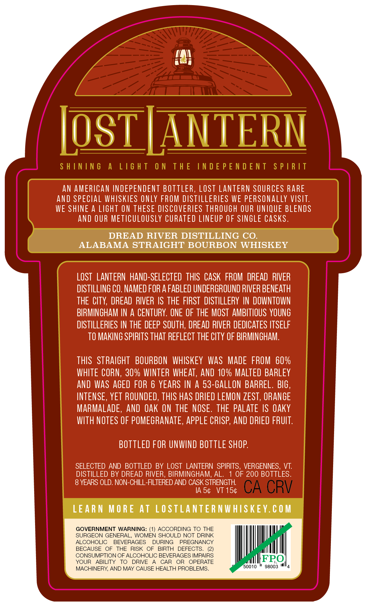
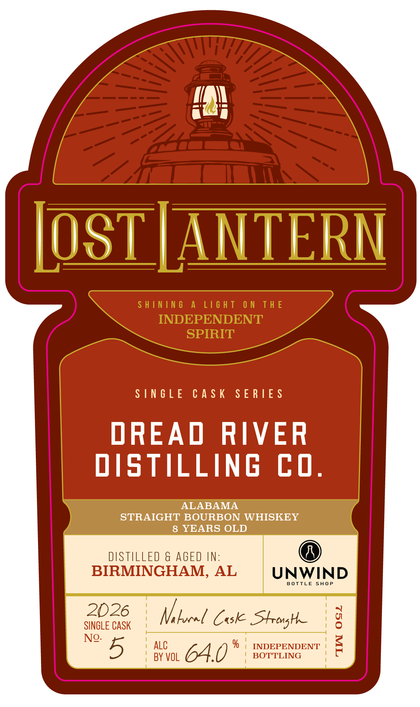

# TTB COLA Label Images - TTBID 26149001000692

**Brand Name:** LOST LANTERN

**Issue Date:** 06/04/2026

**Origin Code:** 46

**Product Class/Type:** 101

**Source:** [TTB Public COLA Registry](https://ttbonline.gov/colasonline/viewColaDetails.do?action=publicFormDisplay&ttbid=26149001000692)

## Label Images

### Back Label

### Front Label

### Label 3

## Extracted Label Text

*Text extracted via OCR - may contain errors*

**Detected Age:** 6 Years

### Back Label

LoST ANTERN
S H ININ 6
A
L16 H T
0 N
T H E
IN D E P E N D E N T
S P |R IT
AN AMERICAN INDEPENDENT BOTTLER, LOSt LANTeRN SOURCES RARE
anD SPECLAL WHISKIES ONLY FROM DISTILLERLES WE PERSONaLlY VISIT:
WE SHINE A LIGHT ON THESE DISCOVERIES THROUGH OUR UNIQUE BLENDS
AND OUR METICULOUSLY CURATED LINEUP OF SINGLE CASks.
DREAD RIVER DISTILLING CO.
ALABAMA STRAIGHT BOURBON WHISKEY
LOST   LANTERN haNd-SELECTED  THIS  CASK FROM  DREAD  RIVER
DISTILLING CO. NAMED FOR A FABLED UNDERGROUND RIVER BENEATH
THE ClTY, DREAD RIVER IS THE FIRST  DISTILLERY IN DOWNTOWN
BIRMINGHAM IN A CENTURY. ONE OF THE MOST  AMBITIOUS YOUNG
DISTILLERIES IN THE DEEP SOUTH, DREAD RIVER DEDICATES ITSELF
TO MAKING SPIRITS THAT REFLECT THE CTY OF BIRMINGHAM.
THIS   STRAIGHT
BOURBON   WHISKEY
waS MADE  FROM  60%
WHITE CORN, 30% WINTER WHEAT, AND 10% MALTED BARLEY
AND WaS AGED FOR 6 YEARS IN A 53-GALLON BARREL . BIG ,
INTENSE, YET ROUNDED, THIS HaS DRIED LEMON ZEST, ORANGE
MARMALADE,
and Oak ON THE NOSE. THE PALATE IS OAKY
WITH NOTES OF POMEGRANATE, appLe CRISP; AND DRIED FRUIT:
BOTTLED FOR UNWIND BOTTLE SHOP
SELECTED AND BOTTLED
BY LOST LANTERN   SPIRITS_
VERGENNES,
VT:
DISTILLED BY DREAD RIVER, BIRMINGHAM, AL.
OF 200 BOTTLES.
8 YEARS OLD. NON-CHILL-FILTERED AND CASK STRENGTH
IA 54
VT 154
CA CRV
LEARN MORE At LOSTLANTER NWHISKEY. € 0 M
GOVERNMENT WARNING: (1) ACCORDING TO THE
SURGEON GENERAL.
WOMEN SHOULD NOT DRINK
ALCOHOLIC
BEVERAGES
DURING
PREGNANCY
BECAUSE
OF
THE
RISK
OF
BIRTH
DEFECTS_
CONSUMPTION OF ALCOHOLIC BEVERAGES IMPAIRS
YOUR
ABILITY
TO
DRIVE
CAR
OR
OPERATE
FRO
MACHINERY AND MAY CAUSE HEALTH PROBLEMS
50010
98003

### Front Label

in

IOSTJANTERN

SINGLE CASK SERIES

DREAD RIVER

DISTILLING CO.

STRAIGHT BOURBON WHISKEY

8 YEARS OLD

DISTILLED & AGED IN:

BIRMINGHAM, AL

UNWIND

BOTTLE SHOP

SINGLE CASK

Vi locel Cok Strong

| ALC

% | INDEPENDENT

No. 5

| BY VOL

64.0

BOTTLING

### Label 3

SHINING A LIGHT ON THE INDEPENDENT SPIRIT —— ene ~~ Li¥idS LNJON3Jd SONI JHL NO LHSIT V SNINIHS
camel
ci =
Se
