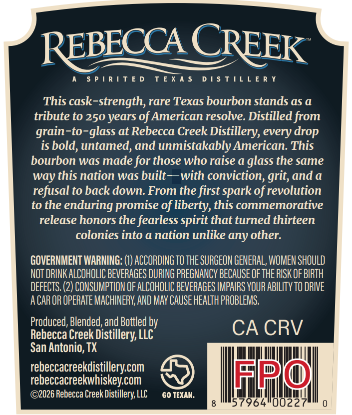
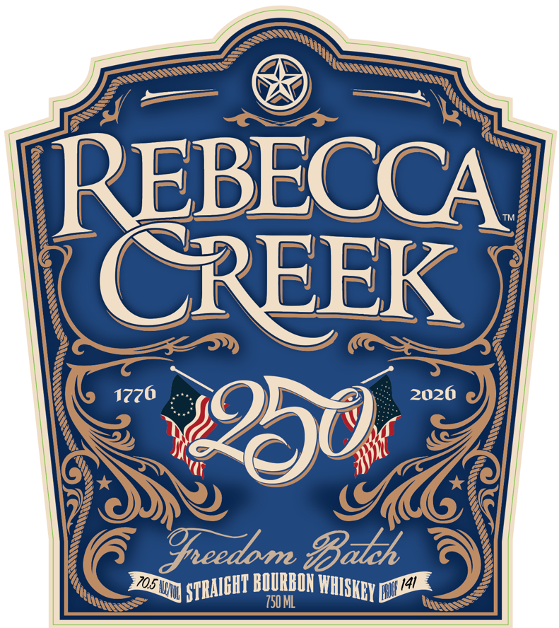

# TTB COLA Label Images - TTBID 26149001000697

**Brand Name:** REBECCA CREEK 250 FREEDOM BATCH

**Issue Date:** 06/10/2026

**Origin Code:** 44

**Product Class/Type:** 101

**Source:** [TTB Public COLA Registry](https://ttbonline.gov/colasonline/viewColaDetails.do?action=publicFormDisplay&ttbid=26149001000697)

## Label Images

### Back Label

### Front Label

## Extracted Label Text

*Text extracted via OCR - may contain errors*

### Back Label

REBECCA CREEK

A SPIRITED TEXAS DISTILLERY

This cask-strength, rare Texas bourbon stands as a

tribute to 250 years of American resolve. Distilled from

grain-to-glass at Rebecca Creek Distillery, every drop

is bold, untamed, and unmistakably American. This

bourbon was made for those who raise a glass the same

way this nation was built—with conviction, grit, and a

refusal to back down. From the first spark of revolution

to the enduring promise of liberty, this commemorative

release honors the fearless spirit that turned thirteen

colonies into a nation unlike any other.

GOVERNMENT WARNING: (1) ACCORDING T0 THE SURGEON GENERAL, WOMEN SHOULD

NOT DRINK ALCOHOLIC BEVERAGES DURING PREGNANCY BECAUSE OF THE RISK OF BIRTH

DEFECTS. (2) CONSUMPTION OF ALCOHOLIC BEVERAGES IMPAIRS YOUR ABILITY TO DRIVE

ACAR OR OPERATE MACHINERY, AND MAY CAUSE HEALTH PROBLEMS,

Produced, Blended, and Bottled by

Rebecca Creek Distillery, LLC

CA CRV

San Antonio, TX

rebeccacreekdistillery.com

IML a PN 0)

FE 1

rebeccacreekwhiskey.com

©2026 Rebecca Creek Distillery, LLC

GO TEXAN.

lit

“il Ae Hh

a Mal

0

### Front Label

REBECCA
CREEK
2026
4930
Epeedom Balch
705
tud
BOURBOH
Da
750 ML
1
1776
ISTRAIGHT E
WHISKEY [
1
