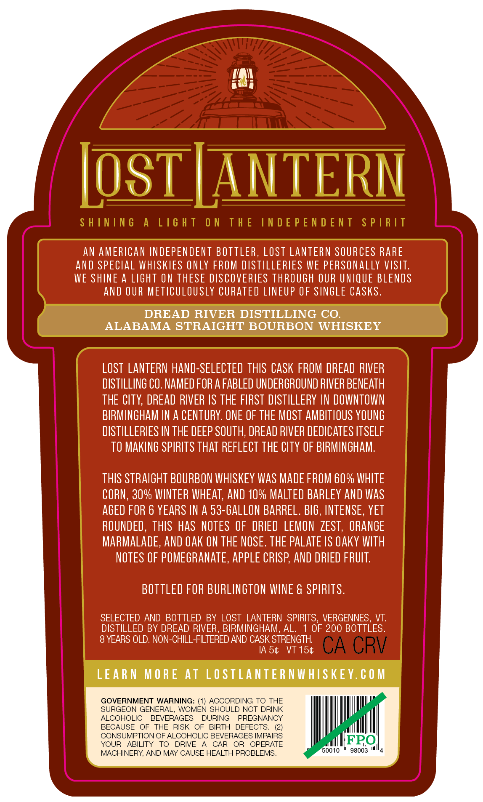
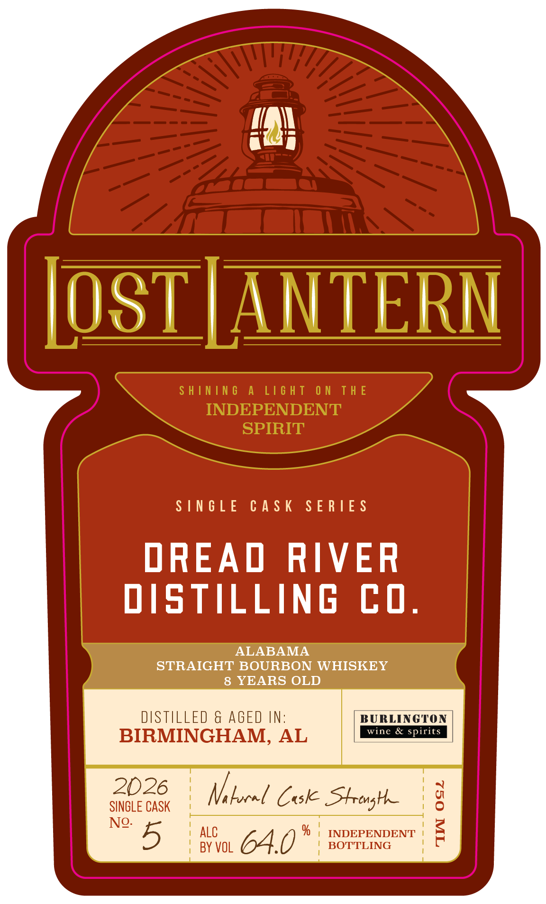

# TTB COLA Label Images - TTBID 26149001000698

**Brand Name:** LOST LANTERN

**Issue Date:** 06/05/2026

**Origin Code:** 46

**Product Class/Type:** 101

**Source:** [TTB Public COLA Registry](https://ttbonline.gov/colasonline/viewColaDetails.do?action=publicFormDisplay&ttbid=26149001000698)

## Label Images

### Back Label

### Front Label

### Label 2

## Extracted Label Text

*Text extracted via OCR - may contain errors*

**Detected Age:** 6 Years

### Back Label

LosT LANTERN
S HININ 6
L16 H T
0 N
T H E
IN D E P E N D E NT
S P | R [T
AN AMERICAN INDEPENDENT BOTTLER, Lost LANTERN SOURCES RARE
and SPECIAL WHISKIES ONLY FROM DISTILLERIES WE PERSONALLY VISIT.
WE SHINE A LIGhT ON THESE DISCOVERIES THROUGH OUR UNIQUE BLENDS
ANd OUR METICULOUSLY CURATED LINEUP OF SINGLE CASks.
DREAD RIVER DISTILLING CO.
ALABAMA STRAIGHT BOURBON WHISKEY
LOST  LANTERN HAND-SELECTED THIS CASK FROM DREAD RIVER
DISTILLING CO. NAMED FOR A FABLED UNDERGROUND RIVER BENEATH
THE CTY, DREAD RIVER /S THE FIRST DISTILLERY IN DOWNTOWN
BIRMINGHAM IN A CENTURY. ONE OF THE MOST AMBITLOUS YOUNG
DISTILLERIES IN THE DEEP SOUTH, DREAD RIVER DEDICATES ITSELF
TO MAKING SPIRITS THAT REFLECT THE CLTY OF BIRMINGHAM:
THIS STRAIGHT BOURBON WHISKEY WaS MADE FROM 60% WHITE
CORN, 30% WINTER WHEAT, AND 10% MALTED BARLEY AND WaS
AGED FOR 6 YEARS IN A 53-GALLON BARREL. BIG, INTENSE , YET
ROUNDED , ThIS HaS NOTES OF  DRIED  LEMON  ZEST,
ORANGE
MARMALADE, ANd Oak ON THE NOSE. THE PALATE IS €aky WITH
NOTES OF POMEGRANATE, appLe CRISP; AND DRIED FRUIT:
BOTTLED FOR BURLINGTON WINE & SPIRITS .
SELECTED AND
BOTTLED BY LOST LANTERN   SPIRITS, VERGENNES,
VT:
DISTILLED BY DREAD RIVER, BIRMINGHAM, AL.
OF 200 BOTTLES.
8 YEARS OLD. NON-CHILL-FILTERED AND CASK STRENGTH
IA 54
VT 154
CA CRV
LEAR N MORE
At LOSTLANTER NWHISKEY. C 0 M
GOVERNMENT WARNING: (1) ACCORDING TO THE
SURGEON GENERAL, WOMEN SHOULD NOT DRINK
ALCOHOLIC
BEVERAGES
DURING
PREGNANCY
BECAUSE
OF
THE
RISK
OF
BIRTH
DEFECTS_
CONSUMPTION OF ALCOHOLIC BEVERAGES IMPAIRS
YOUR
ABILITY
TO
DRIVE
CAR
OR
OPERATE
FRO
MACHINERY; AND MAY CAUSE HEALTH PROBLEMS.
50010
98003

### Front Label

in

IOSTJANTERN

SINGLE CASK SERIES

DREAD RIVER

DISTILLING CO.

ALABAMA

STRAIGHT BOURBON WHISKEY

8 YEARS OLD

DISTILLED & AGED IN:

BURLINGTON

BIRMINGHAM, AL

& sp

2026

SINGLE CASK

Vi locel Cok Strong

No. 5

| ALC

| BY VOL

64.0

% | INDEPENDENT

BOTTLING

### Label 2

SHINING A LIGHT ON THE INDEPENDENT SPIRIT —— ene ~~ Li¥idS LNJON3Jd SONI JHL NO LHSIT V SNINIHS
camel
ci =
Se
