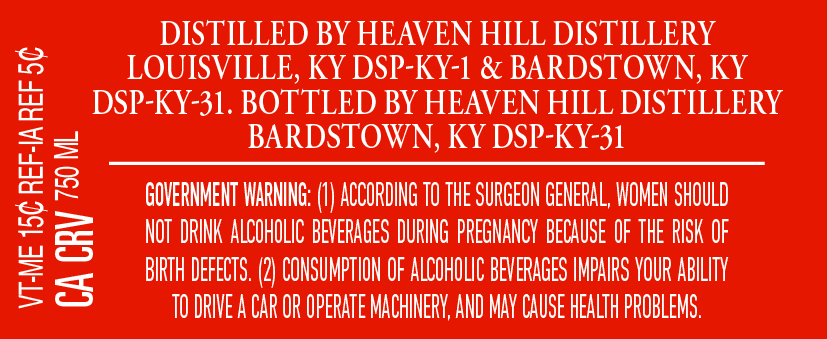
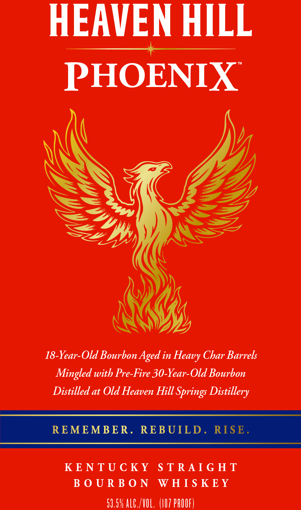
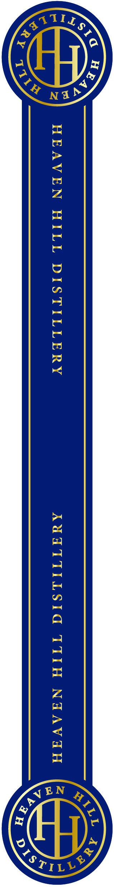

# TTB COLA Label Images - TTBID 26149001000736

**Brand Name:** HEAVEN HILL

**Fanciful Name:** PHOENIX

**Issue Date:** 06/03/2026

**Origin Code:** 22

**Product Class/Type:** 101

**Source:** [TTB Public COLA Registry](https://ttbonline.gov/colasonline/viewColaDetails.do?action=publicFormDisplay&ttbid=26149001000736)

## Label Images

### Back Label

### Label 1

### Label 3

### Label 4

## Extracted Label Text

*Text extracted via OCR - may contain errors*

*2 image(s) excluded: text did not meet readability threshold*

**Detected Proof:** 119

### Back Label

DISTILLED BY HEAVEN HILL DISTILLERY
LOUISVILLE, KY DSP-KY-1 & BARDSTOWN, KY
DSP-KY-31. BOTTLED BY HEAVEN HILL DISTILLERY
BARDSTOWN, KY DSP-KY-31

GOVERNMENT WARNING: (I) ACCORDING 10 THE SURGEON GENERAL, WOMEN SHOULD

NOT DRINK ALCOHOLIC BEVERAGES DURING PREGNANCY BECAUSE OF THE RISK OF

BIRTH DEFECTS. (2) CONSUMPTION OF ALCOHOLIC BEVERAGES IMPAIRS YOUR ABILITY
TODRIVEA CAR OR OPERATE MACHINERY, AND MAY CAUSE HEALTH PROBLEMS.

VT-ME 15¢ REF-IA REF 5¢

CA CRY 70 ML

### Label 1

HEAVEN HILL

Ee

PHOENIX

18-Year-Old Bourbon Aged in Heavy Char Barrels
Mingled with Pre-Fire 30-Year-Old Bourbon
Distilled at Old Heaven Hill Springs Distillery

KENTUCKY STRAIGHT
BOURBON WHISKEY

59.5% ALC./VOL. (107 PROOF)
