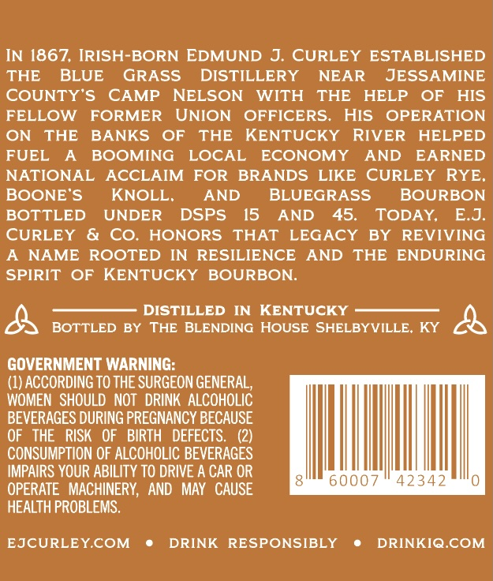
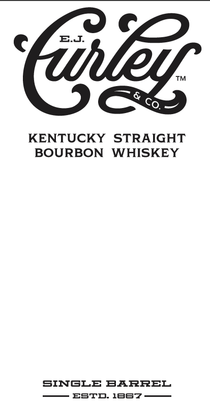
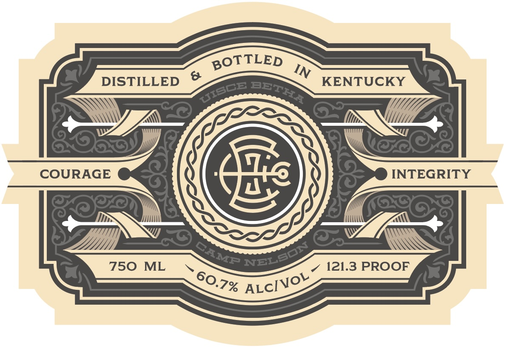
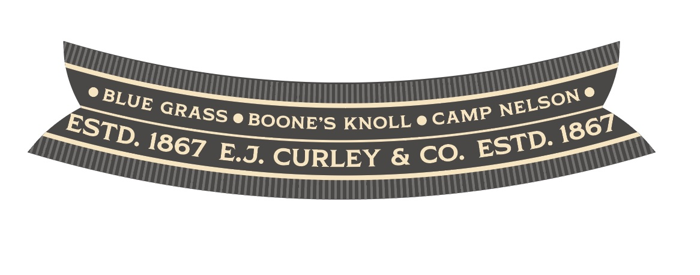
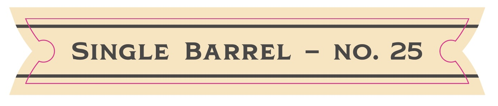

# TTB COLA Label Images - TTBID 26149001000749

**Brand Name:** E.J. CURLEY

**Fanciful Name:** SINGLE BARREL

**Issue Date:** 06/03/2026

**Origin Code:** 22

**Product Class/Type:** 101

**Source:** [TTB Public COLA Registry](https://ttbonline.gov/colasonline/viewColaDetails.do?action=publicFormDisplay&ttbid=26149001000749)

## Label Images

### Back Label

### Front Label

### Label 2

### Label 3

### Label 4

## Extracted Label Text

*Text extracted via OCR - may contain errors*

*1 image(s) excluded: text did not meet readability threshold*

**Detected Proof:** 121.3

### Back Label

IN 1867, IRISH-BORN EDMUND
J CURLEY
ESTABLISHED
THE
BLUE
GRASS
DISTILLERY
NEAR
JESSAMINE
COUNTY'S
CAMP
NELSON
WITH
THE
HELP
OF
HIS
FELLOW
FORMER
UNION
OFFICERS.
HIS
OPERATION
ON
THE
BANKS
OF
THE
KENTUCKY
RIVER
HELPED
FUEL
BOOMING
LOcAL
ECONOMY
AND
EARNED
NATIONAL
AcCLAIM
FOR
BRANDS
LIKE
CURLEY
RYE_
BOONE'S
KNOLL,
AND
BLUEGRASS
BOURBON
BOTTLED
UNDER
DSPS
15
AND
45.
TODAY
EJ
CURLEY
CO;
HONORS
THAT
LEGACY
BY
REVIVING
NAME
ROOTED
IN
RESILIENCE
AND
THE
ENDURING
SPIRIT
OF
KENTUCKY
BOURBON_
DISTILLED IN
KENTUCKY
BOTTLED BY THE BLENDING HOUSE SHELBYVILLE, KY
GOVERNMENT WARNING:
(1) ACCORDING TO THE SURGEON GENERAL,
WOMEN   SHOULD   NOT   DRINK ALCOHOLIC
BEVERAGES DURING PREGNANCY BECAUSE
OF
THE
RISK
OF
BIRTH   DEFECTS
CONSUMPTION OF ALCOHOLIC BEVERAGES
IMPAIRS YOUR ABILITY TO DRIVE A CAR OR
60007
42342
OPERATE   MACHINERY,  AND   MAY  CAUSE
HEALTH PROBLEMS.
EJCURLEYCOM
DRINK
RESPONSIBLY
DRINKIQ.COM

### Front Label

Eu.

KENTUCKY STRAIGHT
BOURBON WHISKEY

SINGLE BARREL
ESTD. 18s7—

### Label 2

BOTTLED
IN
0
DISTILLED
KENTUCKY
COURAGE
9
INTEGRITY
750
ML
121.3 PROOF
BETHA
UISCE
NELSOI
CAMP
60.7%
ALCIVOL

### Label 3

SLUE GRAS

S © BOONE’S KNOLL @ CAMP NELSO

\

30

STD

1867 E.3, CURLEY & CO. EST
