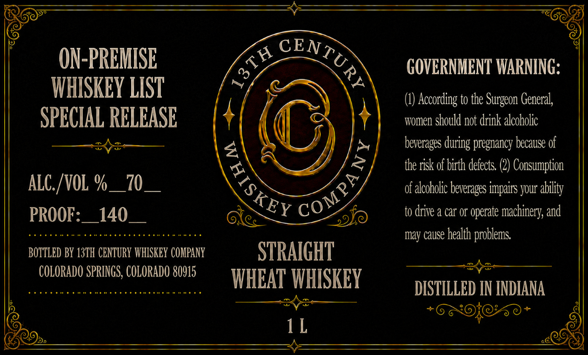

# TTB COLA Label Images - TTBID 26149001000832

**Brand Name:** 13TH CENTURY WHISKEY COMPANY

**Issue Date:** 06/10/2026

**Origin Code:** 13

**Product Class/Type:** 109

**Source:** [TTB Public COLA Registry](https://ttbonline.gov/colasonline/viewColaDetails.do?action=publicFormDisplay&ttbid=26149001000832)

## Label Images

### Label 1

## Extracted Label Text

*Text extracted via OCR - may contain errors*

### Label 1

ON-PREMISE
GOVERNMENT WARNING:
WHISKEY LIST
According to the
General,
SPECIAL RELEASE
Women should not drink alcoholic
beverages during pregnancy because of
the risk of birth defects: (2) Consumption
ALC: /VOL %
70_
0f alcoholic beverages impairs your ability
PROOF =
140
to drive & car o* operate machinery; and
may cause health
' problems
BOTTLED BY 13TH CENTURY WHISKEY COMPANY
STRAIGHT
COLORADO SPRINGS, COLORADO 80915
WHEAT WHISKEY
DISTILLED IN INDIANA
1 L
CENTUR}
5
Surgeon '
)
{
