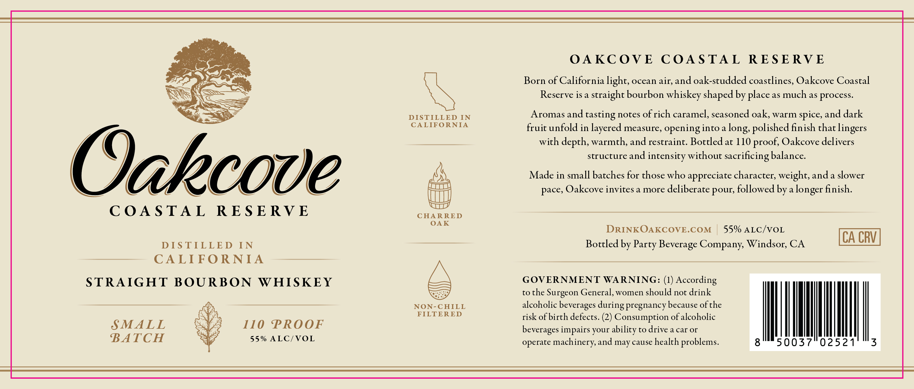

# TTB COLA Label Images - TTBID 26149001000990

**Brand Name:** OAKCOVE

**Issue Date:** 06/22/2026

**Origin Code:** 01

**Product Class/Type:** 101

**Source:** [TTB Public COLA Registry](https://ttbonline.gov/colasonline/viewColaDetails.do?action=publicFormDisplay&ttbid=26149001000990)

## Label Images

### Label 1

## Extracted Label Text

*Text extracted via OCR - may contain errors*

**Detected Proof:** 110

### Label 1

OAKCOVE COASTAL RESERVE

oe

SNS

Born of California light, ocean air, and oak-studded coastlines, Oakcove Coastal

Reserve isa straight bourbon whiskey shaped by place as much as process

2X

SS

Se

DISTILLED IN

Aromas and tasting notes of rich caramel, seasoned oak, warm spice, and dark

CALIFORNIA

fruit unfold in layered measure, opening into a long, polished finish that lingers

with depth, warmth, and restraint. Bottled at 110 proof, Oakcove delivers

structure and intensity without sacrificing balance

bh

mH

Made in small batches for those who appreciate character, weight, and a slower

Onkcove

pace, Oakcove invites a more deliberate pour, followed by a longer finish

COASTAL RESERVE

CHARRED

OAK

DRINKOAKCOVE.COM | 55% ALC/VOL

CA CRV

DISTILLED IN

Bottled by Party Beverage Company, Windsor, CA

CALIFORNIA

STRAIGHT BOURBON WHISKEY

——

—————

———

GOVERNMENT WARNING: (1) According

ET

to the Surgeon General, women should not drink

NON-CHILL

alcoholic beverages during pregnancy because of the

FILTERED

risk of birth defects. (2) Consumption of alcoholic

SMALL

110 PROOF

Es

yy

beverages impairs your ability to drive a car or

yun

BATCH

55% ALC/VOL

operate machinery, and may cause health problems.
