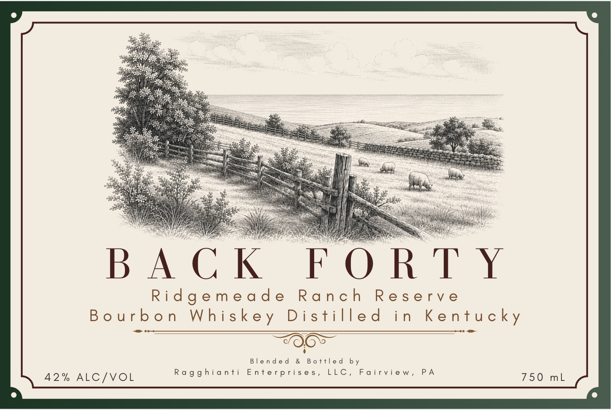

# TTB COLA Label Images - TTBID 26150001000089

**Brand Name:** BACK FORTY

**Fanciful Name:** RIDGEMEADE RANCH RESERVE

**Issue Date:** 06/03/2026

**Origin Code:** 39

**Product Class/Type:** 141

**Source:** [TTB Public COLA Registry](https://ttbonline.gov/colasonline/viewColaDetails.do?action=publicFormDisplay&ttbid=26150001000089)

## Label Images

### Front Label

### Label 2

## Extracted Label Text

*Text extracted via OCR - may contain errors*

*1 image(s) excluded: text did not meet readability threshold*

### Label 2

When Blake Ragghianti began
distilling and blending in 2013, his
intent was to create traditional and

innovative spirits of exemplary
quality. Since then, he has become a

trailblazer in the industry, garnering
international acclaim for his
innovative products and being sought
after for consultation by distillers in
the United States and abroad.
Learn more at
www.blakeragghianti.com
GOVERNMENT WARNING: (1) ACCORDING TO THE
SURGEON GENERAL, WOMEN SHOULD NOT DRINK
ALCOHOLIC BEVERAGES DURING PREGNANCY
BECAUSE OF THE RISK OF BIRTH DEFECTS. (2)
CONSUMPTION OF ALCOHOLIC BEVERAGES IMPAIRS
YOUR ABILITY TO DRIVE A CAR OR OPERATE
MACHINERY, AND MAY CAUSE HEALTH PROBLEMS.
