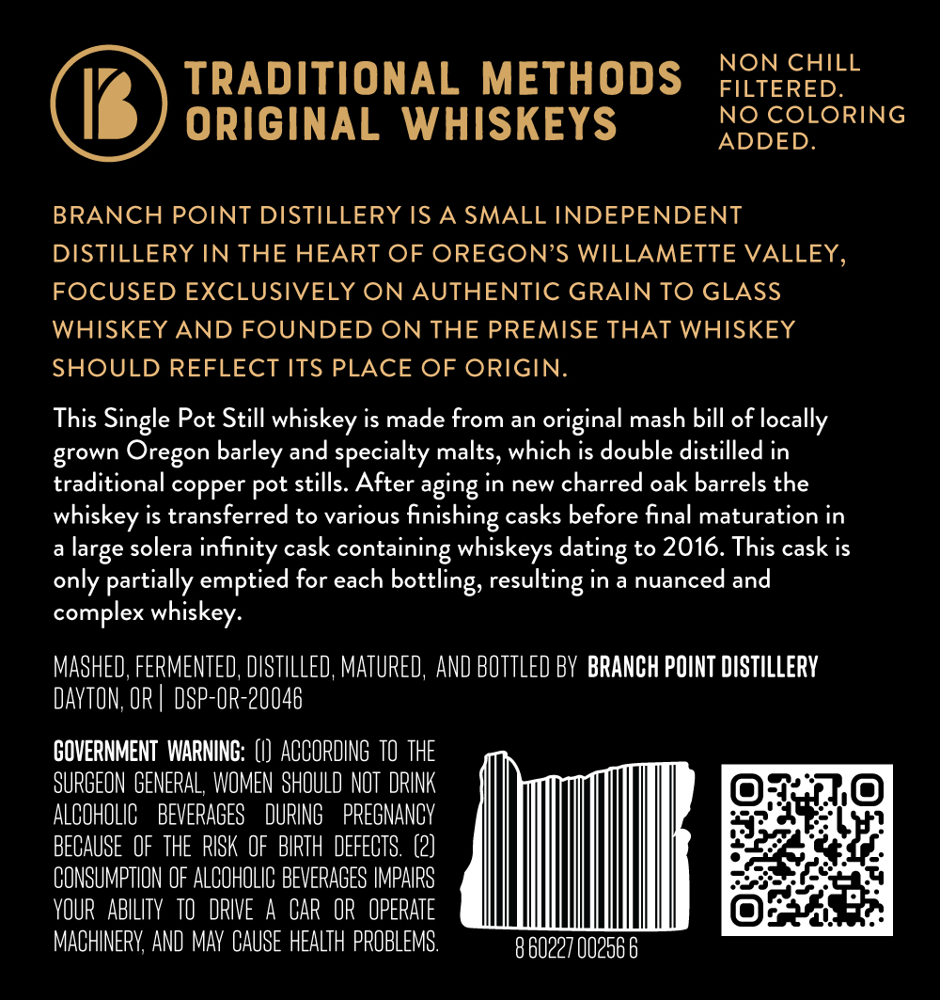
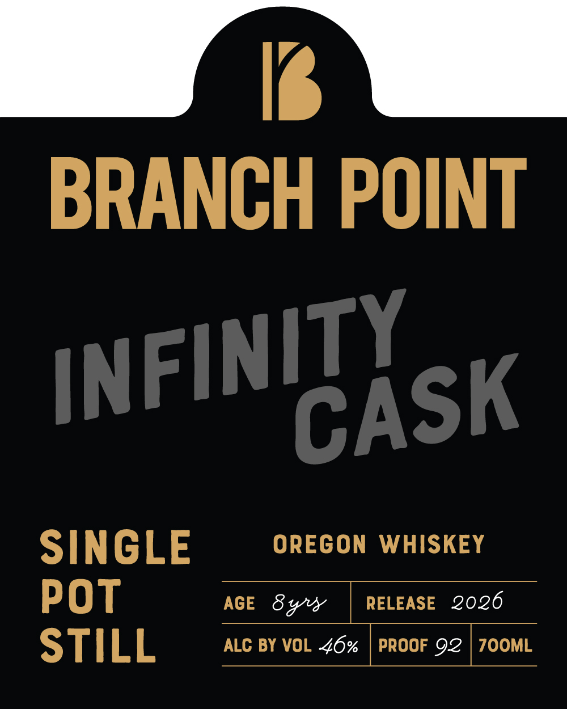

# TTB COLA Label Images - TTBID 26151001000054

**Brand Name:** BRANCH POINT

**Fanciful Name:** INFINITY CASK

**Issue Date:** 06/03/2026

**Origin Code:** 38

**Product Class/Type:** 140

**Source:** [TTB Public COLA Registry](https://ttbonline.gov/colasonline/viewColaDetails.do?action=publicFormDisplay&ttbid=26151001000054)

## Label Images

### Back Label

### Front Label

## Extracted Label Text

*Text extracted via OCR - may contain errors*

**Detected Proof:** 92

### Back Label

NON CHILL
TRADITIONAL METHODS
FILTERED_
ORIGINAL WHISKEYS
NO COLORING
ADDED.
BRANCH POINT DISTILLERY IS A SMALL INDEPENDENT
DISTILLERY IN THE HEART OF OREGON'S WILLAMETTE VALLEY,
FOCUSED EXCLUSIVELY ON AUTHENTIC GRAIN TO GLASS
WHISKEY AND FOUNDED ON THE PREMISE THAT WHISKEY
SHOULD REFLECT ITS PLACE OF ORIGIN.
This Single Pot Still whiskey is made from an original mash bill of locally
grown Oregon barley and specialty malts, which is double distilled in
traditional copper pot stills. After aging in new charred oak barrels the
whiskey is transferred to various
finishing casks before final maturation in
large solera infinity cask containing whiskeys =
to 2016. This cask is
only partially emptied for each
resulting in a nuanced and
complex whiskey:
MASHED; FERMENTED; DISTLLLED; MatuRED, AND BOTTLED BY  BRANCH POINT DISTILLERV
DAYTON; OR
DSP-OR-20046
COVERNMENT  WARNINC: (I)  ACCORDING  TO THE
SURGEON  GENERAL, WOMEN  SHOULD NOT  DRINK
ALCOHOLIC
BEVERAGES
DURING
PREGNANCY
BECAUSE  OF   THE   RISK  OF   BIRTH  DEFECTS  (2)
CONSUMPTHON OF ALCOHOLIC BEVERAGES IMPAIRS
VOUR   ABILITV   tO   @RIVE
A CAR  OR  OPERATE
MACHINERY; AND Mav  CAUSE HEALTH PROBLEMS:
8 60227 00256 6
dating
bottling;

### Front Label

1s
BRANCH POINT
SINGLE
OREGON
WHISKEY
POT
AGE
8 %8
RELEASE
2026
STILL
ALC BY VOL Z6%
PROOF 92
7OOML
INFINITY
CASK
