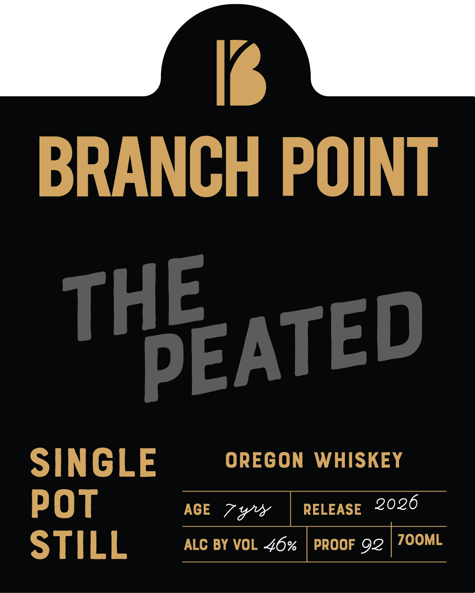

# TTB COLA Label Images - TTBID 26151001000055

**Brand Name:** BRANCH POINT

**Fanciful Name:** THE PEATED

**Issue Date:** 06/03/2026

**Origin Code:** 38

**Product Class/Type:** 140

**Source:** [TTB Public COLA Registry](https://ttbonline.gov/colasonline/viewColaDetails.do?action=publicFormDisplay&ttbid=26151001000055)

## Label Images

### Back Label

### Front Label

## Extracted Label Text

*Text extracted via OCR - may contain errors*

**Detected Proof:** 92

### Back Label

NON CHILL
TRADITIONAL METHODS
FILTERED_
ORIGINAL WHISKEYS
NO COLORING
ADDED.
BRANCH POINT DISTILLERY IS
A SMALL INDEPENDENT
DISTILLERY IN THE HEART OF OREGON'S WILLAMETTE VALLEY,
FOCUSED EXCLUSIVELY ON AUTHENTIC GRAIN TO GLASS
WHISKEY AND FOUNDED ON THE PREMISE THAT WHISKEY
SHOULD REFLECT ITS PLACE OF ORIGIN.
This Single Pot Still whiskey is made from an original mash bill of
locally grown Oregon
specialty malts and heavily
Scottish malt, which is double distilled in traditional copper pot
stills The result is a lightly
whiskey which serves as an
introduction to the
with notes of dark stone fruit and beach
bonfire.
MASHED; FERMENTED; DISTILLED; Matuped, AND BOTTLeD BY BRANCH POINT dISTILLERV
DAYTON; OR
DSP-OR-20046
GOVERNMENT  WARNING: () ACCORDING  tO  THE  SURGEON   GENERAL,
WOMEN SHOULD NOT DRINK AlCoholIC BEVERAGES DURING PREGNANCV
BECAUSE   OF   THE   RISK OF   BIRTH  DEFECTS.  (2}   CONSUMPTION OF
ALCOHOLIC BEVERAGES  IMPAIRS   VOUR AbILITY  TO  DRIVE
CAR OR
OPERATE
MACHINERY
And
MAY
CAUSE
hEalTh
PROBLEMS:
peated
barley;
peated
style,

### Front Label

K
BRANCH POINT
SINGLE
OREGON
WHISKEY
POT
AGE
7 %x
RELEASE
2026
STILL
ALC BY VOL 46%
PROOF 92
7OOML
THE
PEATED
