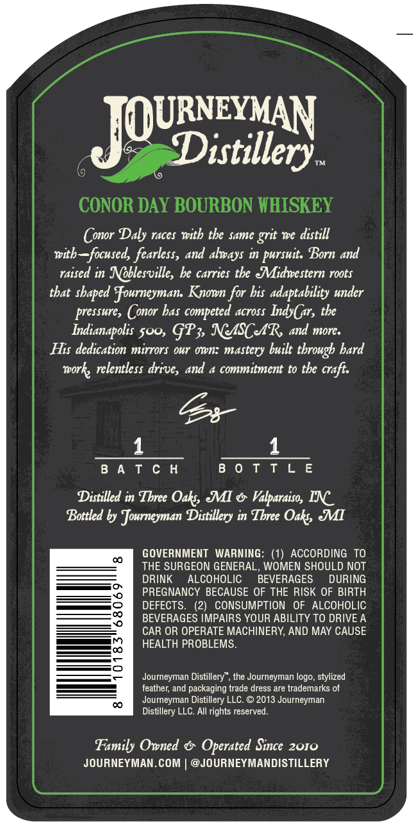
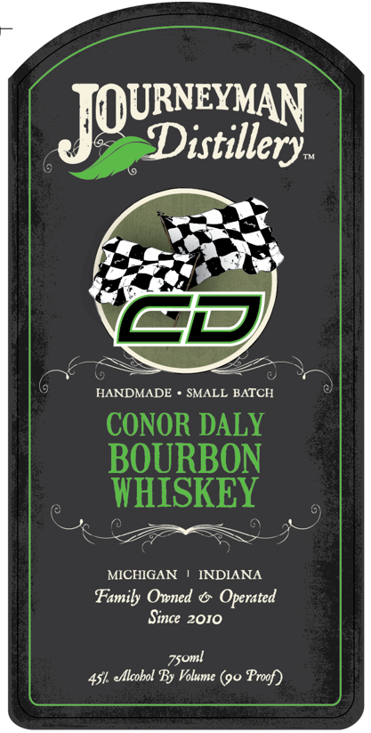

# TTB COLA Label Images - TTBID 26152001000038

**Brand Name:** JOURNEYMAN DISTILLERY

**Fanciful Name:** CONOR DALY BOURBON WHISKEY

**Issue Date:** 06/03/2026

**Origin Code:** 06

**Product Class/Type:** 141

**Source:** [TTB Public COLA Registry](https://ttbonline.gov/colasonline/viewColaDetails.do?action=publicFormDisplay&ttbid=26152001000038)

## Label Images

### Back Label

### Front Label

## Extracted Label Text

*Text extracted via OCR - may contain errors*

**Detected Proof:** 90

### Back Label

JOURisxatery
CONOR DAY BOURBON HHISKEY
Conor Daly races #ith tbe Same grit we distill
nith _focused, fearless, and always i pursuit: Born and
raised in Nlblesville, be carrics the  Midnestern roots
tbat shaped fourneyman Known for bif adaptability under
pressure, Conor bas competed across IndyC, the
Indianapolis 500, GP3 NeASC tR and more:
His dedication mirrors our Own: mastery built tbrough bard
work relentless drive,
and
commitment to tke craft:
8 4 T c H
8 0 T T L E
Distilled in Tbnee Oaks MI & Valparaiso, INC
Bottled by Journeyman Distilker) in Tbrce
JMI
GOVERNMENT WARNING: (1) ACCORDING
THE SURGEON GENERAL, WOMEN SHOULD NOT
DRINK
ALCOHOLIC
BEVERAGES
DURING
PREGNANCY BECAUSE OF THE RISK OF BIRTH
DEFECTS.
CONSUMPTION OF AlcOHOLIC
BEVERAGES IMPAIRS YOUR ABILITY TO DRIVE _
CAR OR OPERATE MACHINERY; AND MAY CAUSE
HEALTH PROBLEMS.
Joumeymal
Distillery
Journeyman
stylized
feather and packeging Irade dress are tradenarks ol
Joumneyman Distillcry LLC
ZuisjoumncyInan
Disbllery E
Hundniz tetenyed
Family Onned € Opcratcd Sincc 201o
JOURNEYMAN.COM
@JOURNEYMANDISTILLERY
Oak
Iloro.

### Front Label

JQURxdtey
HANDMADE
SMALL BATCH
CONOR DALY
BOURBON
WHISKEY
MICHIGAN
INDIANA
Family Owned
Operated
Since 2010
7soml
elcobol By Volume (90
Proof
