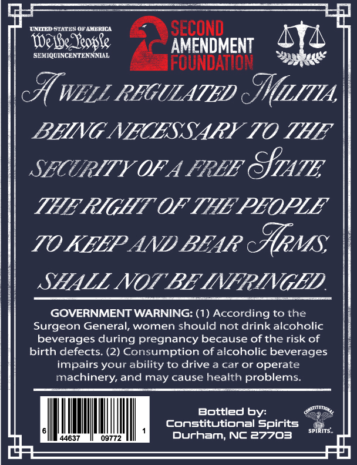
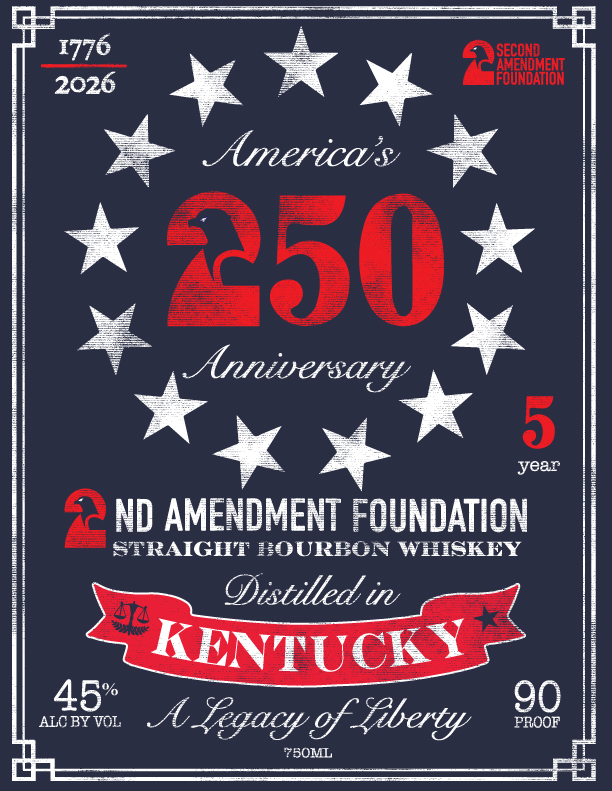

# TTB COLA Label Images - TTBID 26152001000153

**Brand Name:** 2ND AMENDMENT FOUNDATION

**Issue Date:** 06/18/2026

**Origin Code:** 35

**Product Class/Type:** 101

**Source:** [TTB Public COLA Registry](https://ttbonline.gov/colasonline/viewColaDetails.do?action=publicFormDisplay&ttbid=26152001000153)

## Label Images

### Back Label

### Label 1

## Extracted Label Text

*Text extracted via OCR - may contain errors*

**Detected Age:** 5 Years

### Back Label

UNHIEDOTATEN OFAMEKIC
SECOND _
Ie e Teopke
AMENDMENT
SEMIQUINCENTENNINAL
FOUNDANON
c% WELL REGULATED
cMrzua
BHING NECESSARY TO THE
SECRITY OF A FRHE
SfTATE
THE RIGHT OF THE PEOPLE
TO KEEP AND BHAR
crMS
SHALL NOT BE INFRINGED
GOVERNMENT WARNING: (1) According to the
Surgeon General; women should not drink alcoholic
beverages during pregnancy because of the risk of
birth defects: (2) Consumption of alcoholic beverages
impairs your ability to drive a car or operate
machinery, and may cause health problems_
Bottled by:
ConstitUtiONaI Spirits
44637
09772
Durham, NC 27703
SPIRITS _
4ar

### Label 1

1776
SECOND
2026
JFOUNDKEON
Americas
250
Anniversary
5
year
ND AMENDMENT FOUNDATION
STRAIGHT #OURBON WHISKEY
Oistilled in
KENTUCKY
45
90
ALC BY VOL
A Segacy %f Sberty
PROOF
7BOML
