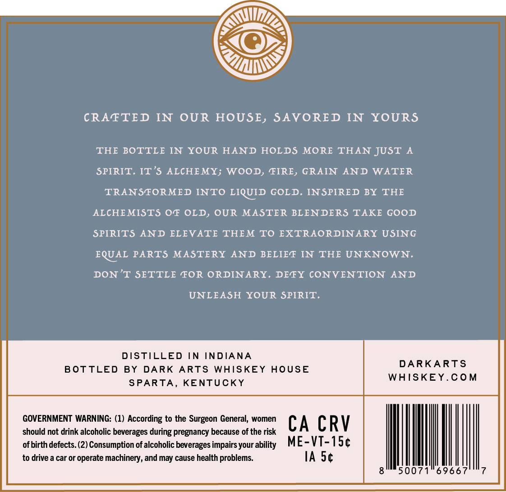
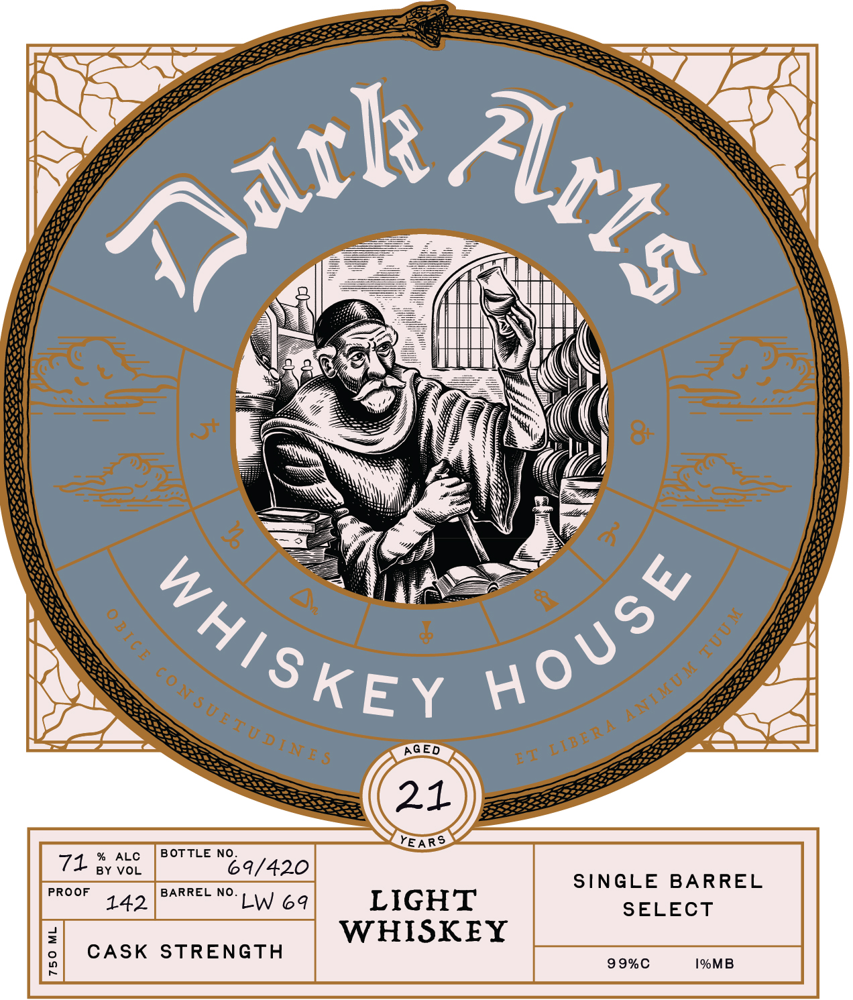

# TTB COLA Label Images - TTBID 26152001000201

**Brand Name:** DARK ARTS WHISKEY HOUSE

**Issue Date:** 06/04/2026

**Origin Code:** 22

**Product Class/Type:** 144

**Source:** [TTB Public COLA Registry](https://ttbonline.gov/colasonline/viewColaDetails.do?action=publicFormDisplay&ttbid=26152001000201)

## Label Images

### Back Label

### Front Label

### Label 3

### Label 4

## Extracted Label Text

*Text extracted via OCR - may contain errors*

*2 image(s) excluded: text did not meet readability threshold*

**Detected Age:** 21 Years

### Back Label

CRAFTED IN OUR HOUSE, SAVORED IN YOURS
THE BOTTLE IN
YOUR HAND HOLDS
MORE
THAN JUST
SPIRIT. IT'S ALCHEMY; WOOD, FIRE, GRAIN
AND
WATER
TRANSTORMED INTO LIQUID GOLD. INSPIRED BY THE
ALCHE MISTS OF OLD, OUR MASTER BLENDERS TAKE GOOD
SPIRITS
AND ELEVATE THEM TO EXTRAORDINARY USING
EQUAL PARTS MASTERY
AND BELIEF IN
THE UNKNOWN.
DON
T SETTLE FOR ORDINARY. DEFY CONVENTION
AND
UNLEASH YOUR SPIRIT
DISTILLED
IN
INDIANA
DARKARTS
BotTLED
BY
DARK
ARTS
WHISKEY
HOUsE
WHISKEY.Com
SPARTA_
KENTUCKY
GOVERNMENT WARNING: (1) According to the Surgeon General, women
CA CRV
should not drink alcoholic beverages during pregnancy because of the risk
of birth defects. (2) Consumption of alcoholic beverages impairs your ability
ME-VT-ISc
to drive_
car Or
operate machinery, and may cause health problems:
IA Sc
50071
6966

### Front Label

Ot
Or
AGED
21
YEARS
ALC
BOTTLE NO
71
BY VOL
69/420
SINGLE
BARREL
PROOF
BARREL NO_
142
LW 69
LIGHT
SELECT
1
WHISKEY
CASK
STRENGTH
99%C
1%MB
atk_
Arts
HoUse
WHISKEY
1
8
ANTMUM
C0NSUETUDTiES
LTBERA
BT
