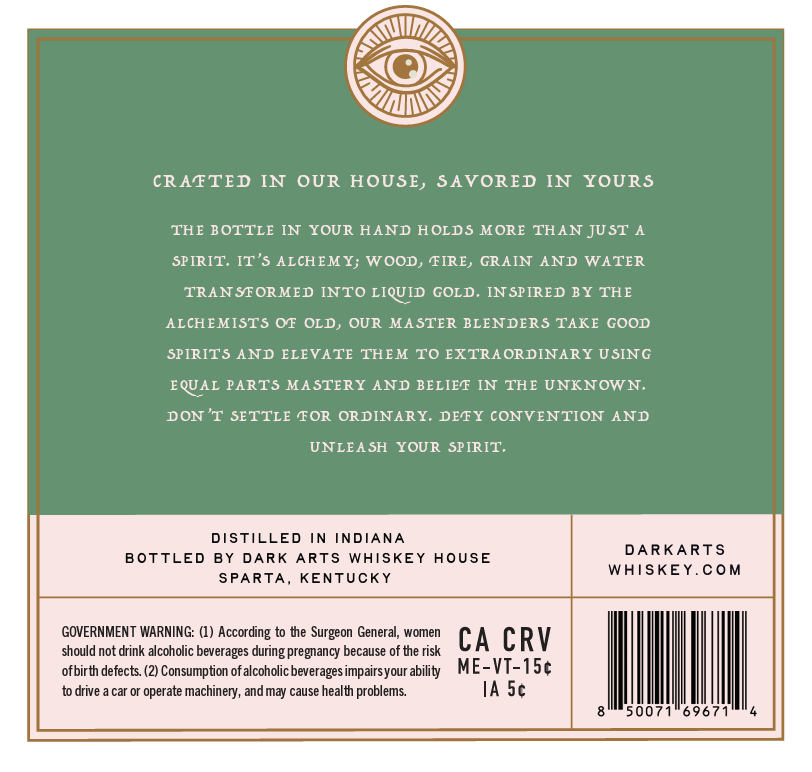
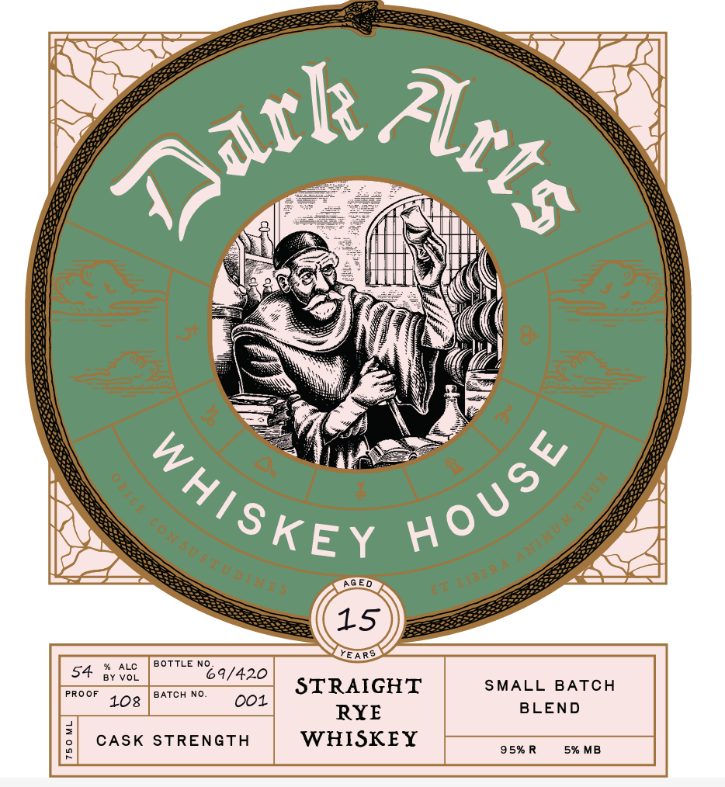

# TTB COLA Label Images - TTBID 26152001000207

**Brand Name:** DARK ARTS WHISKEY HOUSE

**Issue Date:** 06/04/2026

**Origin Code:** 22

**Product Class/Type:** 102

**Source:** [TTB Public COLA Registry](https://ttbonline.gov/colasonline/viewColaDetails.do?action=publicFormDisplay&ttbid=26152001000207)

## Label Images

### Back Label

### Front Label

### Label 3

### Label 4

## Extracted Label Text

*Text extracted via OCR - may contain errors*

*2 image(s) excluded: text did not meet readability threshold*

**Detected Age:** 15 Years

### Back Label

CRAFTED IN
OUR HOUSE, SAVORED IN
YOURS
THE BOTTLE IN
YOUR HAND HOLDS MORE THAN JU ST A
SPIRIT: IT'$ ALCHEM Y; WOOD, FIRE, GRAIN
AND WATER
TRAN SFORMED INTO LIQUID GOLD. IN SPIRED BY THE
ALCHEMISTS
OF OLD, OUR
MASTER BLEN DERS TAKE GOOD
SPIRITS AND ELEVATE THEM TO EXTRAORDINARY USING
EQUAL PARTS MASTERY AND BELIEF
IN
THE UNKNOWN
DON 'T SETTLE FOR ORDINARY-
DEFY CONVENTION AND
UNLEA SH
YOUR SPIRIT.
DISTILLED IN INDIANA
DARKARTS
B OTTLED
BY
DARK ARTS
WAISKEY
HOUSE
WHISKEY.Com
SPARTA
KENTUCKY
GOVERNMENT WARNING: (1) According to the Surgeon General, women
CA CRV
should not drink alcoholic beverages during pregnancy because of the risk
ofbirth defects. (2) Consumption ofalcoholic beverages impairsyour ability
ME-VT-1Sc
to drive
car Or
machinery, and may cause health problems
IA Sc
007
696
operate E

### Front Label

4c
Se
AG ED

15
YEARS
ALC
BOTTLE NO
54
BY VOL
69/420
PROOF
BATCH NO.
STRAIGHT
SMALL
BATCH
108
001
BLEND
RYE
1
CASK
STRENGTH
WHISKEY
95% R
5% MB
ak_
Acts
HoUse
WAISKE{
6
6
t
C0NSUETtoTiTE?
