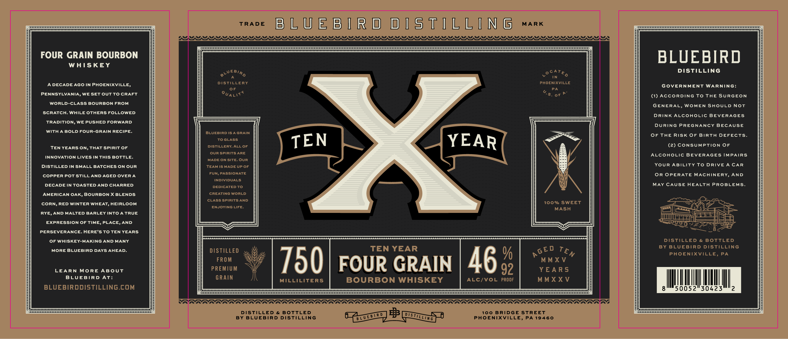

# TTB COLA Label Images - TTBID 26152001000259

**Brand Name:** BLUEBIRD DISTILLING X TEN YEAR

**Issue Date:** 06/05/2026

**Origin Code:** 39

**Product Class/Type:** 141

**Source:** [TTB Public COLA Registry](https://ttbonline.gov/colasonline/viewColaDetails.do?action=publicFormDisplay&ttbid=26152001000259)

## Label Images

### Label 1

## Extracted Label Text

*Text extracted via OCR - may contain errors*

### Label 1

TRADE
B L U EB I R d dIs TILL [ N 6
MARK
Dyyyy
Dyyy
FOUR GRAIN BOURBON
BLUEBIRD
WHISKEY
0LUEB/Ro
DISTILLING
TN
ADECADE AGO IN
PHOENIXVILLE,
DISTILLERY
PHOENIXVILLE
GOVERNMENT WARNING:
0F
PA
PENNSYLVANIA, WE SET OUTTo CRAFT
QUALIT (
S. 0f
(1) ACcoRDING To THE SURGEON
WORLD-CLASS BOURBON FROM
GENERAL, WOMEN SHOULD Not
SCRATCH: WHILE OTHERS FOLLOWED
DRINK ALcohoLic BEVERAGES
TRADITION, WE PUSHED FORWARD
DURING
PREGNANCY BECAUSE
WithA BOLD FOUR-GRAIN RECIPE:
BLUEBIRD IS4 GrAIN
OF THE RISK 0F BIRth DEFECTS.
DISTiO GRXSLOF
TEN
YEAR
(2) CONSUMPTION OF
TEN YEARS ON, THAT spirit Of
our spiritsARE
ALcohoLic BEVERAGES IMPAIRS
INNOVATION LIVES INThis BOTTLE:
MADE ON SITE:
DISTILLED IN SMALL BATCHES ON OUR
TEAMIS MADE Upof
YOUR ABILITY To DRIVE A CAR
COPPER Pot STiLLAND AGED OVER A
FUN, PASSIONATE
OR OPERATE MACHINERY, AND
INDIVIDUALS
DECADE IN TOASTED AND CHARRED
DEDICATED To
MAY CAUSE HEALTH PROBLEMS
AMERICAN OAK, BOURBONX BLENDS
CREATING WORLD
CLASS spirits AND
CORN, RED WINTER WHEAT, HEIRLOOM
100% SWEET
ENJOYING LIFE.
MASH
RYE, AND MALTED BARLEY INTO A TRUE
EXPRESSION OF TIME, PLACE, AND
PERSEVERANCE: HERE'STO TEN YEARS
OF Whiskey-MAKING AND MANY
DISTILLED
& BOTTLED
MORE BLUEBIRD DAYS AHEAD:
DISTILLED
TEN YEAR
BY BLUEBIRD DISTILLING
%
PHOENIXVILLE, PA
LEARN
MoRE ABoUT
PReOIUM
750
FOUR GRAIN
46
92
WAVS
BLUEBIRD
At:
GRAIN
Milliliters
BOURBON WHISKEY
ALC/VOL PROOF
MMXXV
BLUEBIRDDISTILLING.COM
50052"30423
DISTILLED
BOTTLED
100
BRIDGE STREET
1 R
BY BLUEBIRD
DISTILLING
PHOENIXVILLE, PA
19460
CATED
OUR
G E D
TEN
DTSILLIAG
LU E B L
