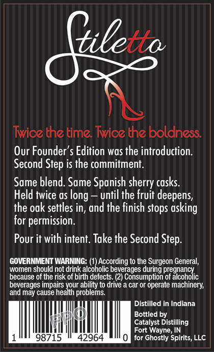
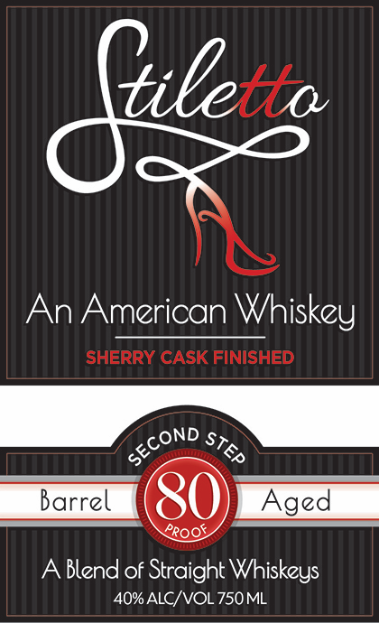

# TTB COLA Label Images - TTBID 26152001000286

**Brand Name:** STILETTO

**Issue Date:** 07/01/2026

**Origin Code:** 19

**Product Class/Type:** 129

**Source:** [TTB Public COLA Registry](https://ttbonline.gov/colasonline/viewColaDetails.do?action=publicFormDisplay&ttbid=26152001000286)

## Label Images

### Back Label

### Front Label

## Extracted Label Text

*Text extracted via OCR - may contain errors*

**Detected Proof:** 80

### Back Label

Giletto
Twice the time: Twice the boldness
Our Founder'$ Edition was the introduction
Second Step is the commitment:
Same blend. Same Spanish sherry casks
Held twice as
until the fruit deepens,
the odk settles in, and the finish stops
for permission.
Pour it with intent. Take the Second Step_
GOVERMMENT WARNING:
According to the Surgeon General,
women should not drink alcoholic beverages during pregnancy
because of the risk of birth defects: (2) Consumption of alcoholic
beverages impairs your ability to drive
car or operate machinery;
and may cause health problems:
Distilled in Indiana
Bottled by
Catalyst Distilling
Fort Wayne,IN
98715
42964
for Ghostly Spirits, LLC
 long
asking

### Front Label

Giletto
An American Whiskey
SHERRY CASK FINISHED
Barrel
80
Aged
Blend of Straight Whiskzys
40% ALC/ VOL 750ML
second
STEP
