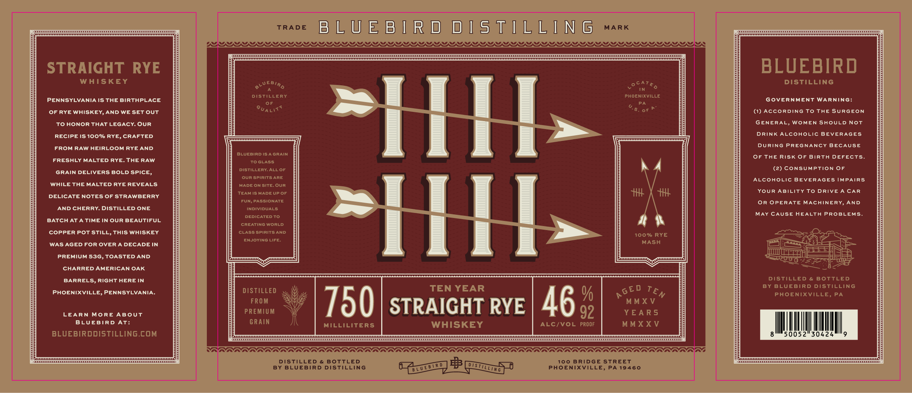

# TTB COLA Label Images - TTBID 26152001000290

**Brand Name:** BLUEBIRD DISTILLING

**Fanciful Name:** 10 YEAR RYE WHISKEY

**Issue Date:** 06/03/2026

**Origin Code:** 39

**Product Class/Type:** 102

**Source:** [TTB Public COLA Registry](https://ttbonline.gov/colasonline/viewColaDetails.do?action=publicFormDisplay&ttbid=26152001000290)

## Label Images

### Label 1

## Extracted Label Text

*Text extracted via OCR - may contain errors*

### Label 1

rave }LUEBIRD DISTILLING mx

DONWON NN NONONONONONONONONNONONONONONONONOINONOINONONONONONONONONONONONONONONONONNONONNONINNNININNNIIINIINDRDONIS

STRAIGHT RYE

BLUEBIRD

WHISKEY

DISTILLING

WEBa,

ofATe,

A

IN

DISTILLERY

PHOENIXVILLE,

PENNSYLVANIA IS THE BIRTHPLACE

GOVERNMENT WARNING:

oF

PA

Pua

“S. oF PF

OF RYE WHISKEY, AND WE SET OUT

(1) ACCORDING TO THE SURGEON

TO HONOR THAT LEGACY. OUR

GENERAL, WOMEN SHOULD NOT

DRINK ALCOHOLIC BEVERAGES

RECIPE IS 100% RYE, CRAFTED

FROM RAW HEIRLOOM RYE AND.

DURING PREGNANCY BECAUSE

BLUEBIRD IS AGRAIN

OF THE RISK OF BIRTH DEFECTS.

FRESHLY MALTED RYE. THE RAW,

TOGLASS

DISTILLERY. ALL OF

(2) CONSUMPTION OF

GRAIN DELIVERS BOLD SPICE,

OURSPIRITS ARE

ALCOHOLIC BEVERAGES IMPAIRS

WHILE THE MALTED RYE REVEALS

MADE ON SITE. OUR

YOUR ABILITY TO DRIVE A CAR

DELICATE NOTES OF STRAWBERRY

TEAM IS MADE UP OF

FUN, PASSIONATE

OR OPERATE MACHINERY, AND

AND CHERRY. DISTILLED ONE

INDIVIDUALS.

May CAUSE HEALTH PROBLEMS.

BATCH AT A TIME IN OUR BEAUTIFUL

DEDICATED TO

CREATING WORLD

“|.

COPPER POT STILL, THIS WHISKEY

CLASS SPIRITS AND

100% RYE

ENJOYING LIFE.

MASH

5

WAS AGED FOR OVER A DECADE IN

eal:

y

IIT

rE

aye

Ee

EE

PREMIUM 53G, TOASTED AND

Saag =

Eras

CHARRED AMERICAN OAK

BARRELS, RIGHT HERE IN

DISTILLED & BOTTLED

BY BLUEBIRD DISTILLING

DISTILLED

TEN YEAR

PHOENIXVILLE, PENNSYLVANIA.

GED Te

PHOENIXVILLE, PA

%

FROM

MMXV

LEARN MORE ABOUT

PREMIUM

STRAIGHT RYE

AG

YEARS

92

BLUEBIRD AT:

GRAIN

MMXXV

WHISKEY

ALC/VOL PROOF

MIN

BLUEBIRDDISTILLING.COM

il

50052°30424

I,

WADA AAAAAAAAAAAAAAAAAAAAARAAAAAARAAAAAAAAAAA AAA AAAAAAAAAAAAAAAAAG

DISTILLED & BOTTLED

100 BRIDGE STREET

BY BLUEBIRD DISTILLING

A) BB PS

PHOENIXVILLE, PA 19460
