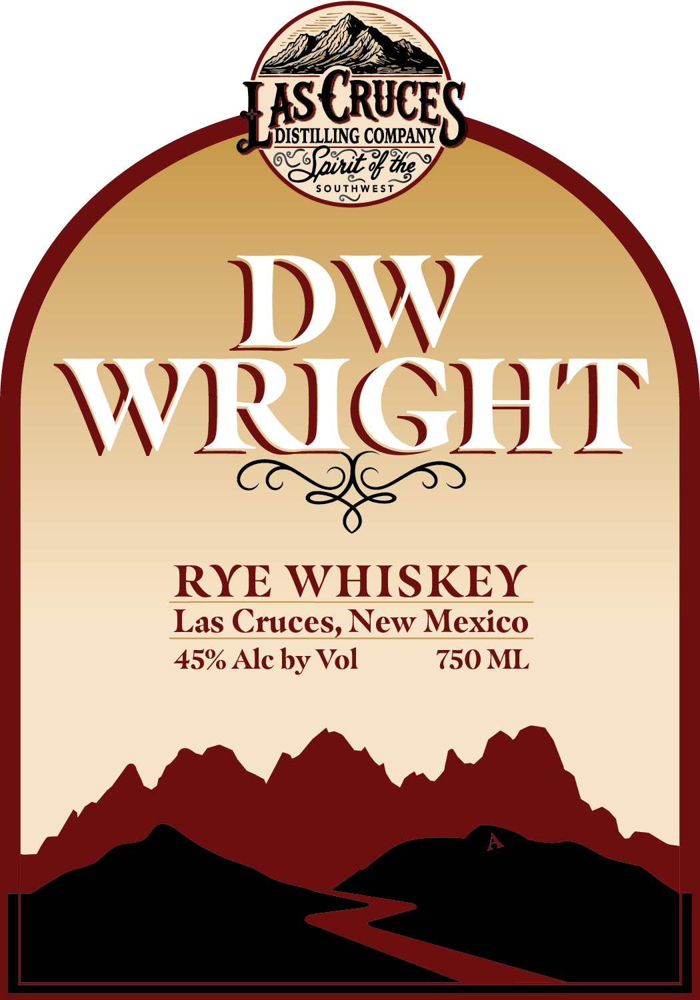
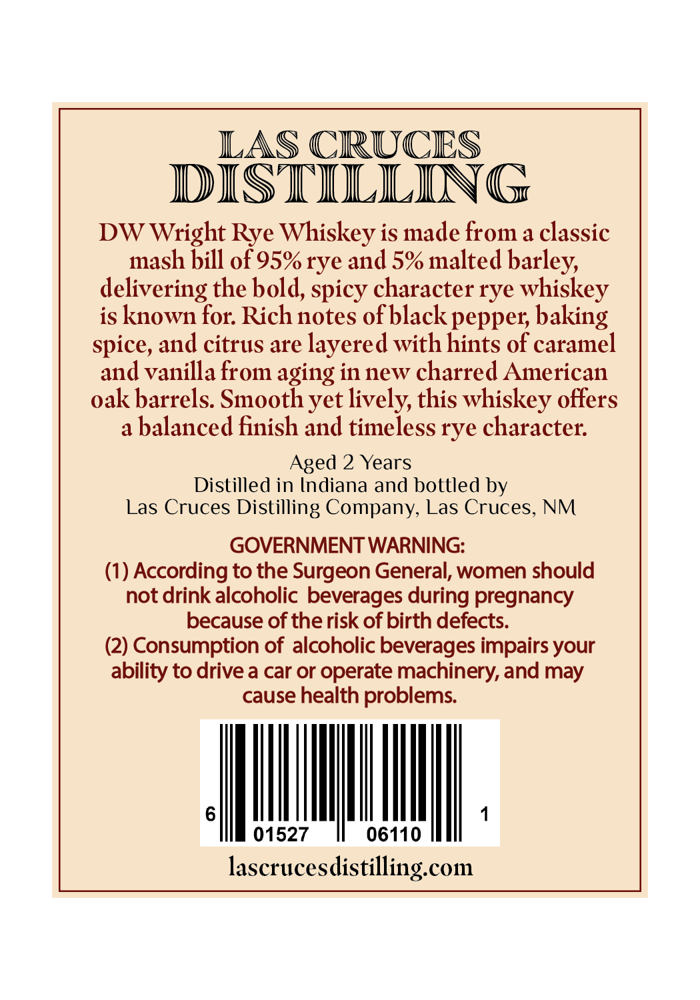

# TTB COLA Label Images - TTBID 26152001000356

**Brand Name:** DW WRIGHT
RYE WHISKEY

**Issue Date:** 06/04/2026

**Origin Code:** 34

**Product Class/Type:** 142

**Source:** [TTB Public COLA Registry](https://ttbonline.gov/colasonline/viewColaDetails.do?action=publicFormDisplay&ttbid=26152001000356)

## Label Images

### Label 1

### Label 2

## Extracted Label Text

*Text extracted via OCR - may contain errors*

**Detected Proof:** 90
**Detected Age:** 2 Years

### Label 1

IS
GQUCES
IDISTILLING COMPANY
Zpinit %%5
S0UTHWEST
DW
WRIGHZL
RYE WHISKEY
Las Cruces, New Mexico
45% Alc by Vol
750 ML

### Label 2

DISTfHHG
DW Wright Rye Whiskey is made from a classic
mash bill of 95%rye and 5% malted barley,
delivering the bold, spicy character rye whiskey
is known for Rich notes ofblack pepper; baking
spice, and citrus are layered with hints of caramel
and vanilla from aging in new charred American
oak barrels. Smooth yet lively, this whiskey offers
a
balanced finish and timeless rye character:
Aged 2 Years
Distilled in Indiana and bolttled by
Las Cruces Distilling Company, Las Cruces, NM
GOVERNMENT WARNING:
(1) According to the Surgeon General, women should
not drink alcoholic beverages during pregnancy
because of the risk of birth defects:
(2) Consumption of alcoholic beverages impairs your
ability to drive a car or operate machinery, and may
cause health problems
01527
06110
lascrucesdistilling com
