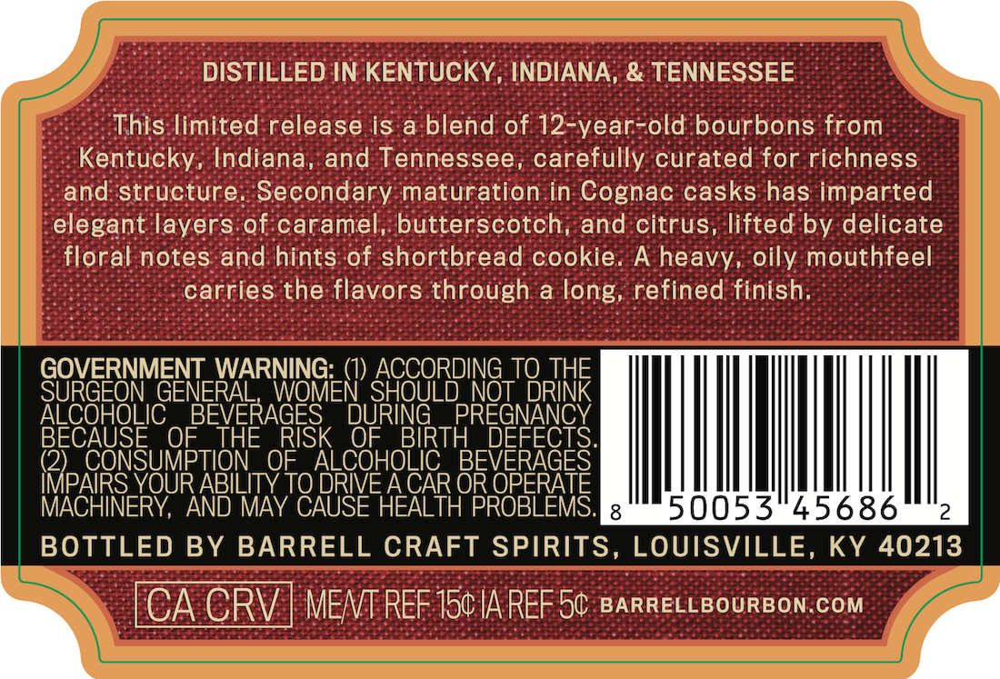
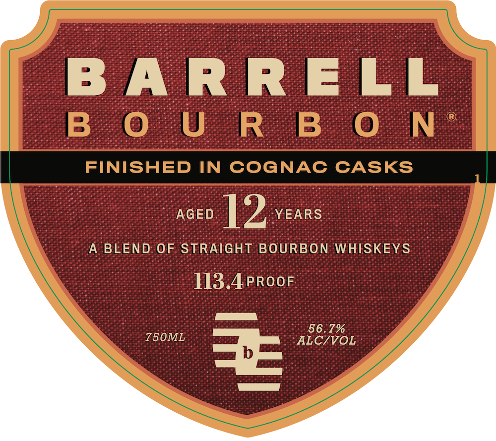
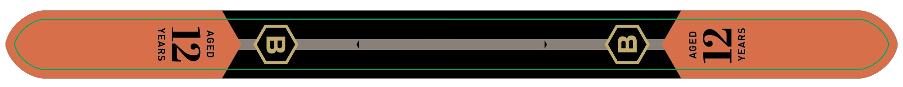

# TTB COLA Label Images - TTBID 26152001000370

**Brand Name:** BARRELL BOURBON

**Issue Date:** 06/04/2026

**Origin Code:** 22

**Product Class/Type:** 121

**Source:** [TTB Public COLA Registry](https://ttbonline.gov/colasonline/viewColaDetails.do?action=publicFormDisplay&ttbid=26152001000370)

## Label Images

### Back Label

### Front Label

### Label 2

## Extracted Label Text

*Text extracted via OCR - may contain errors*

*1 image(s) excluded: text did not meet readability threshold*

**Detected Proof:** 113.4
**Detected Age:** 12 Years

### Back Label

DISTILLED IN KENTUCKY, INDIANA, & TENNESSEE
This limited release is a blend of 12-year-old bourbons from
Kentucky, Indiana, and Tennessee, carefully curated for richness
and structure: Secondary maturation in Cognac casks has imparted
elegant layers of caramel, butterscotch, and citrus, lifted by delicate
floral notes and hints of shortbread cookie_
A heavy
oily mouthfeel
carries the flavors through a long, refined finish
GOVERNMENT_WARNING:
ACCORDING_TQ THE
SURGEON GENERAL
WOMEN SHOULD NOT DRINK
ALCOHOLIC
BEVERAGES
DURING
PREGNANCY
BECAUSE
OF
THE
RISK
OF
BIRTH
DEFECTS
(2)_ CONSUMPTION
OF
ALCOHOLIC
BEVERAGES
IMPAIRS YOUR ABILITY TO DRIVE A CAR OR OPERATE
MACHINERY, AND MAY CAUSE HEALTH PROBLEMS:
8
50053"45686
BOTTLED BY BARRELL CRAFT SPIRITS,
LOUISVILLE, KY 40213
CA CRV | MENT REF 150IA REF 5c BARRELLBOURBON.COM

### Front Label

B A RR ELL
B  0 U R B 0 N
FINISHED
IN
COGNAC CASKS
AGED
12
YEARS
A BLEND OF STRAIGHT BOURBON WHISKEYS
113.4PROOF
56.7%
750ML
ALC/VOL
=
