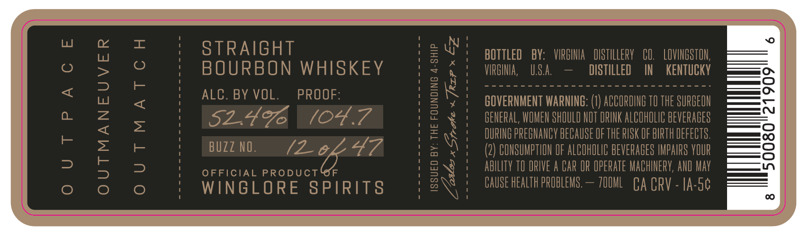
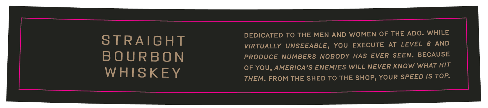

# TTB COLA Label Images - TTBID 26152001000639

**Brand Name:** WINGLORE SPIRITS

**Issue Date:** 06/04/2026

**Origin Code:** 05

**Product Class/Type:** 101

**Source:** [TTB Public COLA Registry](https://ttbonline.gov/colasonline/viewColaDetails.do?action=publicFormDisplay&ttbid=26152001000639)

## Label Images

### Label 1

### Label 2

## Extracted Label Text

*Text extracted via OCR - may contain errors*

### Label 1

L
I
STRAIGHT
9 4
BOTTLED
BY:   VIRGINLA   DISTILLERY
CO,
LOVINGSTON;
0
BOURBON WHISKEY
J
VIRGINA;
U.S.a,
DISTILLED
IN
KENTUCKV
<
8
ALC . BY VOL.
PROOF:
[2
GOVERNMENT WARNING:
ACCORDING TO THE SURGEON
2
1
2
52.49
(04.7
2
0
BEREFAPREBHEHSHHEEH KETF THE HSROHFHRTHEVEFLFES
F
BUZZ NO.
(2_04
0
(2) CONSUMPTHON OF ALCOHOLIC BEVERAGES IMPAIRS VOUR
3
3
OFFICIAL PRODUCTUF
EN
AbILITV TO DRIVE A CAR OR OPERATe MACHINERV, AND May
0
WINGLORE SPIRIT8
CAUSE HEALTh PROBLEMS ,
70OML   CA CPV
IA-Sc

### Label 2

DEDICATED TO THE MEN AND WOMEN OF THE ADO. WHILE

STRAIGHT

VIRTUALLY UNSEEABLE, YOU EXECUTE AT LEVEL 6 AND

BOURBON

PRODUCE NUMBERS NOBODY HAS EVER SEEN. BECAUSE

OF YOU, AMERICA’S ENEMIES WILL NEVER KNOW WHAT HIT

WHISKEY

THEM. FROM THE SHED TO THE SHOP, YOUR SPEED IS TOP.
