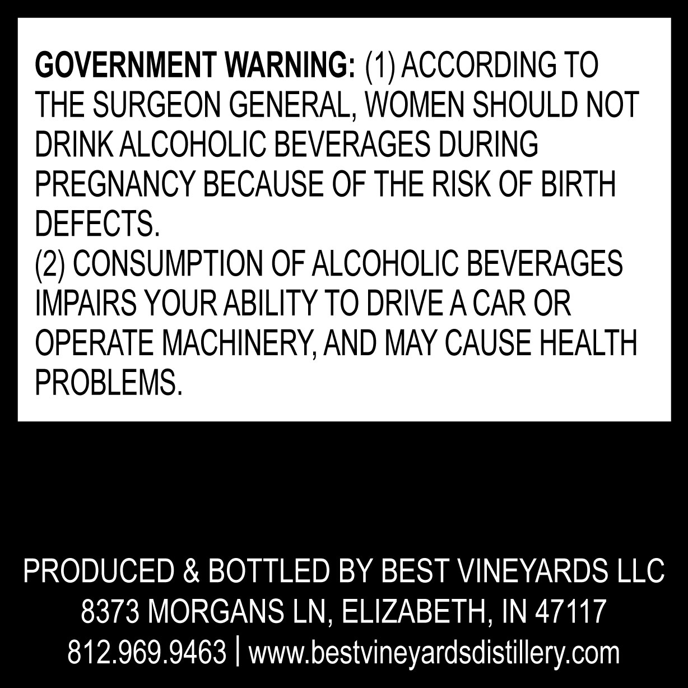
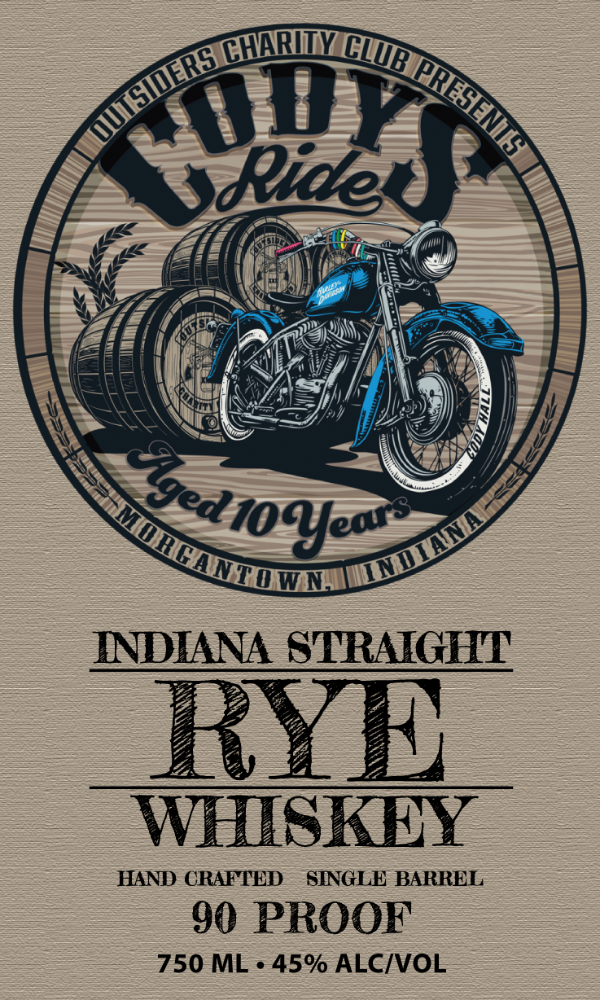

# TTB COLA Label Images - TTBID 26152001000645

**Brand Name:** CODYS RIDE

**Issue Date:** 06/12/2026

**Origin Code:** 19

**Product Class/Type:** 102

**Source:** [TTB Public COLA Registry](https://ttbonline.gov/colasonline/viewColaDetails.do?action=publicFormDisplay&ttbid=26152001000645)

## Label Images

### Back Label

### Front Label

## Extracted Label Text

*Text extracted via OCR - may contain errors*

**Detected Proof:** 90

### Back Label

GOVERNMENT WARNING: (1) ACCORDING TO
THE SURGEON GENERAL, WOMEN SHOULD NOT
DRINK ALCOHOLIC BEVERAGES DURING
PREGNANCY BECAUSE OF THE RISK OF BIRTH
DEFECTS.
(2) CONSUMPTION OF ALCOHOLIC BEVERAGES
IMPAIRS YOUR ABILITY TO DRIVEACAR OR
OPERATE MACHINERY,AND MAY CAUSE HEALTH
PROBLEMS .
PRODUCED & BOTTLED BY BEST VINEYARDS LLC
8373 MORGANS LN, ELIZABETH, IN 47117
812.969.9463
wwwbestvineyardsdistillery com

### Front Label

@HRINY
Ride
INDIANA STRAIGHT
RY
WHISKEY
HAND CRAFTED
SINGLE BARREL
90 PROOF
750 ML . 45% ALCIVOL
TWWBI
[IDER
[RHHNEE
beDx
Sged1ofe" >
MunqM
IMWn
