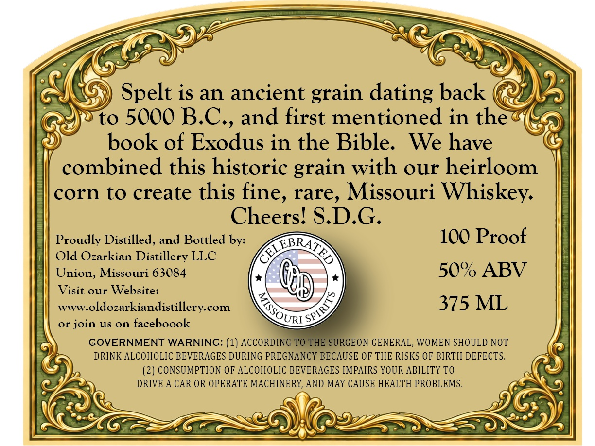
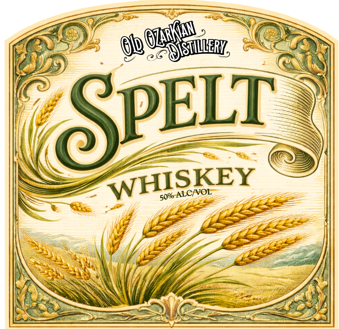

# TTB COLA Label Images - TTBID 26153001000046

**Brand Name:** OLD OZARKIAN DISTILLERY SPELT WHISKEY

**Issue Date:** 06/15/2026

**Origin Code:** 29

**Product Class/Type:** 140

**Source:** [TTB Public COLA Registry](https://ttbonline.gov/colasonline/viewColaDetails.do?action=publicFormDisplay&ttbid=26153001000046)

## Label Images

### Back Label

### Front Label

## Extracted Label Text

*Text extracted via OCR - may contain errors*

*1 image(s) excluded: text did not meet readability threshold*

**Detected Proof:** 100

### Back Label

Spelt is an ancient grain dating back
to
5000 B.C., and first mentioned in the
book of Exodus in the Bible.
We have
combined this historic grain with our heirloom
corn to create this fine, rare, Missouri Whiskey:
Cheers! S.D.G.
Proudly Distilled, and Bottled by:
100 Proof
Old Ozarkian Distillery LLC
Union, Missouri 63084
50% ABV
Visit our Website:
WWW.oldozarkiandistillerycom
375 ML
or join US on faceboook
GOVERNMENT WARNING: (1) ACCORDING TO THE SURGEON GENERAL, WOMEN SHOULD NOT
DRINK ALCOHOLIC BEVERAGES DURING PREGNANCY BECAUSE OF THE RISKS OF BIRTH DEFECTS,
(2) CONSUMPTION OF ALCOHOLIC BEVERAGES IMPAIRS YOUR ABILITY TO
DRIVE A CAR OR OPERATE MACHINERY, AND MAY CAUSE HEALTH PROBLEMS,
KaRTo
MISSQUE)
SPIRIT
