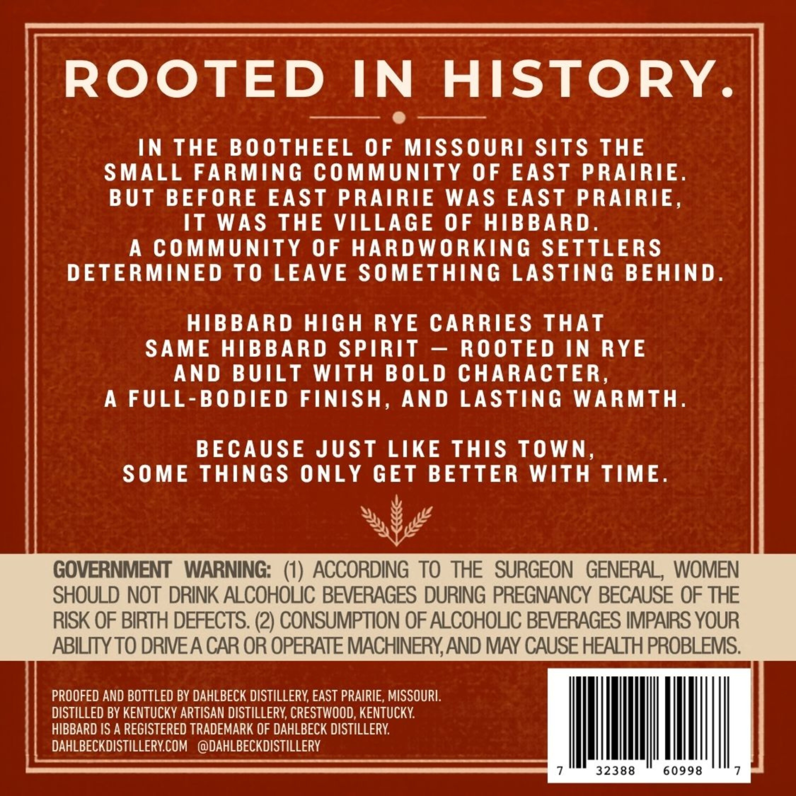
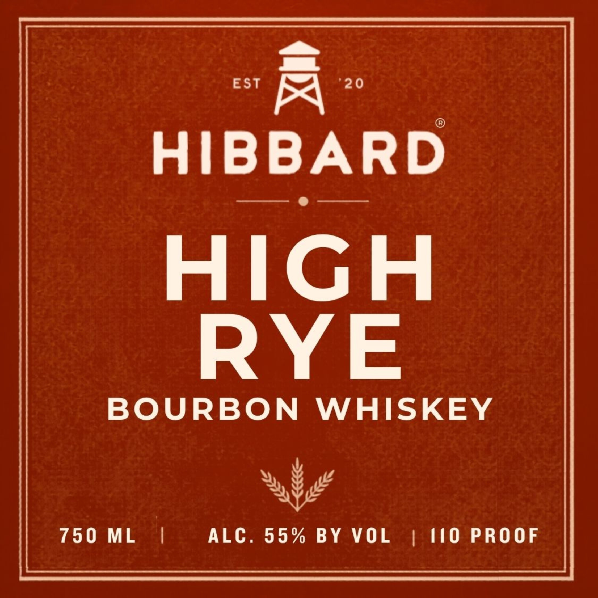
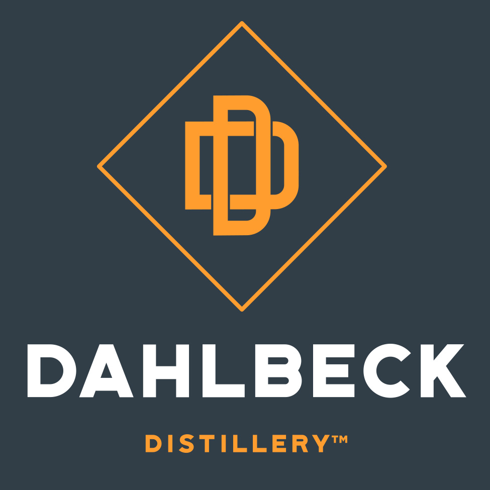

# TTB COLA Label Images - TTBID 26153001000054

**Brand Name:** HIBBARD

**Fanciful Name:** HIGH RYE

**Issue Date:** 06/04/2026

**Origin Code:** 22

**Product Class/Type:** 141

**Source:** [TTB Public COLA Registry](https://ttbonline.gov/colasonline/viewColaDetails.do?action=publicFormDisplay&ttbid=26153001000054)

## Label Images

### Back Label

### Front Label

### Label 2

## Extracted Label Text

*Text extracted via OCR - may contain errors*

*1 image(s) excluded: text did not meet readability threshold*

**Detected Proof:** 110

### Back Label

ROOTED
IN
HISTORY
IN THE BOOTHEEL
0F MISSOURI SiTS THE
SMALL FARMING COMMUNITY OF EAST
PRAIRIE.
B UT
BEFO RE EAST PRAIRIE
WAS EAST PRAIRIE,
IT WAS THE VILLAGE 0F HIBBARD .
A
COMMUNITY 0F
HARDWORKING SETTLERS
DETERMINED
TO LEAVE SOMETHING LASTING BEHIND.
HIBBARD HIGH
RYE
CARRIES
ThAT
SAME HIBBARD SPIRT
ROOTED IN RYE
AND
BUILT
With
BOLD CHARACTER,
A FULL-BO DIED FINISH, AND
LASTING
WARMTH.
BECAUSE JUST LIKE THIS ToWn,
SOME ThiNGS
ONLY GET BETTER
WIth
TIME.
GOVERNMENT
WARNING:   (1) ACCORDING TO THE   SURGEON   GENERAL , WOMEN
SHOULD NOT DRINK ALCOHOLIC BEVERAGES DURING PREGNANCY BECAUSE OF THE
RISK OF BIRTH DEFECTS. (2) CONSUMPTION OF ALCOHOLIC BEVERAGES IMPAIRS YOUR
ABILITY TO DRIEA CAR OR OPERATE MACHINERYAND MAY CAUSE HEALTH PROBLEMS:
PROOFED AND BOTTLED BY DAHLBECK DISTILLERY; EAST PRAIRIE, MISSOURL:
DISTILLED BY KENTUCKY ARTISAN DISTILLERY; CRESTWOOD, KENTUCKY
HIBBARD IS A REGISTERED TRADEMARK OF DAHLBECK DISTILLERY
DAHLBECKDISTILLERYCOM
@DAHLBECKDISTILLERY
7
32388
60998
7

### Front Label

EST
A
20
HIBBARD
RIGH
BOURBON
WHISKEY
750
ML
ALC. 55%
BY
VOL
110
PROOF
