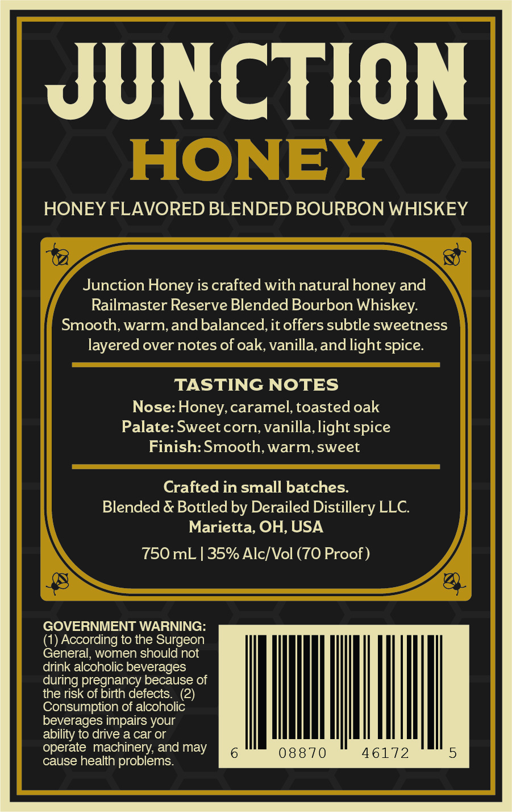
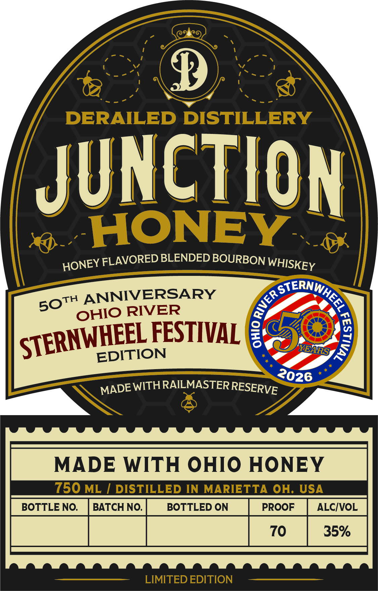
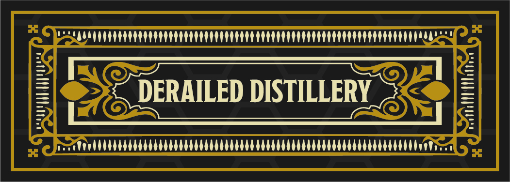
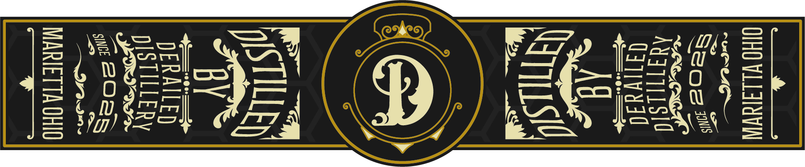

# TTB COLA Label Images - TTBID 26153001000083

**Brand Name:** DERAILED DISTILLERY

**Fanciful Name:** JUNCTION HONEY

**Issue Date:** 06/10/2026

**Origin Code:** 09

**Product Class/Type:** 149

**Source:** [TTB Public COLA Registry](https://ttbonline.gov/colasonline/viewColaDetails.do?action=publicFormDisplay&ttbid=26153001000083)

## Label Images

### Back Label

### Front Label

### Label 2

### Label 3

## Extracted Label Text

*Text extracted via OCR - may contain errors*

*1 image(s) excluded: text did not meet readability threshold*

**Detected Proof:** 70
**Detected Age:** 2 Years

### Back Label

JUNCTION

HONEY FLAVORED BLENDED BOURBON WHISKEY

Junction Honey is crafted with natural honey and

Railmaster Reserve Blended Bourbon Whiskey.

Smooth, warm, and balanced, it offers subtle sweetness

layered over notes of oak, vanilla, and light spice.

TASTING NOTES

Nose: Honey, caramel, toasted oak

Palate: Sweet corn, vanilla, light spice

Finish: Smooth, warm, sweet

Crafted in small batches.

Blended & Bottled by Derailed Distillery LLC

Marietta, OH, USA

750 mL | 35% Alc/Vol (70 Proof)

GOVERNMENT WARNING

(1) According to the Surgeon

General, women should not

drink alcoholic beverages

during pregnancy because of

the risk of birth defects. (2)

Consumption of alcoholic

beverages impairs your

ability to drive a car or

un)

operate machinery, and may

08870

46172

cause health problems.

### Front Label

p
DERAILED DISTILLERY
JUNCTION
HONEY
FLAVORED BLENDED BOURBON
ANNIVERSARY
RIVER
FESTIVAL 8
9
EDITION
WITHRAILMASTER
MADE WITH OHIO HONEY
750 ML
DISTILLED IN
MARIETTA
OH. USA
BOTTLE NO.
BATCH NO.
BOTTLED ON
PROOF
ALCIVOL
70
35%
LIMITED EDITION
WHISKEY
HONEY
GerNwher _
5
5OTH
OHIO
STERNWHEEL
2
YEARS
2026
RESERVE
MADE

### Label 2

PSLRA TTT RTT RTE CTR PPP TYPE
I Spl =
= DERAILED DISTILLERY =

Peo oC Coo oon
