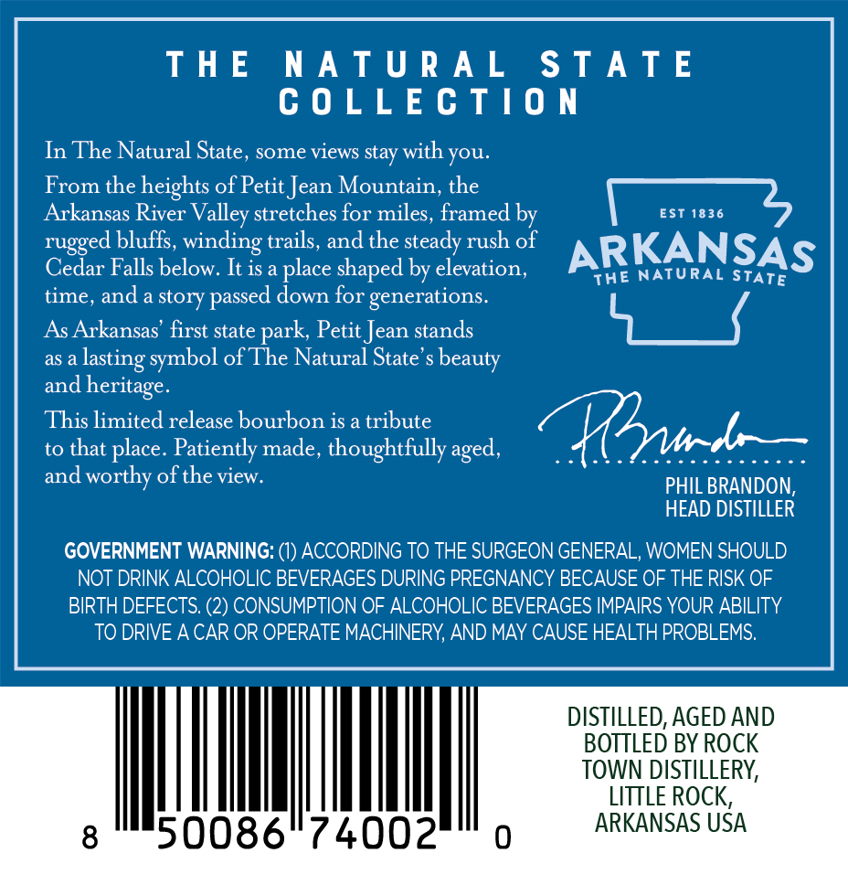
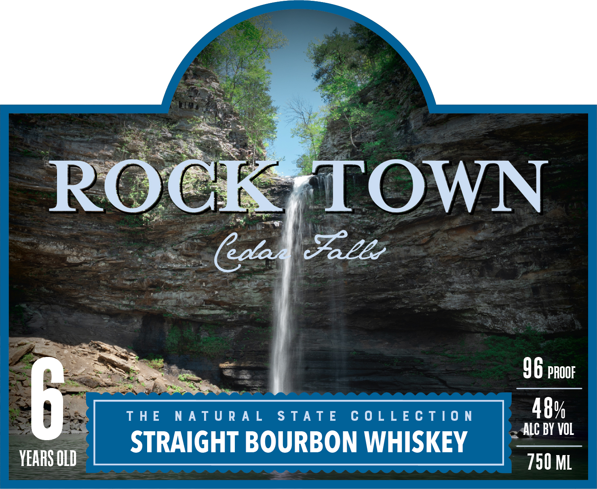

# TTB COLA Label Images - TTBID 26153001000102

**Brand Name:** ROCK TOWN

**Issue Date:** 06/05/2026

**Origin Code:** 12

**Product Class/Type:** 101

**Source:** [TTB Public COLA Registry](https://ttbonline.gov/colasonline/viewColaDetails.do?action=publicFormDisplay&ttbid=26153001000102)

## Label Images

### Back Label

### Front Label

## Extracted Label Text

*Text extracted via OCR - may contain errors*

### Back Label

THE NATURAL STATE

COLLECTION

In The Natural State, some views stay with you.

From the heights of Petit Jean Mountain, the

Arkansas River Valley stretches for miles, framed b

[eee 0S

rugged bluffs, winding trails, and the steady rush of

ARKANSAS

Cedar Falls below. It is a place shaped by elevation,

THE NATURAL STaTe

time, and a story passed down for generations.

As Arkansas’ first state park, Petit Jean stands

YS

as a lasting symbol of The Natural State’s beauty

and heritage.

This limited release bourbon is a tribute

to that place. Patiently made, thoughtfully aged,

ag latsiGascosSsocsace

and worthy of the view.

PHIL BRANDON,

HEAD DISTILLER

GOVERNMENT WARNING: (1) ACCORDING TO THE SURGEON GENERAL, WOMEN SHOULD

NOT DRINK ALCOHOLIC BEVERAGES DURING PREGNANCY BECAUSE OF THE RISK OF

BIRTH DEFECTS. (2) CONSUMPTION OF ALCOHOLIC BEVERAGES IMPAIRS YOUR ABILITY

TO DRIVE A CAR OR OPERATE MACHINERY, AND MAY CAUSE HEALTH PROBLEMS.

DISTILLED, AGED AND

BOTTLED BY ROCK

TOWN DISTILLERY,

LITTLE ROCK,

50086° 74002

ARKANSAS USA

### Front Label

96 proor

a rane TERT STATE COLLECTION oH
STRAIGHT BOURBON WHISKEY |- —

YEARS OLD
