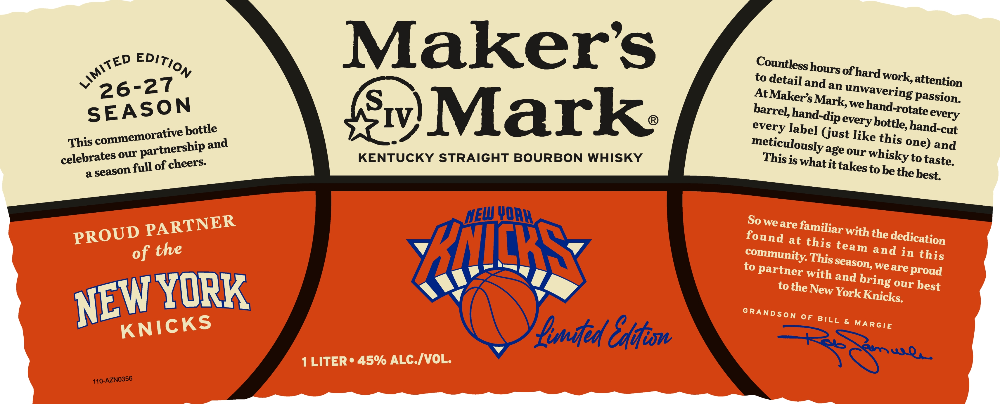
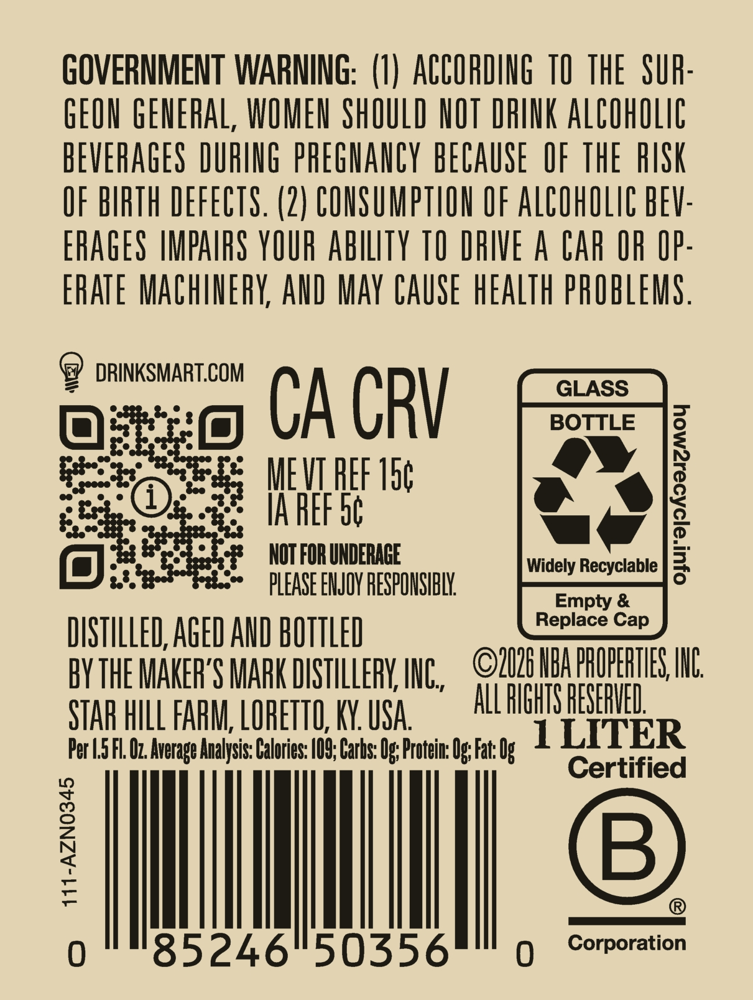

# TTB COLA Label Images - TTBID 26153001000105

**Brand Name:** MAKER'S MARK

**Issue Date:** 06/04/2026

**Origin Code:** 22

**Product Class/Type:** 101

**Source:** [TTB Public COLA Registry](https://ttbonline.gov/colasonline/viewColaDetails.do?action=publicFormDisplay&ttbid=26153001000105)

## Label Images

### Label 1

### Label 2

## Extracted Label Text

*Text extracted via OCR - may contain errors*

**Detected Proof:** 90

### Label 1

Makers
to detail
ofhard work;
and an
AtL
passion.
we
bottle
IV
Mark
(just
one) and
age
celebrates =
of
KENTUCKY STRAIGHT BOURBON WHISKY
is whatit-
to
a
tobethe
NEW
QRK
So we are
with the -
at
of the
Yncks
and in
to partner with
we are proud
and
YORK
tothe_
York_
0F
&
Inifed
1 LITER =
45% ALC IVOL:
DwqL
110-AZN0356
Edition
LiMiTED
Countless
hours =
attention
26-27
unwavering -
Maker's _
Mark;
SEASON
hand-rotate =
barrel; _
hand-dipe
every
every
bottle; =
hand-cut
every
label
commemorative |
like
this
This
meticulously
and
partnership
our
whisky '
our
This
taste.
cheers:
takes =
full
season
best:
PARTNER
familiar
PROUD
found
dedication
this
team
community:'
this
This
season,
bring
NEW
our
best
New
Knicks:
GRANDSON
KNICKS
BILL
GAdtiow
MARGIE

### Label 2

GOVERNMENT WARNING: (U) ACCORDING TO THE   SUR:
GEON GENERAL, WOMEN ShOULD NOT DRINK AlCohOLig
BEVERAGES DURING phEGNANCY beCauSe  OF thE  RISK
OF BIRTH DEFECTS. (2 } CONSUMPTION OF ALCOhOLIC BEV:
ERAGES MPAIFS YOUR abilTy TO DRIVE A CAr OR IP:
ERATE MaChinErY, AND May CAUSE hEaLTh pROBLEMS .
DRINKSMART.COM
GLASS
CA CRV
BOTTLE
MEVI HEF 15c
IA REF 56
7
NOT FOR UNDERAGE
Widely Recyclable
PLEASE ENJOY RESPONSIBLY
Empty &
Replace
DISTILLED,AGED AND BOTTLED
BYTHE MAKER'S MaRK DISTHLLERK, ING,
2U26 HBA PPOPEHTLES; IUL
STAR HILL FABM; LOHETTO; KY. USA
All PIGHTS PESERHEL
Per L.5 FL Oz Average Analysis: Calories: /09; Carbs: Os; Protein: Os; Fat: Ug
1LITER
Certified
1
B
0
85246"50356
Corporation
Cap
