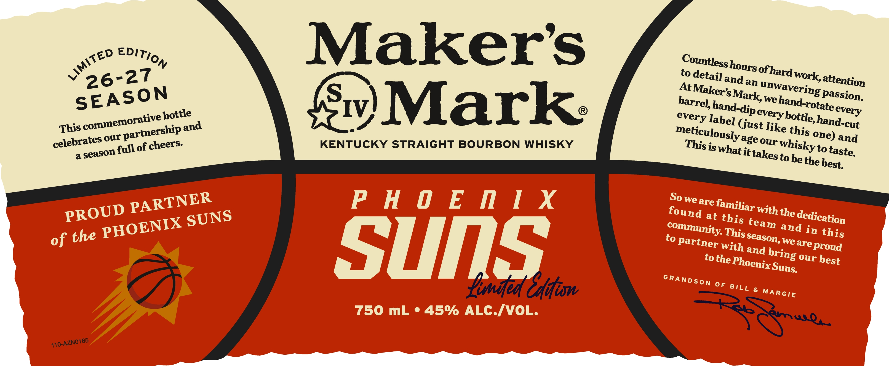
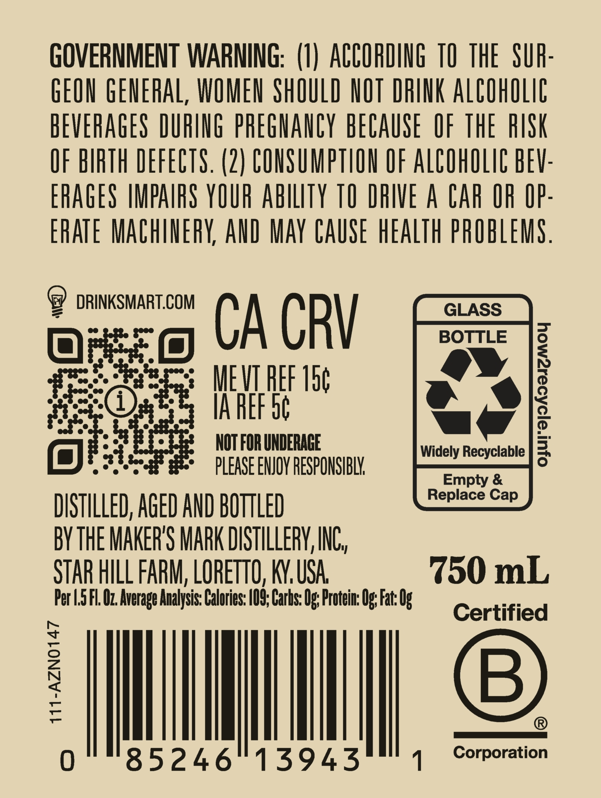

# TTB COLA Label Images - TTBID 26153001000108

**Brand Name:** MAKER'S MARK

**Issue Date:** 06/04/2026

**Origin Code:** 22

**Product Class/Type:** 101

**Source:** [TTB Public COLA Registry](https://ttbonline.gov/colasonline/viewColaDetails.do?action=publicFormDisplay&ttbid=26153001000108)

## Label Images

### Label 1

### Label 2

## Extracted Label Text

*Text extracted via OCR - may contain errors*

**Detected Proof:** 90

### Label 1

Makers
to
of)
andan
work;
AtE
Mark
we _
'passion:
This
'IV
(just
our
age
one) and
of cheers
KENTUCKY STRAIGHT BOURBON WHISKY
is
to
a
it
to be
P H 0 E n 1 X
So we
at
with the _
and in
of
sunS
to
partner with and
we
proud
to the_
Iunded Edifos
0F
&
750 mL
45% ALC-IVOL.
^usls
Edition
LiMitED
Countless _
hours =
hard
26-27
detail =
attention
unwavering
Maker's_
SEASON
Mark;
barrel; -
hand-rotate =
hand-dipe
every
every
bottle
bottle, 2
every
commemorative |
label
hand-cut
and
like
partnership
meticulously
this
celebrates
our
This
whisky !
full
what =
taste:
season
takes =
the
best:
PARTNER
are
familiar -
PROUD
found
SUNS
dedication
this
PHOENIX
team
community:"
This:
this
the
season;
are _
bring
our
best
Phoenix =
Suns:
GRANDSON
BILL
MARGIE
T10-AZNO165

### Label 2

GOVERNMENT WARNING:   (I) ACCOHDING TO  THE   SUR:
GEON GENERAL, WOMEN ShOULD NOT DRINK AlCOhOLig
BEVERAGES DURING phEGHANCY bECAUSE  OF thE RISK
OF BIRTH DEFECTS. (2 ) CONSUMPTION OF ALCOhOLIC BEV:
ERAGES IMPAIFS YOUR abilTy TO DRIVE A Car OR OP:
ERATE MaChinERY AND May CAUSE heALTh pROBLEMS .
DRINKSMART.COM
GLASS
CA CRV
BOTTLE
MEVIREF 15c
IA REF 56
7
NOT FOR UNDERAGE
Widely Recyclable
pLEASE ENJOY RESPONSIBLK
Empty &
Replace Cap
DISTILLED, AGED AND BOTTLED
BY THE MakERS MARK DISTILLERV, INC,
STAR HILL FARM; LOReTTO, KY, USA
750 mL
Per L.5 FL Oz Average Analysis: Calories: /09;, Carbs: O;; Protein: Og Fat: Og
Certified
1
B
85246"13943
Corporation
