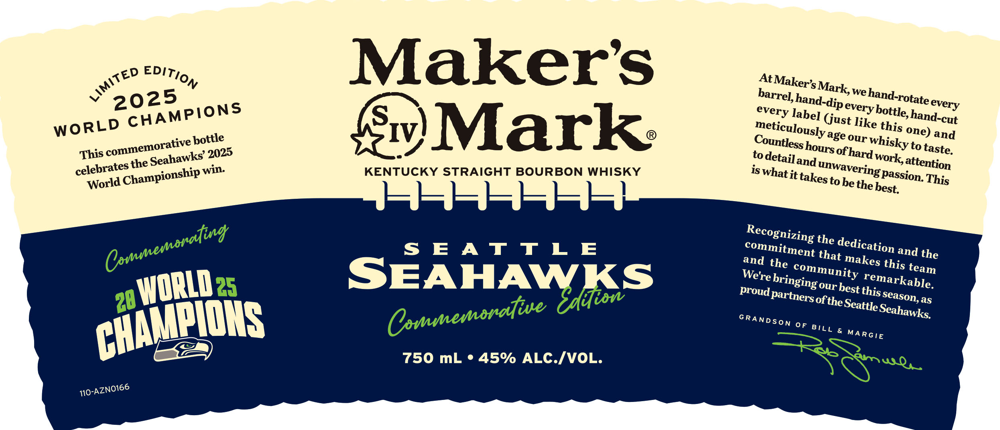

# TTB COLA Label Images - TTBID 26153001000113

**Brand Name:** MAKER'S MARK

**Issue Date:** 06/04/2026

**Origin Code:** 22

**Product Class/Type:** 101

**Source:** [TTB Public COLA Registry](https://ttbonline.gov/colasonline/viewColaDetails.do?action=publicFormDisplay&ttbid=26153001000113)

## Label Images

### Label 1

### Label 2

## Extracted Label Text

*Text extracted via OCR - may contain errors*

### Label 1

9 At Maker’, Mark, we hand-rotate every
[ barrel, hand-dip every hottle, hand-cut
every labe] Gust like this One) and
meticulously age our Whisky to taste,
Countless hours of hard Work, attention
« ep ED Tio ”y ® to detail and unwavering Passion, This
ay 5 Ss S ) [ 1S What it takes to he the best,
Y 202 MPION IV, REON WHISKY
LD CHAN pottle FUCKY STRAIGHT BOU }
wo R manent 2025 SEU Recognizing the dedication and the
TS Os eaten win. °oOmmitment that makes this team
celebrate nampions and the community remarkable,
World T LE We're bringing Our best this Season, as
S E A T Ss Proud Partners of; the Seattle Seahawks,
cil SEAHAWK SRANDSoy OY Dirk, MARGIE
we WQ,
BALD 2s Cnmmensret NS
W -/VOL.
AAMMPIONS Fee See ALES
6
MO-AZNO1EE

### Label 2

GOVERNMENT WARNING: (1) ACCORDING TO THE  SUR:
GEON GENERAL, WOMEN ShOULD NOT DRINK AlCohOlic
BEVERAGES DURING prEGhaNCY BECAUSE   OF ThE  RISK
OF BIRTH DEFECTS. (2) CONSUMPTHON OF AlCOhOLIc BEV:
ERAGES IMPAIRS YOUR abilTy TO DRIVE a Car OR IP:
ERATE MAChIERY; AND May CAUSe hEalth PROBLEMS.
DRINKSMART.COM
GLASS
CA CRV
BOTTLE
MEVI PEF I5c
7
IA REF 5c
NOT FOR UNDERAGE
Widely Recyclable
3
please ENJOY RESPONSIBL
Empty &
Replace Cap
DISTILLED; AGED AND BOTTLED
bYthE MAKER'S MARK DISTILLERV,INC,
STAR HILL FARM; LORETTO, KN, USA
750 mL
Fer |5 FL Uz Average Analysis: Calbries: /O9; Carbs: Ug; Frotein Ug Fat: Ug
Certified
7
B
0
85246
13943
Corporation
