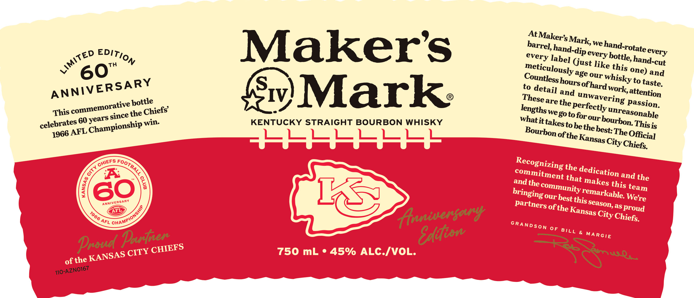
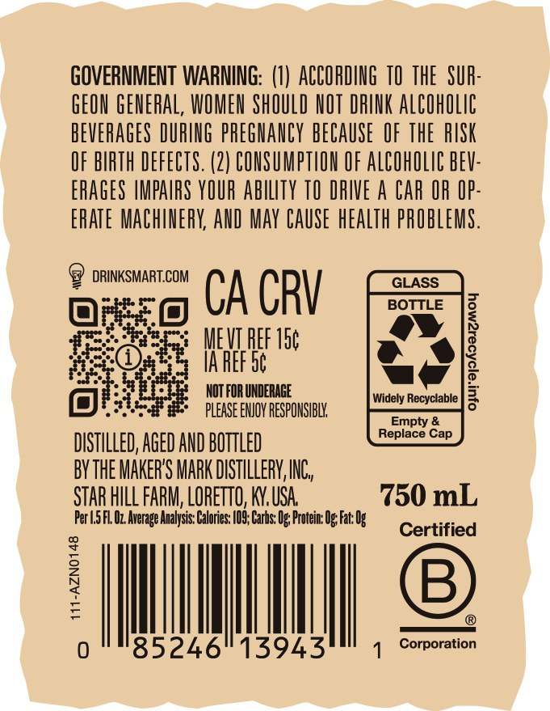

# TTB COLA Label Images - TTBID 26153001000116

**Brand Name:** MAKER'S MARK

**Issue Date:** 06/04/2026

**Origin Code:** 22

**Product Class/Type:** 101

**Source:** [TTB Public COLA Registry](https://ttbonline.gov/colasonline/viewColaDetails.do?action=publicFormDisplay&ttbid=26153001000116)

## Label Images

### Label 1

### Label 2

## Extracted Label Text

*Text extracted via OCR - may contain errors*

**Detected Proof:** 90

### Label 1

At)
Th
Makers
(just
age
one) and
to
IV
Mark
to
and
work;
bottle
are
passion.
This
since the'
we go toforour
60
win
KENTUCKY STRAIGHT BOURBON WHISKY
whatit
to
bethe
-FKKHKKKH
ofthe
the
A
that
and the
andthe
1S
ofthe
as
proud
(anisergary
0F
Parhner
EAdion
Proud
750 mL
45% ALC-IVOL:
of the
Makers _
Mark;, "
we
barrel; -
hand-rotate =
hand-dip =
every
Edition
LimiTED
every
bottle, =
every
label
hand-cut
like
60'
meticulously
this
Countless
our
whisky
hours e
ANNIVERSARY
taste:
ofhard
detail
attention
unwavering
These =
the
commemorative
perfectly -
lengths -
Chiefs'
unreasonable
years
bourbon:
takes =
celebrates '
Thisis
Championship -
best:
Bourbon
AFL
Thee
1966
Official
Kansas
City"
Chiefs:
Recognizing
CHIEFS
FOOTBALL
8
dedication
commitment
1
8
makes
60
this
community
team
bringing
remarkable:
We're
our
best +
this =
AnNiVERSARY
season,
partners
chamPionshi?
Kansas
AFL
1966
City'
Chiefs:
AFL
GRANDSON
BILL
MARGIE
CHIEFS
CITY
Ausos =
KANSAS
T10-AZNO167

### Label 2

GOVERNMENT WARNING: (1) ACCORDING TO THE  SUR:
GEON GENERAL, WOMEN ShOULD NOT DRINK AlCohOlic
BEVERAGES DURING prEGhaNCY BECAUSE   OF ThE  RISK
OF BIRTH DEFECTS. (2) CONSUMPTHON OF AlCOhOLIc BEV:
ERAGES IMPAIRS YOUR abilTy TO DRIVE a Car OR IP:
ERATE MAChIERY; AND May CAUSe hEalth PROBLEMS.
DRINKSMART.COM
GLASS
CA CRV
BOTTLE
MEVI PEF I5c
7
IA REF 5c
NOT FOR UNDERAGE
Widely Recyclable
3
please ENJOY RESPONSIBL
Empty &
Replace Cap
DISTILLED; AGED AND BOTTLED
bYthE MAKER'S MARK DISTILLERV,INC,
STAR HILL FARM; LORETTO, KN, USA
750 mL
Fer |5 FL Uz Average Analysis: Calbries: /O9; Carbs: Ug; Frotein Ug Fat: Ug
Certified
7
B
0
85246
13943
Corporation
