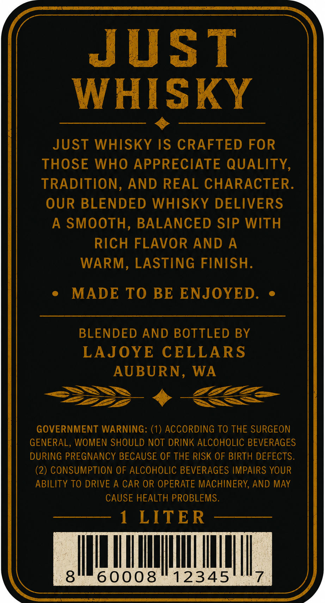
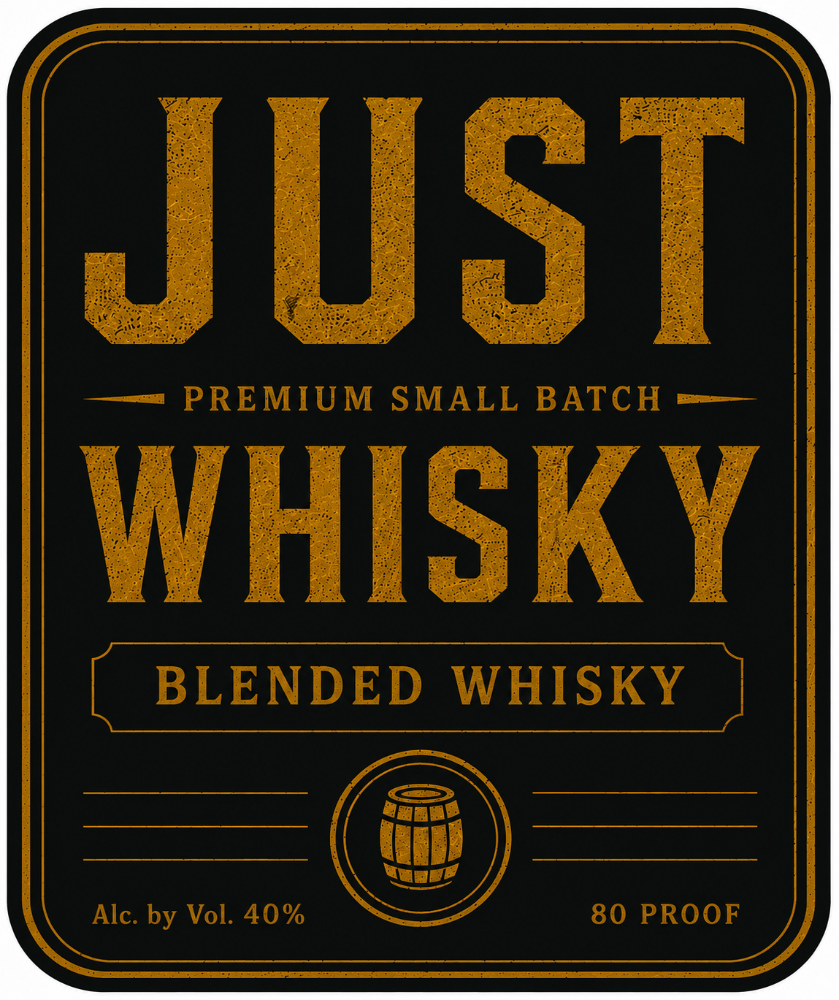

# TTB COLA Label Images - TTBID 26153001000243

**Brand Name:** JUST

**Issue Date:** 06/05/2026

**Origin Code:** 07

**Product Class/Type:** 137

**Source:** [TTB Public COLA Registry](https://ttbonline.gov/colasonline/viewColaDetails.do?action=publicFormDisplay&ttbid=26153001000243)

## Label Images

### Back Label

### Front Label

## Extracted Label Text

*Text extracted via OCR - may contain errors*

**Detected Proof:** 80

### Back Label

JUST
WHISKY
JUST WHISKY IS CRAFTED FOR
THOSE WHO APPRECIATE QUALITY,
TRADITION,
AND REAL CHARACTER.
OUR BLENDED WHISKY DELIVERS
A SMOOTH,
BALANCED SIP WITH
RICH FLAVOR AND
A
WARM,
LASTING FINISH.
MADE TO BE ENJOYED
BLENDED AND BOTTLED BY
LAJOYE CELLARS
AUBURN,
WA
GOVERNMENT WARNING: (1
ACCORDING TO THE SURGEON
GENERAL, WOMEN SHOULD NOT DRINK ALCOHOLIC BEVERAGES
DURING PREGNANCY BECAUSE OF THE RISK OF BIRTH DEFECTS.
(2) CONSUMPTION OF ALCOHOLIC BEVERAGES IMPAIRS YOUR
ABILITY TO DRIVE A CAR OR OPERATE MACHINERY, AND MAY
CAUSE HEALTH PROBLEMS.
1
LITER
8
60008
12345

### Front Label

JuST
PREMIUM
SMALL
BATCH
WHISKY
BLENDED
WHISKY
Alc: by Vol. 40%
80 PROOF
