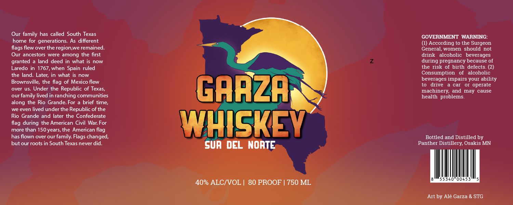

# TTB COLA Label Images - TTBID 26153001000295

**Brand Name:** PANTHER DISTILLERY

**Fanciful Name:** GARZA WHISKEY

**Issue Date:** 06/08/2026

**Origin Code:** 27

**Product Class/Type:** 140

**Source:** [TTB Public COLA Registry](https://ttbonline.gov/colasonline/viewColaDetails.do?action=publicFormDisplay&ttbid=26153001000295)

## Label Images

### Label 1

## Extracted Label Text

*Text extracted via OCR - may contain errors*

**Detected Proof:** 80

### Label 1

Our family has called South Texas
GOVERNMENT WARNING:
home for generations
As different
According to the Surgeon
flags flew over the region,we remained.
General, women  should
not
Our ancestors
were among the first
drink
alcoholic   beverages
granted
land deed in what is now
during pregnancy because of
Laredo in 1767,when Spain ruled
the risk of birth defects_
the land: Later; in what
now
Consumption
alcoholic
Brownsville;
the flag of Mexico flew
beverages impairs your ability
drive
car
OI operate
over
Under the Republic of Texas,
GARZA
machinery, and may
cause
our
family lived in ranching communities
health problems__
along the Rio Grande: For
brief time;
we even lived under the Republic of the
Rio Grande and later the Confederate
during the American Civil War:
WHISKEY
more than 150years, the American
has flown over our family Flags changed;
Bottled and Distilled by
but our roots in South Texas never did.
Sur DEL NORTE
Panther Distillery; Osakis MN
53 4
40% ALCIVOL
80 PROOF
750 ML
Art by Ale Garza & STG
flag
For
flag
