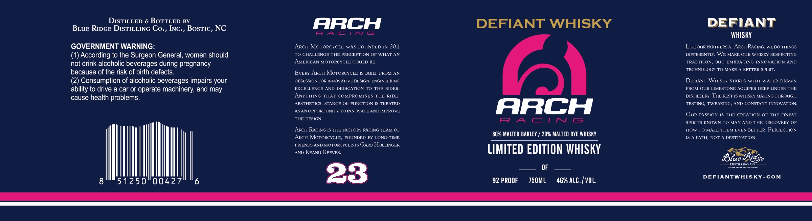

# TTB COLA Label Images - TTBID 26153001000305

**Brand Name:** DEFIANT WHISKY

**Fanciful Name:** DEFIANT WHISKY ARCH RACING LIMITED EDITION WHISKY

**Issue Date:** 06/08/2026

**Origin Code:** 35

**Product Class/Type:** 140

**Source:** [TTB Public COLA Registry](https://ttbonline.gov/colasonline/viewColaDetails.do?action=publicFormDisplay&ttbid=26153001000305)

## Label Images

### Label 1

### Label 2

## Extracted Label Text

*Text extracted via OCR - may contain errors*

*1 image(s) excluded: text did not meet readability threshold*

**Detected Proof:** 92

### Label 1

DISTILLED & BOTTLED BY
ARCH
DEFIANT WHISKY
DEFIANT
BLUE RIDGE DISTILLING Co., INC , BOSTIC, NC
R A
C ! [J
Cs
WHISKY
GOVERNMENT WARNING:
ARCH MoToRCYCLE
WAS FOUNDED IN 20ll
LiKE OUR PARTNERSAT ARCHRACING
WE DO THINGS
(1) According to the Surgeon General, women should
TO CHALLENGE THE PERCEPTION OF WHAT AN
DIFTERENTLY WE MAKE OUR WHISRY RESPECTING
not drink alcoholic beverages during pregnancy
AMERICAN MOTORCYCLE COULD BE
TRADITION,
BUT
EMBRACING INNOVATION AND
because of the risk of birth defects_
EvERY ARCH MOTORCYCLE IS BUILT FROM AV
TECHNOLOGY TO MAKE
BETTEP SPIRIT,
(2) Consumption of alcoholic beverages impairs your
OBSESSION FOR INNOVATIVE DESIGN, ENGINEERING
DEFIANT WHISKY STARTS WITH WATER DRAWN
ability to drive a car or operate machinery, and may
EXCELLENCE AND
DEDICATION TO
THE RIDER.
TROM OUR LIMESTONE AQUIFER DFEP UNDER THE
cause health problems.
ANYTHING
THAT COMPROMISES THE RIDE,
DISTILLERY THE REST IS WHISKY MAKING THROUGH
AESTHETICS
STANCE OR FUNCTION IS TREATED
TESTING,
TWEAKNG
AND CONSTANT INNOVATION
ASANOPPORTUNITY TO INNOVATE AND IMPROVE
ARCH
OuR PASSION IS THE CREATION OF
THE
FINEST
THE DESIGA
F? A C | N G
SPIRITS KNOWNTO MAN AND THE DISCOVERY
ARCH RACING IS THE FACTORY RACING TEAM OF
HOW TO MAKE THEM EVEN BETTER
PERFECTION
80% MALTED BARLEY
20% MALTED RYE WHISKY
ARCH MoTORCYCLE;
FOUNDED
BY LONG-TIME
PATH,
NOT
DESTINATION.
FRIENDS AND MOTORCYCLISTS GARD HoLLINGER
AND KEAvu REEVES _
lIMITED EDITION WHISKY
lue
lidge
DISTILTINC Co
OF
51250"0042
23
92 PROOF
750ML
46% ALC.| VOL.
DEFIANTWHISKY
com
