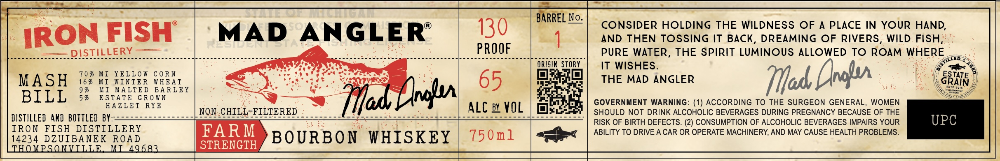

# TTB COLA Label Images - TTBID 26153001000322

**Brand Name:** MAD ANGLER

**Issue Date:** 06/11/2026

**Origin Code:** 06

**Product Class/Type:** 141

**Source:** [TTB Public COLA Registry](https://ttbonline.gov/colasonline/viewColaDetails.do?action=publicFormDisplay&ttbid=26153001000322)

## Label Images

### Label 1

## Extracted Label Text

*Text extracted via OCR - may contain errors*

### Label 1

MEL No CONSIDER HOLDING THE WILDNESS OF A PLACE IN YOUR HAND

130

AND THEN TOSSING IT BACK, DREAMING OF RIVERS, WILD FISH

“IRON FISH | MAD ANGLER’

aaa

2 ee

ISTILLER

Sei essanosLorecscocoseesesee

sues esvewceseb cos. Stee eo eee S ‘

PROOF

PURE WATER, THE SPIRIT LUMINOUS ALLOWED TO ROAM WHERE

ORIGIN STORY.

IT WISHES

&

70% MI YELLOW CORN

at

et

? ESTATE

MASH

16% MI

WINTER WHEAT

THE MAD ANGLER

id, ral

A\

9%

5% ESTATE GROWN

MI MALTED BARLEY

if

BILL

HAZLET RYE

GOVERNMENT WARNING: (1) ACCORDING TO THE SURGEON GENERAL, WOMEN

DISTILLED AND BOTTLED BY

Ao ees

NON CHIL:

AS

ILTERED.

base bes

eo Senos

rir: Res ss

ae

BCE oe I le eta

SHOULD NOT DRINK ALCOHOLIC BEVERAGES DURING PREGNANCY BECAUSE OF THE

RISK OF BIRTH DEFECTS. (2) CONSUMPTION OF ALCOHOLIC BEVERAGES IMPAIRS YOUR

IRON FISH DISTILLERY

FARM

ABILITY TO DRIVE A CAR OR OPERATE MACHINERY, AND MAY CAUSE HEALTH PROBLEMS.

14234 DEVI BENE ROAD

STRENGTH

BOURBON WHISKEY 750m1

HOMP

M

4968
