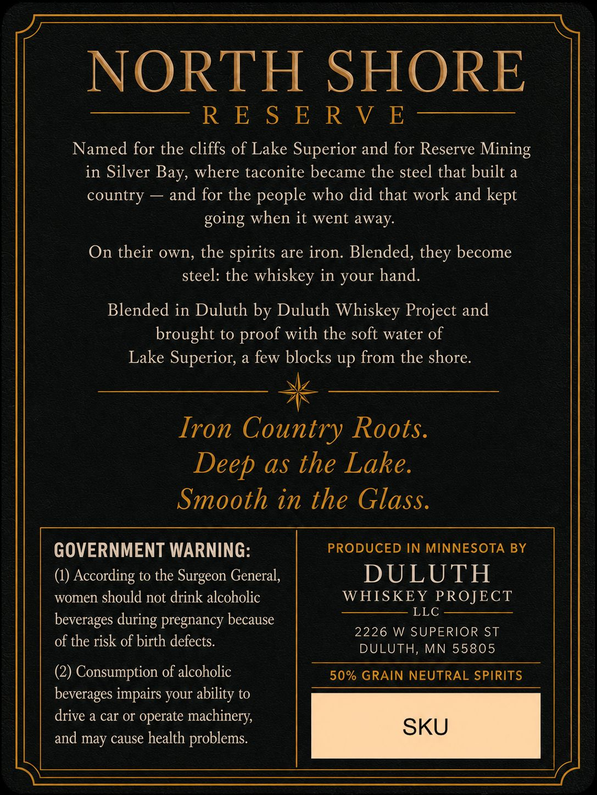
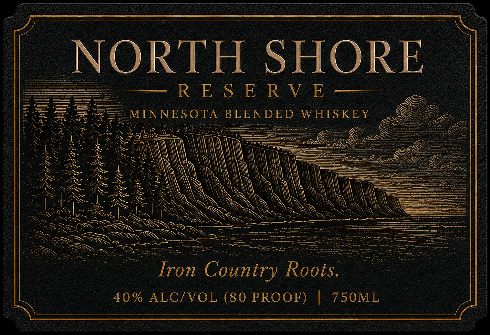
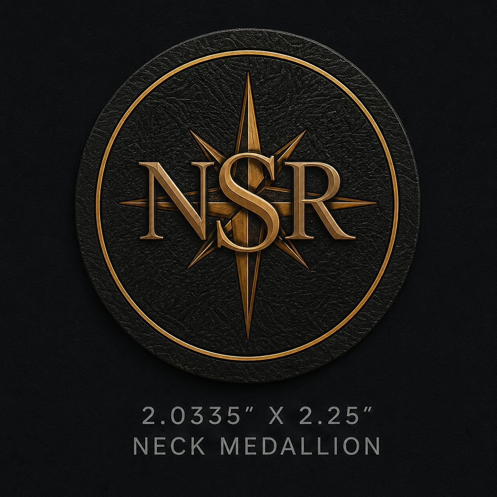

# TTB COLA Label Images - TTBID 26153001000342

**Brand Name:** NORTH SHORE RESERVE

**Issue Date:** 07/30/2026

**Origin Code:** 27

**Product Class/Type:** 137

**Source:** [TTB Public COLA Registry](https://ttbonline.gov/colasonline/viewColaDetails.do?action=publicFormDisplay&ttbid=26153001000342)

## Label Images

### Back Label

### Front Label

### Label 2

## Extracted Label Text

*Text extracted via OCR - may contain errors*

*1 image(s) excluded: text did not meet readability threshold*

**Detected Proof:** 80

### Back Label

NOKIE SHOKE

a eek eo Re Ee

Named for the cliffs of Lake Superior and for Reserve Mining

in Silver Bay, where taconite became the steel that built a

country — and for the people who did that work and kept

going when it went away.

On their own, the spirits are iron. Blended, they become

steel: the whiskey in your hand.

Blended in Duluth by Duluth Whiskey Project and

brought to proof with the soft water of

Lake Superior, a few blocks up from the shore

wiz

AN

Iron Country Roots

Deep as the Lake

Smooth in the Glass

PRODUCED IN MINNESOTA BY

GOVERNMENT WARNING

(1) According to the Surgeon General,

DULUTH

women should not drink alcoholic

WHISKEY PROJECT

ELE

beverages during pregnancy because

of the risk of birth defects.

2226 W SUPERIOR ST

DULUTH, MN 55805

(2) Consumption of alcoholic

50% GRAIN NEUTRAL SPIRITS

beverages impairs your ability to

drive a car or operate machinery,

and may cause health problems.

SKU

### Front Label

NORTH
SHORE
R E $ E R V E
MINNES OTA
BLENDED
WHIS KEY
Iron Country Roots.
40 % ALCIVOL (80 PROOF)
750ML
