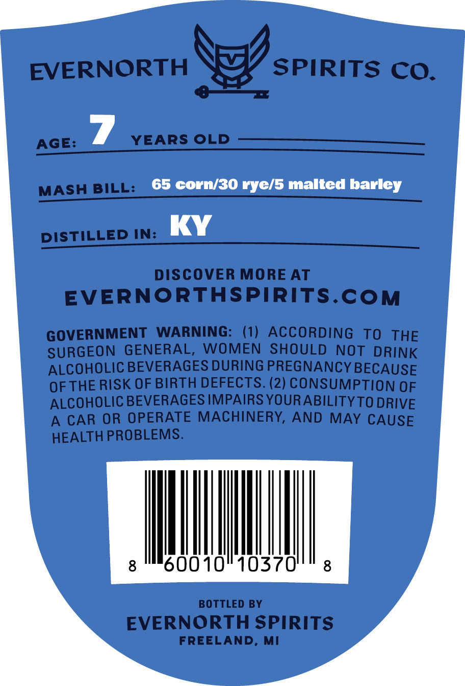
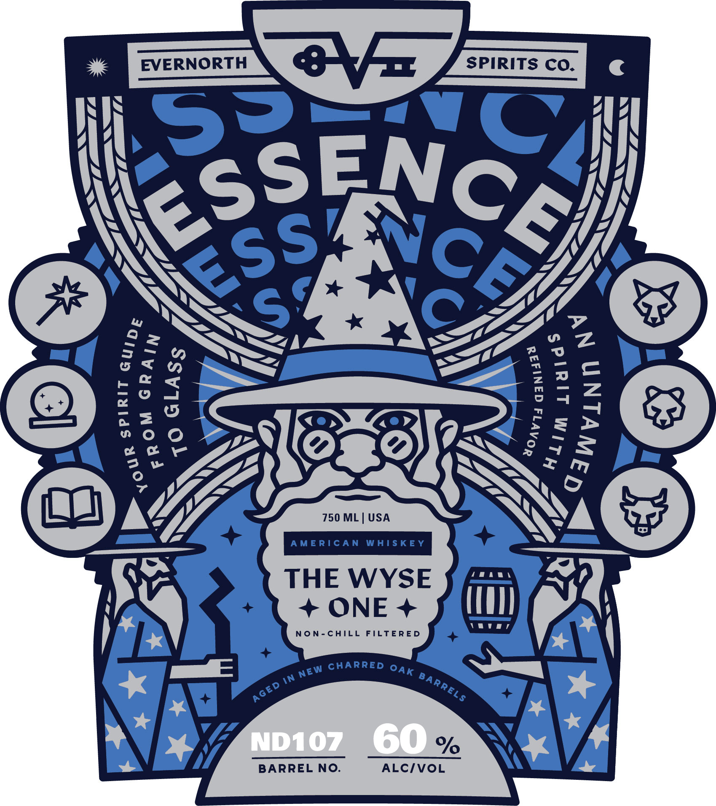

# TTB COLA Label Images - TTBID 26153001000352

**Brand Name:** EVERNORTH SPIRITS CO.

**Fanciful Name:** WYSE ONE

**Issue Date:** 06/08/2026

**Origin Code:** 06

**Product Class/Type:** 140

**Source:** [TTB Public COLA Registry](https://ttbonline.gov/colasonline/viewColaDetails.do?action=publicFormDisplay&ttbid=26153001000352)

## Label Images

### Back Label

### Label 1

## Extracted Label Text

*Text extracted via OCR - may contain errors*

### Back Label

EVERNORTH
SPIRITS CO.
AGE:
YEARS OLD
MASH BILL:
65 corn/30 rye/5 malted barley
DISTILLED IN:
DISCOVER MORE AT
EVERNORTHSPIRITS.CoM
GOVERNMENT
WARNING:
(1) ACCORDING
TO
THE
SURGEON
GENERAL,
WOMEN
SHOULD
NOT
DRINK
ALCOHOLIC BEVERAGES DURING PREGNANCY BECAUSE
OFTHE RISK OF BIRTH DEFECTS: (2) CONSUMPTION OF
ALCOHOLIC BEVERAGES IMPAIRS YOUR ABILITYTO DRIVE
A
CAR OR OPERATE MACHINERY, AND MAY CAUSE
HEALTH PROBLEMS.
8
60010
10370'
8
BOTTLED BY
EVERNORTH SPIRITS
FREELAND, MI

### Label 1

EVERNORTH
0F
SPIRITS CO.
57
0
N
3
0
C
1
2
T
750 ML
USA
ME RIC A N
WAISKE Y
THE WYSE
ONE
non-ChILL
FILTERE D
CHARRED
in
ND10z
60
BARREL NO:
ALCIVOL
RSSENCE}
ESs
2
1
1
1
1
3
1
8
1
2
8
3
OAK
NEW
BARRELS
AGED
ol
