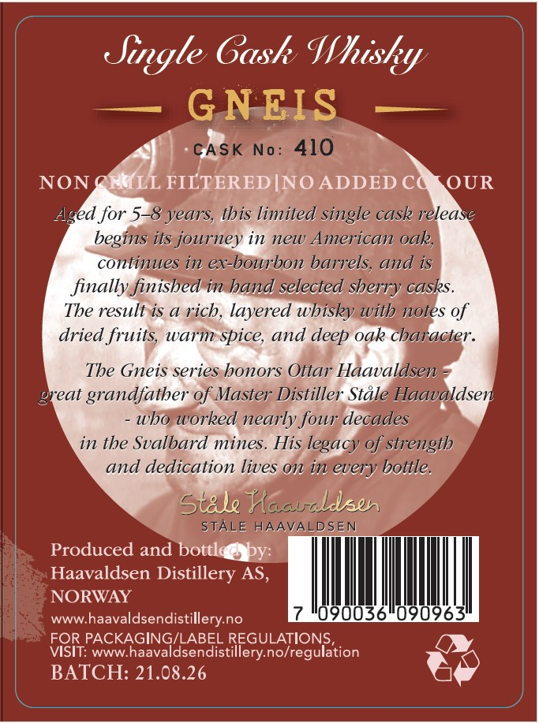
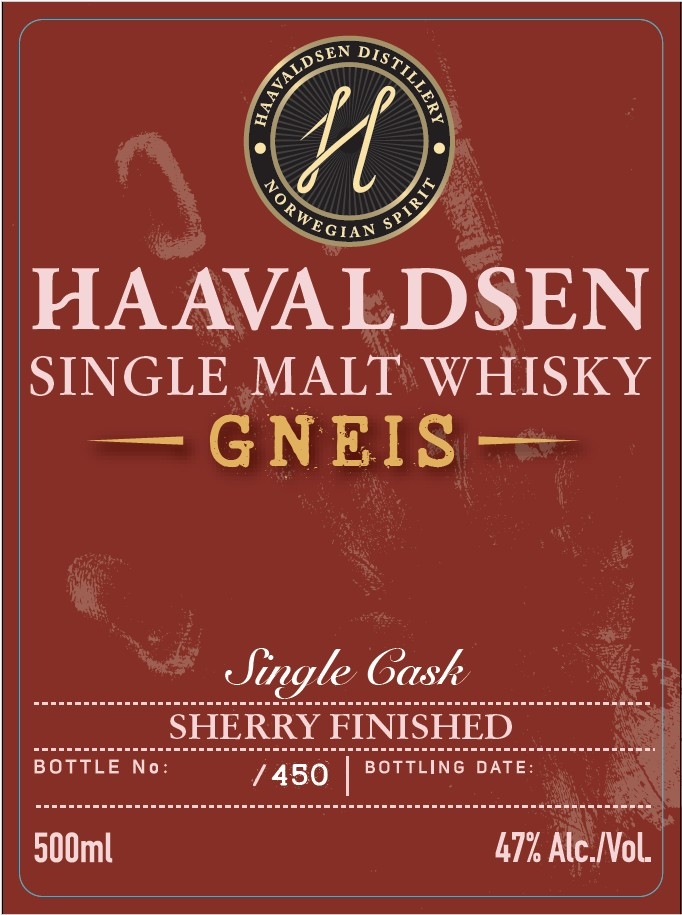
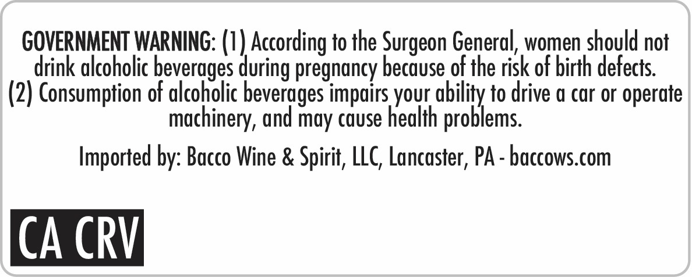

# TTB COLA Label Images - TTBID 26153001000363

**Brand Name:** HAAVALDSEN

**Fanciful Name:** GNEIS

**Issue Date:** 06/08/2026

**Origin Code:** 5C

**Product Class/Type:** 118

**Source:** [TTB Public COLA Registry](https://ttbonline.gov/colasonline/viewColaDetails.do?action=publicFormDisplay&ttbid=26153001000363)

## Label Images

### Back Label

### Front Label

### Label 3

## Extracted Label Text

*Text extracted via OCR - may contain errors*

**Detected Proof:** 94
**Detected Age:** 8 Years

### Back Label

Single Gask Whisky
GNEIS
CASK
No:
410
NON
EMLL FILTERED INO ADDED C
OUR
Aged for 5-8 years; this limited single cask release
begins its journey in new American oak;
continues in ex-bourbon barrels; and is
finally finished in hand selected sherry casks.
The result is a rich, layered whisky with notes of
dried fruits; warm spice, and deep oak character
The Gneis series honors Ottar Haavaldsen
great grandfather of Master Distiller Stale Haavaldsen
who worked nearly four decades
in the Svalbard mines. His
legacy of strength
and dedication lives 0 in every bottle.
Stale HacucLlen
STALE HAAVALDSEN
Produced
bottled
by:
Haavaldsen Distillery AS,
NORWAY
WWW
haavaldsendistillery no
FOR PACKAGING/LABEL
VISIT:
WWW:
haaval
laseRdist?fegunaTgMation
BATCH: 21.08.26
and

### Front Label

Se

rar

HAAVALDSEN

SINGLE MALT WHISKY

—GNEIS—

paudde sou seneesnea cacsuern Soceuee acaud sn saeressssaccconeneneteaeoacce ce imee

Single Gash

Besesuesceeescseccusecosealceacoueceras

SHERRY F

euceesceseoo

BOTTLE N

SeeusasesuswcccesescersceasGeuccecsscesascceascocsssccecs.sccacemetct ae

7450 |

500ml

47% Alc.Vol.

### Label 3

GOVERNMENT WARNING: (I) According to the Surgeon General, women should not
drink alcoholic beverages during pregnancy because of the risk of birth defects
(2) Consumption of alcoholic beverages impuirs your ability to drive & car or operate
machinery, and may cause health problems.
Imported by: Bacco Wine & Spirit, LLC, Lancaster; PA - baccows_com
CA CRVI
