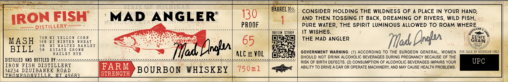

# TTB COLA Label Images - TTBID 26153001000365

**Brand Name:** MAD ANGLER

**Issue Date:** 06/11/2026

**Origin Code:** 06

**Product Class/Type:** 141

**Source:** [TTB Public COLA Registry](https://ttbonline.gov/colasonline/viewColaDetails.do?action=publicFormDisplay&ttbid=26153001000365)

## Label Images

### Label 1

## Extracted Label Text

*Text extracted via OCR - may contain errors*

### Label 1

=e

=

BARREL No

CONSIDER HOLDING THE WILDNESS OF A PLACE IN YOUR HAND,

30

AND THEN TOSSING IT BACK, DREAMING OF RIVERS, WILD FISH,

"IRON FISH | MAD ANGLER’

PURE WATER, THE SPIRIT LUMINOUS ALLOWED TO ROAM WHERE

aes

ISTILLER

Pade

egceueS.Loskessicuscseseseoes

pisses

Bere rer ere repre eee een eee

PROOF

ORIGIN STORY.

IT WISHES.

70% MI YELLOW CORN

Peo

Ys

THE MAD ANGLER

ESTATE

MASH

16% MI WINTER WHEAT

MI MALTED BARLEY

PFO)

9%

5% ESTATE GROWN

Tad, rar

BILL

HAZLET RYE

“SS

GOVERNMENT WARNING: (1) ACCORDING TO THE SURGEON GENERAL, WOMEN FOR SALE

GAN ONLY

DISTILLED AKD BOTTLED BY:

eee

acne

Bea seweee

Bs

rar no

en elite

SHOULD NOT DRINK ALCOHOLIC BEVERAGES DURING PREGNANCY BECAUSE OF THE

RISK OF BIRTH DEFECTS. (2) CONSUMPTION OF ALCOHOLIC BEVERAGES IMPAIRS YOUR

IRON FISH DISTILLERY

FARM

ABILITY TO DRIVE A CAR OR OPERATE MACHINERY, AND MAY CAUSE HEALTH PROBLEMS.

14234 Dev eANEs ROAD

HOMP

M

4968

STRENGTH

BOURBON WHISKEY 150ml
